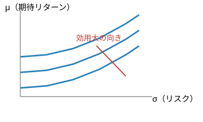

<!-- _class: title -->
<!-- _header: '' -->
<!-- _footer: '' -->

# 第1章　投資家の選好

金融工学　社内勉強会スライド

底本：『新・証券投資論 I 理論篇』（日本証券アナリスト協会 編，小林孝雄・芹田敏夫 著，日本経済新聞出版社，2009）第1章

数学的な予備知識は前提とし，経済学的な考え方の説明を重視します

---

# 本日の内容

1. 不確実な将来をどうモデル化するか（確率くじ）
2. なぜ「期待値」だけでは投資判断ができないか
3. 効用関数と期待効用最大化原理
4. リスク回避・中立・追求
5. 確実等価額とリスク・プレミアム
6. リスク回避度の測り方（Arrow–Pratt）
7. 実務で使う効用関数のファミリー
8. 次章（ポートフォリオ理論）へのブリッジ

---

この章のねらい

投資とは「不確実な将来の富」の中からどれを選ぶかという行為。

結果が確率的にしか決まらない以上，まず

* 不確実な結果に**順序をつける**枠組み
* その順序を**数値化**する道具

が必要になる。これが**効用関数**と**期待効用理論**。

---

# Part 1：不確実な将来をどう表すか

---

# 投資＝「くじ」を選ぶこと

- 将来の株価は今日の時点ではわからない → **確率変数**として扱う
- 「確率○％でいくらになる」という形にしたものを**確率くじ**（lottery）と呼ぶ
- 経済学ではまずこの「くじ」を比較する土俵を作るところから始める

定義：確率くじ

帰結 $x_1,\dots,x_n$ とそれぞれの確率 $p_1,\dots,p_n \geqq 0$（$\sum p_i = 1$）の組
$$
L = \bigl((x_1,p_1),\dots,(x_n,p_n)\bigr)
$$
を確率くじという。

---

# 走る例：2つの株式くじ $X, Y$

  

    
X

    
1/2→100円

    
1/2→50円

  

  

    
Y

    
1/2→120円

    
1/2→40円

  

- 今日の株価はどちらも同じとする
- 上がるときは $Y$ の方が高く（120>100），下がるときは $X$ の方がまだマシ（50>40）
- この章を通じて $X,Y$ を共通の例として使う

---

# リターンとリスクを数値にする

定義：期待値・分散

$$
\mathbb{E}[X] := \sum_i x_i p_i, \qquad
\mathrm{Var}(X) := \mathbb{E}\bigl[(X-\mathbb{E}[X])^2\bigr], \qquad
\sigma(X) := \sqrt{\mathrm{Var}(X)}
$$

**期待値＝リターン，標準偏差＝リスク**という対応づけ

|  | 期待値 $\mathbb{E}[\cdot]$ | 標準偏差 $\sigma(\cdot)$ |
|---|---|---|
| $X$ | 75 | 25 |
| $Y$ | 80 | 40 |

$Y$ は $X$ より期待値も標準偏差も大きい → **ハイリスク・ハイリターン**

---

# では期待値の高い方を選べばよい？

- 直感的には「期待値（＝平均的な儲け）が大きい方が良い」と思いがち
- しかし人は **同じ期待値でもリスクが低い方**を好む傾向がある（保険に入る，など）
- 期待値だけを最大化するルールは，次の有名な逆説で破綻する

例：サンクトペテルブルクのパラドックス（1738）

コインを表が出るまで投げ，$k$ 回目に初めて表が出たら $2^k$ 円もらえるくじ。

賞金の期待値は
$$
\sum_{k=1}^\infty 2^{-k}\cdot 2^k = \infty
$$
と**無限大**だが，このくじに大金を払う人はいない。

---

# 発想の転換：金額ではなく「満足度」

- Bernoulli の提案：金額そのものではなく，その**効用（満足度）の期待値**で評価すべき
- 例えば効用を $u(x)=\log_2 x$ とすると期待効用は

$$
\sum_{k=1}^\infty 2^{-k}\log_2(2^k) = \sum_{k=1}^\infty \frac{k}{2^k} = 2
$$

と**有限**に収束する

ポイント

「いくら儲かるか」ではなく「どれだけ満足するか」を最大化する，という発想が期待効用理論の出発点。

---

# Part 2：効用関数と期待効用最大化

---

# 効用関数とは

定義：効用関数

投資家が富 $x$ を得たときの満足度を**効用**といい，$u(x)$ と書く。

- 効用は「点数」のようなもの。**絶対値に意味はなく，大小関係だけが意味を持つ**（この点は後で詳しく）
- 本章を通じて具体例として
$$
u(x) = 300x - x^2 \qquad (0 \leqq x \leqq 150)
$$
を使う（$x=150$ を超えると減少するため，富の範囲をここに限定）

---

# 効用関数 $u(x) = 300x - x^2$

$u(0)=0,\ u(50)=12{,}500,\ u(100)=20{,}000,\ u(150)=22{,}500$

---

# 効用関数が満たすべき2つの性質

性質1：単調性

富が大きいほど効用も大きい（$u$ は増加関数）

性質2：限界効用の逓減

富が大きくなるほど，追加1円がもたらす満足度の増分は小さくなる（$u$ は凹関数）

身近な例：福引で1万円当たった学生の喜び ≫ お金持ちが1万円もらった喜び。
空腹時のリンゴ1個目は嬉しいが，2個目はそれほどでもない。

---

# 期待効用最大化原理

原理

合理的な投資家は，複数の選択肢のうち<b>期待効用</b>が最大のものを選ぶ。

$u(x)=300x-x^2$ のもとで，くじ $X,Y$ の期待効用を計算すると

$$
\mathbb{E}[u(X)] = \tfrac12 u(100) + \tfrac12 u(50) = \tfrac12(20{,}000+12{,}500) = \mathbf{16{,}250}
$$
$$
\mathbb{E}[u(Y)] = \tfrac12 u(120) + \tfrac12 u(40) = \tfrac12(21{,}600+10{,}400) = \mathbf{16{,}000}
$$

期待リターンは Y の方が高いのに，投資家は X を選ぶ

$Y$ のリスクの高さが，効用の観点では割に合わない，ということ。

---

# 「確実」であることには価値がある

$X$ の期待値 $\mathbb{E}[X]=75$ を**確実に**もらえるくじ $\tilde X$ と比較すると

$$
u(75) = 300\cdot75-75^2 = \mathbf{16{,}875} \; > \; 16{,}250 = \mathbb{E}[u(X)]
$$

- 期待値が同じ 75 でも，**リスクなしの $\tilde X$ の方が好まれる**
- $Y$ についても同様に $u(80)=17{,}600 > 16{,}000=\mathbb{E}[u(Y)]$

経済学的な意味

これは「リスクを嫌う」投資家の姿そのもの。次のスライドで，これが効用関数の<b>凹さ</b>から生じることを図で確認する。

---

# なぜ確実な方が好まれるのか：凹関数の幾何学

弦 $AB$ の中点 $C$（＝期待効用）は，曲線上の点 $D$（＝確実にもらう効用）より**必ず下**にある。
これが「凹関数 ⇔ リスク回避」の直感（Jensen の不等式）。

---

# なぜこの理論を信じてよいのか？（vNM の定理）

「期待値の効用で比較してよい」というのは天下りのルールではなく，**もっともらしい選好の公理から導ける定理**（von Neumann–Morgenstern, 1944）

選好が満たすべき自然な性質

- **完備性**：どんな2つのくじでも必ずどちらかを好める（迷ったままにしない）
- **推移性**：$A$ が $B$ より好き，$B$ が $C$ より好き，なら $A$ は $C$ より好き（堂々巡りはしない）
- **連続性**：好みは確率のわずかな変化で急に逆転しない
- **独立性**：2つのくじに同じ「おまけ」を同じ割合で混ぜても優劣は変わらない

これらを満たす選好は，**ある効用関数の期待値**として表現できる（逆も成立）。

---

# 効用の一意性 と 現実の人間

vNM 定理（続き）：効用の一意性

効用関数 $u$ は，**正のアフィン変換を除いて一意**。
つまり $\tilde u = au+b$（$a>0$）も同じ選好を表す。

ただし現実の人間は，先の4条件のうち特に**独立性**を系統的に破ることが知られている。

アレのパラドックス（Allais, 1953）

多くの人は「確実な100円」（問題1）を選ぶ一方，問題2ではより手厚い方（$D$）を選ぶ。
理論上は矛盾（独立性公理からは同じ選び方をするはず）。
→ これを説明しようとするのが**行動ファイナンス**。

---

# Part 3：リスク回避の測り方

---

# リスク回避・中立・追求の3タイプ

定義：リスク態度

くじ $X$ について
- $u(\mathbb{E}[X]) \geqq \mathbb{E}[u(X)]$ → **リスク回避型**（凹）
- $u(\mathbb{E}[X]) = \mathbb{E}[u(X)]$ → **リスク中立型**（直線）
- $u(\mathbb{E}[X]) \leqq \mathbb{E}[u(X)]$ → **リスク追求型**（凸）

回避型（凹）

中立型（直線）

追求型（凸）

混合型（S字）

混合型：宝くじを買いつつ保険にも入る行動を説明できる（プロスペクト理論）

---

# 確実等価額（certainty equivalent）

定義：確実等価額・リスク・ディスカウント額

くじ $X$ と同じ期待効用を確実にもたらす金額 $\bar X$ を
$$
u(\bar X) = \mathbb{E}[u(X)]
$$
で定め，**確実等価額**という。差 $\mathbb{E}[X]-\bar X$ を**リスク・ディスカウント額**（リスクプレミアム）という。

**経済的な意味**：$\bar X$ はそのくじを

- 手放してもよいと思う**最低の売り値**
- 買ってもよいと思う**最高の買い値**

投資家が「リスクを織り込んで」くじに付ける主観的な値段。

---

# リスクプレミアムの図解

期待効用の高さ $C$ から水平線を引き曲線と交わる点が $\bar X$。$\mathbb{E}[X]$ との差がリスクプレミアム。

---

# 数値例：$X$ と $Y$ の確実等価額

$u(x)=300x-x^2$ のもとで $u(\bar X)=16{,}250$ を解くと

$$
\bar X = 150-\sqrt{150^2-16{,}250} \approx \mathbf{70.94}
\qquad\Rightarrow\qquad
\mathbb{E}[X]-\bar X = 75-70.94 = \mathbf{4.06}
$$

同様に $Y$ について

$$
\bar Y \approx \mathbf{69.38}
\qquad\Rightarrow\qquad
\mathbb{E}[Y]-\bar Y = 80-69.38 = \mathbf{10.62}
$$

リスクが大きい Y の方が，リスク・ディスカウント額も大きい

これは「危ない商品ほど高いプレミアムを要求される」という市場の直感と整合的。

---

# 分散投資するとプレミアムは中間になる

$X$ と $Y$ に半分ずつ投資した複合くじ $Z$（$\tfrac12$：110円，$\tfrac12$：45円）を考える。

|  | $\mathbb{E}[\cdot]$ | 確実等価額 | リスク・ディスカウント額 |
|---|---|---|---|
| $X$ | 75 | 70.94 | 4.06 |
| $Z$（$X,Y$ 半分ずつ） | 77.5 | 70.55 | **6.95** |
| $Y$ | 80 | 69.38 | 10.62 |

先取り：次章への伏線

分散投資でリスクプレミアムが両端の中間になる，という現象は，次章「ポートフォリオ理論」の分散効果の入り口にあたる。

---

# リスク回避の強さ＝曲線の「曲がり具合」

$u(x)=300x-x^2$ の代わりに，より曲がりの緩い $v(x)=500x-x^2$ を考えると

| 効用関数 | $X$ のプレミアム | $Y$ のプレミアム |
|---|---|---|
| $u(x)=300x-x^2$（曲がり大） | 4.06 | 10.62 |
| $v(x)=500x-x^2$（曲がり小） | 1.78 | 4.64 |

$v$ ではプレミアムが小さくなり，しかも $\mathbb{E}[v(Y)]>\mathbb{E}[v(X)]$ で **好みが逆転**（$Y$ が選ばれる）。

直感

「曲がりが緩い」＝「よりリスク中立に近い」投資家。曲率がリスク回避の強さそのものを表す。

---

# 曲率の比較（スケールをそろえて重ねる）

両方とも 0→1 に正規化（正のアフィン変換なのでリスク回避度は変わらない）。$u$ の方が対角線から大きく膨らむ＝より凹＝よりリスク回避的。

---

# Arrow–Pratt のリスク回避度

定義：絶対的リスク回避度

$$
\mathrm{ARA}_u(x) := -\frac{u''(x)}{u'(x)}
$$

（$1/\mathrm{ARA}_u(x)$ を**リスク許容度**という。相対的リスク回避度は $\mathrm{RRA}_u(x)=x\cdot\mathrm{ARA}_u(x)$）

- 効用の2階微分だけを見るのではなく，**1階微分で正規化**するのがポイント
  → 効用の「単位」を取り替えても（$au+b$）値が変わらない
- 近似式：$\;\mathbb{E}[X]-\bar X \approx \dfrac12\,\mathrm{ARA}_u(\mu)\,\sigma^2\quad(\mu=\mathbb{E}[X])$

$u$ の場合：$\mathrm{ARA}_u(75)=\dfrac{2}{150}$ より $\dfrac12\cdot\dfrac{2}{150}\cdot625\approx4.17$（実測 4.06 とほぼ一致）

---

# 効用に「絶対的な目盛り」はない

- vNM 定理より $u$ と $\tilde u = au+b$（$a>0$）は**同じ選好**を表す
- 温度の摂氏・華氏のように，**原点（ゼロ点）も単位（目盛り幅）も自由**
- したがって「効用が16,250」という**数値自体には意味がない**

では何が「実質的な量」か

アフィン変換で**値が変わらない**量だけが意味を持つ：

- 確実等価額 $\bar X$（選好の順序そのものから決まる）
- Arrow–Pratt のリスク回避度 $\mathrm{ARA}_u$（1階微分で正規化済み）

---

# Part 4：実務での使われ方 と 次章へ

---

# 代表的な効用関数のファミリー

| 名称 | $u(x)$ | $\mathrm{ARA}_u(x)$ | $\mathrm{RRA}_u(x)$ |
|---|---|---|---|
| 2次型 | $ax-x^2$ | $\dfrac{2}{a-2x}$（増加） | — |
| 指数型（CARA） | $1-e^{-cx}$ | $c$（**一定**） | $cx$（増加） |
| べき乗型（CRRA） | $\dfrac{x^{1-\gamma}}{1-\gamma}$ | $\dfrac{\gamma}{x}$（減少） | $\gamma$（**一定**） |
| 対数型 | $\log x$ | $\dfrac{1}{x}$（減少） | $1$（一定） |

CARA = Constant Absolute Risk Aversion／CRRA = Constant Relative Risk Aversion

---

# 富が増えるとリスク回避度はどう変わる？

分類：IARA / DARA / CARA

$\mathrm{ARA}_u(x)$ が

- 単調**増加** → IARA（増加的リスク回避型）
- 単調**減少** → DARA（減少的リスク回避型）
- **一定** → CARA（一定的リスク回避型）

- **DARA が現実的**とされる：お金持ちほどリスクを取りやすい，という直感に対応
- 2次効用（本章の $u(x)=300x-x^2$）は IARA という弱点がある
  → 実務では CARA（指数型）や CRRA（べき乗・対数型）がよく使われる

---

# 次章への橋渡し：平均・分散アプローチ

次章のポートフォリオ理論は，期待値と分散だけで意思決定する枠組み。
実は，期待効用最大化の**特別な場合**として正当化できる。

例：2次効用の場合

$u(x)=ax-x^2$ なら，$\mathbb{E}[X^2]=\sigma^2+\mu^2$ を使って

$$
\mathbb{E}[u(X)] = a\mu-\mu^2-\sigma^2
$$

**期待効用が $\mu,\sigma$ だけで決まる**（正規分布 × 指数効用でも同様の結果）

---

# 無差別曲線（$\sigma,\mu$ 平面）

同じ曲線上のくじはすべて無差別。**右上がり**なのは「リスクを増やす代わりにリターンの上昇を要求する」ため。傾きが急なほどリスク回避が強い。

---

# まとめ

- 不確実な将来は**確率くじ**でモデル化し，期待値＝リターン，分散＝リスクとして測る
- 期待値だけでなく**効用の期待値**を最大化するのが合理的（vNM 定理が公理的に正当化）
- 効用関数が**凹** ⇔ **リスク回避的**（Jensen の不等式）
- **確実等価額**＝くじの主観的な値段，**リスク・ディスカウント額**＝リスクの対価
- リスク回避の強さは **Arrow–Pratt の $\mathrm{ARA}_u=-u''/u'$** で定量化できる
- 効用の絶対値に意味はなく，**アフィン変換で不変な量**（確実等価額・$\mathrm{ARA}_u$）だけが実質的

---

<!-- _class: title -->
<!-- _header: '' -->
<!-- _footer: '' -->

# 次回：第2章 ポートフォリオ理論

複数の資産を組み合わせたときの期待値・分散を扱い，
分散投資によるリスク低減効果と効率的フロンティアへ

ご質問・ご議論のある方はぜひ

