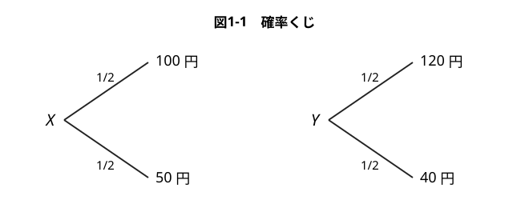
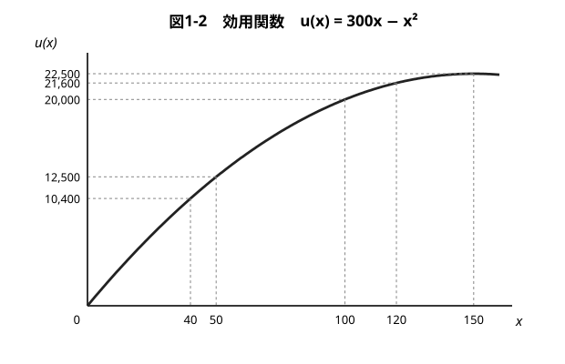
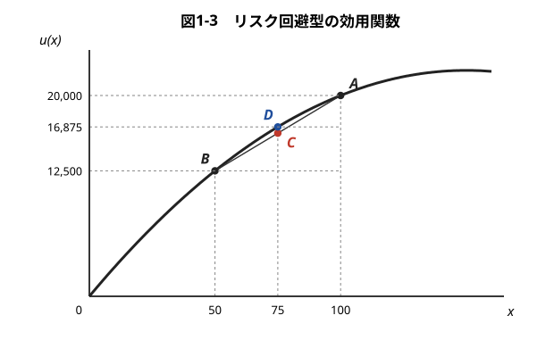
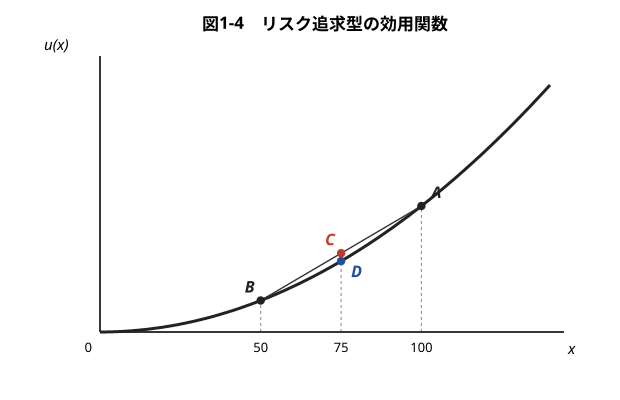
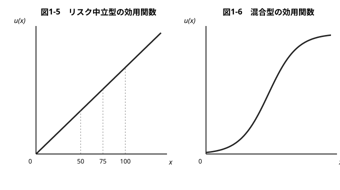
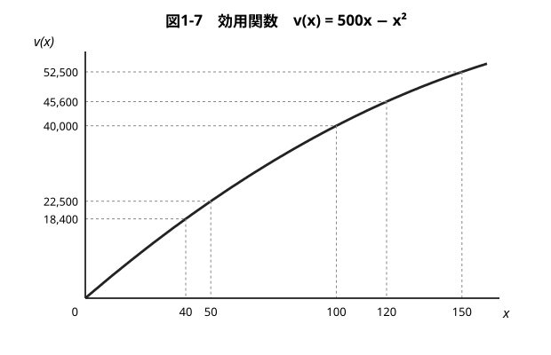
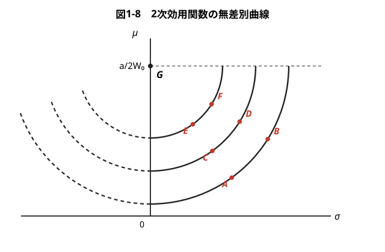
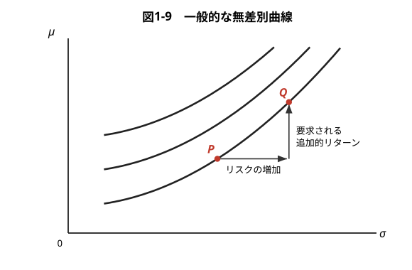
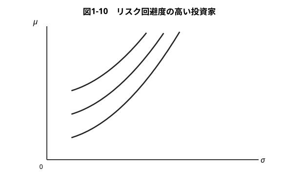

## 証券投資論 勉強会

### 第1章　投資家の選好

---

# はじめに

証券投資は，将来の不確実な結果を引き受ける行為である。同じ「有利さ」を持つ2つの投資案件があっても，リスクの大きさが違えば，投資家によって選ぶものが変わる。そうしたリスク選好の違いを表現する道具が**効用関数**であり，どちらを選ぶかを決める原理が**期待効用最大化原理**である。

本章では，まず確率くじ・効用関数・期待効用最大化原理を導入し，**リスク回避型／リスク追求型／リスク中立型**を区別する。次に，リスクを負担するコストを金額で測る**確実等価額**と**リスク・ディスカウント額**を定義し，それが効用関数の**曲率**（リスク回避度）で決まることを確かめる。最後に，第2章以降で使う**平均・分散アプローチ**が期待効用理論とどうつながるかを見る。

---

# 1.1.1 確率くじ

将来の不確実性は，確率分布や確率変数など，統計学の概念を用いてモデル化することができる。

次の株式投資を例に考えてみよう。将来，株価が確率 $1/2$ で100円，確率 $1/2$ で50円になるとする。この将来の株価を，確率変数 $X$ で表す。同様に，別の株式の株価 $Y$ が確率 $1/2$ で120円，確率 $1/2$ で40円になるとする。株価が上昇するときには $X<Y$，下落するときには $X>Y$ となる。両方の今日の株価は同じとする。

なお，$X$ や $Y$ をくじ引きになぞらえて**確率くじ**と呼ぶ。

---

> 現実感を持って本章を読み進めたいときには，金額を万円単位に読み換えてほしい。

---

# 1.1.2 期待値と分散

株価の散らばり（分散，あるいは標準偏差）が大きい $Y$ のほうが，**リスク**が大きい。一方で，$Y$ のほうが将来の価格の平均（期待値）も高い。実際にそれぞれの**期待値**と**標準偏差**を計算してみると
$$
E(X)=\tfrac12\times100+\tfrac12\times50=75,\qquad
E(Y)=\tfrac12\times120+\tfrac12\times40=80
$$
$$
\sigma(X)=\sqrt{\tfrac12(100-75)^2+\tfrac12(50-75)^2}=25,\qquad
\sigma(Y)=\sqrt{\tfrac12(120-80)^2+\tfrac12(40-80)^2}=40
$$

この計算によれば，$Y$ のほうが期待値が大きく，標準偏差も大きい。これを，**$Y$ が $X$ よりハイリスク・ハイリターンである**という。

---

# 1.1.3 効用関数

では，投資家はどちらの株式を購入するであろうか。答えは投資家によって異なるはずである。それは，個々の投資家の**リスク選好**に違いがあるためである。積極果敢にリスクをとりにいくことを好む投資家もいれば，できるだけリスクを避けたい投資家もいる。そうしたリスク選好の違いを表現するために，**効用関数**という概念を用いる。

経済学では，財を消費したときに得られる満足度を**効用**と呼び，$x$ 単位の財の消費から得られる効用を効用関数を使って $u(x)$ と表す。ただし，証券投資を扱う場合には，$x$ は衣食住など個別の財の数量ではなく，**消費や富の大きさ**を指す。

---

話を具体的に進めるために，効用関数が2次関数
$$
u(x)=300x-x^2
$$
で与えられると仮定してみよう。この効用関数を用いて考えると，株価が0になるときの効用は $u(0)=0$ であるが，株価が50円になれば $u(50)=12{,}500$，100円になれば $u(100)=20{,}000$，150円になれば $u(150)=22{,}500$ の効用が得られることになる。

---

---

# 1.1.4 効用関数の2つの性質

効用関数は次の2つの性質を満たすはずである。

**性質1（効用の単調性）**　消費や富の量が大きいほど，効用は大きい。

**性質2（限界効用の逓減）**　消費や富の量が大きくなるほど，追加的に得られる1円当たりの消費や富がもたらす効用の増分は小さくなる。

数学用語を用いると，性質1は関数 $u(x)$ が $x$ の**増加関数**であること，性質2は関数 $u(x)$ が**凹関数**であることを意味している。

---

$u(x)$ が増加関数であるとは，より多くの富を保有するほど満足度が大きくなることを意味する。この点に関して，2次関数を用いるときには，**関数が右下がりになる領域を除外して考える必要がある**。$u(x)=300x-x^2$ の形状は放物線で，$x=150$ から右側では曲線が右下がりになってしまう。したがって，この関数を用いる場合には $x\leqq150$ に限定しなければならない。

性質2を理解するには，学生が福引きで1万円の賞金を当てたときと，大金持ちが1万円の賞金を当てたときの喜びを比べてみればよい。また，空腹のときのリンゴ1個は大きな喜びになるが，2個目のリンゴのもたらす喜びは1個目のときほどは大きくない。経済学ではこれを「**限界効用の逓減**」と呼ぶ。

---

図1-2 の効用関数の場合，
$$
u(50)-u(0)=12{,}500,\quad u(100)-u(50)=7{,}500,\quad u(150)-u(100)=2{,}500
$$
である。つまり，同じ50円ずつの資産の増加でも，資産が0円から50円に増えるときには効用が12,500単位増加するのに対して，50円からスタートするときには7,500単位，100円からスタートするときには2,500単位しか増えない。

効用関数を凹関数と仮定すれば，右へ行くほど効用を表す曲線の傾き（1階の微分）が減少するので，このように限界効用が逓減することになる。

---

# 1.2.1 期待効用最大化原理の使い方

フォン・ノイマンとモルゲンシュテルンは，合理的な投資家は複数の投資案件からの選択にあたって**最大の期待効用をもたらす投資案件を選ぶ**ものであることを，いくつかの簡単な前提条件から導き出した。人間は効用の期待値を最大にすべく行動するという主張なので，これをフォン・ノイマン＝モルゲンシュテルンの**期待効用最大化原理**と呼ぶ（Von Neumann–Morgenstern [1944]）。

確率くじ $X$ のもたらす効用の期待値を計算すると
$$
E[u(X)]=\tfrac12u(100)+\tfrac12u(50)=\tfrac12\times20{,}000+\tfrac12\times12{,}500=16{,}250
$$
同様に確率くじ $Y$ がもたらす効用の期待値は
$$
E[u(Y)]=\tfrac12u(120)+\tfrac12u(40)=\tfrac12\times21{,}600+\tfrac12\times10{,}400=16{,}000
$$

つまりこの投資家にとって，**1番目の株式を保有することによって得られる期待効用のほうが大きい**。この場合，この投資家は1番目の株式を選択すべきということになる。

---

# 1.2.2 結果が確実なくじと結果が不確実なくじ

確率くじ $X$ の賞金額の期待値は $E(X)=75$ であった。この期待値に等しい金額が，確率1で確実に得られるくじの期待効用を計算しよう。このくじを $X_Z$ と呼ぶことにする。

$u(75)=300\times75-75^2=16{,}875$ であるから，くじ $X_Z$ がもたらす期待効用は
$$
E[u(X_Z)]=1\times u(75)=16{,}875
$$
である。$E[u(X)]=16{,}250$ であったので，$X$ と $X_Z$ を比べると，**$X_Z$ の期待効用のほうが大きくなる**。

確率くじ $Y$ についても，$E(Y)=80$ に等しい金額が確実にもらえるくじ $Y_Z$ の期待効用は $E[u(Y_Z)]=u(80)=17{,}600$ と計算される。一方 $E[u(Y)]=16{,}000$ なので，やはり $Y_Z$ の期待効用のほうが大きくなる。

---

# 1.3.1 リスク回避型の効用関数

一般に，$u(x)=300x-x^2$ のような効用関数を仮定して，ある確率くじと，その賞金の期待値が確率1で確実にもらえるくじを比較すると，**前者の期待効用のほうが必ず小さくなる**。このことは，投資家が（リターンが同じであれば）リスクを嫌がる性向を持つことを意味する。こうした結果になるのは，効用関数が性質2，すなわち「限界効用の逓減」を満たすためである。

図1-3 を見てみよう。$X=100$ のときの効用の大きさは A 点，$X=50$ のときの効用の大きさは B 点の高さで表されるので，効用の期待値 $E[u(X)]=0.5u(100)+0.5u(50)$ の大きさは，**A 点と B 点を結ぶ線分の中点 C の高さ**で与えられる。他方，賞金の期待値が確実にもらえるくじ $X_Z$ の効用は **D 点**の高さで与えられる。

---

図で D 点が C 点よりも上に来ているが，その理由は**効用関数が凹関数であるから**にほかならない。

---

以上を一般化すると，次のようになる。

**ジェンセンの不等式**：効用関数が性質2（限界効用の逓減，凹関数）を満たすかぎり，どのような確率くじ $X$ を考えても
$$
E[u(X)]\leqq u(E[X])
$$
が成り立つ。

左辺は確率くじ $X$ から得られる期待効用，右辺は賞金の期待値 $E(X)$ を確実にもらえるときの効用で，前者が後者よりも必ず小さく（または等しく）なる。

このため，図1-3 のような限界効用逓減型の効用関数を持つ投資家を**リスク回避型**という。

---

# 1.3.2 リスク追求型の効用関数

性質2とは逆に，効用関数が**凸関数**の場合を図1-4 に示した。この効用関数の下で，さきほどの確率くじ $X$ と $X_Z$ を比べると，$X$ の期待効用のほうが大きくなる。つまり，賞金の期待値 $E(X)$ を確実にもらえるときの効用 $u(E[X])$ よりも，確率くじ $X$ から得られる期待効用 $E[u(X)]$ のほうが必ず大きくなる。

期待値で考えれば必ず損することがわかり切っている**宝くじ**を人々がなぜ買うのかを説明するには，凸型の効用関数を考える必要がある。効用関数が凸関数で与えられれば，限界効用は**逓増**する。つまり，お金が入ってくるほどますます貪欲にお金を求めるようになる。

図1-4 のような限界効用逓増型の効用関数を持つ投資家を**リスク追求型**あるいは**ギャンブラー型**という。

---

> 関数 $u$ が凸関数のときは，ジェンセンの不等式の向きが逆になる。

---

# 1.3.3 リスク中立型、混合型の効用関数

図1-5 のように効用関数が右上がりの**直線**で表される投資家を**リスク中立型**という。リスク中立型の投資家にとっては賞金額の期待値の大きさがすべてで，投資結果のバラツキは，投資案件を評価するうえでプラス要因にもマイナス要因にもならない。

また，図1-6 のように，富が小さいときはギャンブラー型（凸型），富が大きくなるとリスク回避型（凹型）となるような効用関数（**混合型**と呼ばれる）を考えることもできる。

---

---

# 1.3.4 現代ポートフォリオ理論と効用関数

世間の多くの人々が宝くじに一攫千金の夢を託すのは事実であり，また，リスクの追求を自己目的にして人生を生きる人がいないでもない。しかしながら，たいていの場合，人生の重大な意思決定を行うときは，**何かの目的（リターン）を達成するためにリスクをとる**。

金融市場でも，リスクの高い金融商品をマーケットで販売しようとすれば，そのリスクを負担することの代償（**リスクプレミアム**）を買い手から求められる。つまり，マーケットで「ハイリスク・ハイリターン」の原則が成立していることを説明するには，**投資家が平均的にはリスク回避型の効用関数（凹関数）を持っている**と考える必要がある。

以上の理由で，宝くじやギャンブルの経済学ではなく，投資や金融市場の経済学を説く現代ポートフォリオ理論では，**効用関数は凹関数で，限界効用は逓減すると仮定する**ことになる。

---

# 1.3.5 行動ファイナンス

効用関数が凹関数かどうかを問う以前の問題として，現代ポートフォリオ理論では，**効用関数の存在を前提に**期待効用最大化原理を用いて企業や個人の行動を分析する。フォン・ノイマンとモルゲンシュテルンは，人間の行動が一定の**合理性**を満たしていることを前提にすると，効用関数が存在すること，および人間行動を期待効用最大化原理によって説明できることを，理論的に証明した。

しかし，実際の人間は，前提にした合理性の仮定に反する行動をとることもある。ファイナンスの分野でこの側面をクローズアップして期待効用理論の再検討を行うのが，**行動ファイナンス**である。行動ファイナンスの研究は近年大変盛んに行われている。

残念ながら，期待効用理論に置き換わるほどの一般性のある理論はまだそこから生まれてきていないが，行動ファイナンスの研究に，投資家の自己反省も含めて，多くの示唆を見いだすことは可能である。本書では，期待効用最大化原理とリスク回避型の効用関数を用いて，現代ポートフォリオ理論とそれに基づく投資理論を解説していく。

---

# 1.4.1 確実等価額

確率くじ $X$ の期待効用は16,250効用単位，$X$ の賞金額の期待値を確実にもらえるくじ $X_Z$ の効用は16,875効用単位であった。つまり，確率くじ $X$ よりも賞金額が確定した $X_Z$ のほうが投資家に高い期待効用をもたらした。それでは，**いくらの賞金額を確実に保証すれば，確率くじ $X$ の期待効用と等しくなる**のであろうか。

この答えを見つけるには，$E[u(X)]=16{,}250=u(\hat X)$ を満たす $\hat X$ を求めればよい。効用関数が与えられているので，答えは
$$
u(\hat X)=300\hat X-{\hat X}^2=16{,}250
$$
の根を求めて，$\hat X\simeq70.94$ となる。

**確実等価額**：一般に，確率くじ $X$ が与えられたとき，$u(\hat X)=E[u(X)]$ を満たす $\hat X$ を確率くじ $X$ の**確実等価額**（certainty equivalent）と呼ぶ。

---

# 1.4.2 確率くじの売り値

確率くじ $X$ の確実等価額が70.94円であることを次のように説明することもできる。効用関数を持つ投資家が確率くじ $X$ を持っているとしよう。確率くじ $X$ を所有することによって，投資家は16,250単位の期待効用を得ている。

もし，誰かがこの投資家から確率くじ $X$ の譲渡を受けたいと思えば，**16,250効用単位以上の効用を投資家にもたらす金額**を対価として支払う必要がある。その金額がいくらになるかを計算すれば70.94円となる。

このように，確実等価額 $\hat X$ は確率くじ $X$ の**売り値**（selling price）と解釈することができる。

---

# 1.4.3 リスク・ディスカウント額

**リスク・ディスカウント額**：確率くじ $X$ の賞金の期待値 $E(X)$ と確実等価額 $\hat X$ の差
$$
\text{リスク・ディスカウント額}\equiv E(X)-\hat X
$$

いまの場合，リスク・ディスカウント額は $75-70.94=4.06$ 円である。確率くじ $X$ の売り値は賞金額の期待値 $E(X)$ よりも安い。この差額は，**確率くじのリスクに見合う分だけ投資家が売り値を値引きしている**と考えることができる。

> 金融商品のリスクは金融商品の価格にディスカウント（割り引き）をもたらす。一方で，価格と投資収益率は反比例の関係にあるから，投資収益率（リターン）で考えればリスクは投資収益率に**プレミアム**（上乗せ）をもたらす。本書では混同を避けるために，価格の差で定義されるものは**リスク・ディスカウント額**と呼ぶことにする。

---

# 1.4.4 確率くじ Y の場合

同様に，確率くじ $Y$ について，確実等価額とリスク・ディスカウント額を計算してみよう。確率くじ $Y$ の期待効用は16,000効用単位であった。これと同じ効用を得るには
$$
u(\hat Y)=300\hat Y-{\hat Y}^2=16{,}000
$$
を満たす $\hat Y$ に相当する賞金が必要である。答えは $\hat Y\simeq69.38$ 円となる。また，リスク・ディスカウント額は
$$
80-69.38=10.62\ \text{円}
$$
である。

---

# 1.4.5 確率くじ X と Y のポートフォリオの場合

1節で計算したように，確率くじ $Y$ は確率くじ $X$ と比べてハイリスク・ハイリターンであった。実際，$Y$ の標準偏差が大きいため，$Y$ のリスク・ディスカウント額（10.62円）が $X$ のリスク・ディスカウント額（4.06円）を大きく上回った。

賞金額の期待値で比べると $Y$ のほうが $X$ よりも5円大きいのであるが，**リスク・ディスカウント額の格差が強く影響して $Y$ の期待効用が $X$ を下回る結果になった**。

---

**計算例1.1**　確率くじ $X$，$Y$ の結果が1つのコインの表裏で決まるとする。つまり，コインが表になれば $X=100/Y=120$ で，コインが裏になれば $X=50/Y=40$ である。いま，確率くじ $X$，$Y$ に $1/2$ 単位ずつ投資するとする。

両方の確率くじに $1/2$ 単位ずつ投資すると
$$
\text{確率 }1/2\text{ で }\tfrac12\times100+\tfrac12\times120=110\ \text{円},\qquad
\text{確率 }1/2\text{ で }\tfrac12\times50+\tfrac12\times40=45\ \text{円}
$$
の賞金が得られることになる。したがって，期待効用は
$$
\tfrac12u(110)+\tfrac12u(45)=\tfrac12\times20{,}900+\tfrac12\times11{,}475=16{,}187.5
$$

---

確実等価額は $u(Z)=300Z-Z^2=16{,}187.5$ を解いて $Z\simeq70.55$ 円となる。また，賞金額の期待値は
$$
\tfrac12\times110+\tfrac12\times45=77.5\ \text{円}
$$
であるので，リスク・ディスカウント額は
$$
77.5-70.55=6.95\ \text{円}
$$
となる。

この例では，2つの確率くじに $1/2$ 単位ずつ投資するという形でリスクを分散した結果，**確率くじ $Y$ に1単位投資するよりもリスク・ディスカウント額が大きく低下した**（10.62円 → 6.95円）。

---

# 1.5.1 湾曲の小さい効用関数

リスク・ディスカウント額は，効用関数の**湾曲が大きい**と大きな数値になる。次に，これを例で確認しよう。

$u(x)=300x-x^2$ の代わりに，効用関数
$$
v(x)=500x-x^2
$$
を考えてみる。この効用関数は図1-2 の効用関数に比べてずっと**直線に近い**。直線に近ければ，リスク中立的な投資家の効用関数に近いことになるので，リスクを負担するコスト，すなわちリスク・ディスカウント額が小さくなるはずである。

この効用関数を持つ投資家を想定すれば，確率くじ $X$ と $Y$ の順位が逆転して，ハイリスク・ハイリターンの $Y$ のほうがよりよい選択肢になるかもしれない。これを調べてみよう。

---

---

効用関数 $v$ を用いて，確率くじ $X$ と $Y$ の期待効用を計算すると
$$
E[v(X)]=\tfrac12v(100)+\tfrac12v(50)=\tfrac12\times40{,}000+\tfrac12\times22{,}500=31{,}250
$$
$$
E[v(Y)]=\tfrac12v(120)+\tfrac12v(40)=\tfrac12\times45{,}600+\tfrac12\times18{,}400=32{,}000
$$

となる。予想した通り，$u$ を持つ投資家とは反対に，**$v$ を持つ投資家は確率くじ $X$ よりも確率くじ $Y$ を好む**ことがわかった。

---

この効用関数を仮定して，確実等価額とリスク・ディスカウント額も計算してみよう。
$$
v(\hat X)=500\hat X-{\hat X}^2=31{,}250\ \Rightarrow\ \hat X\simeq73.22,\qquad
v(\hat Y)=500\hat Y-{\hat Y}^2=32{,}000\ \Rightarrow\ \hat Y\simeq75.36
$$

これより，リスク・ディスカウント額は
$$
E(X)-\hat X=75-73.22=1.78,\qquad E(Y)-\hat Y=80-75.36=4.64
$$
と計算される。効用関数 $u$ の下で計算されたリスク・ディスカウント額は $X$ について4.06円，$Y$ について10.62円であったので，**リスク・ディスカウント額はどちらの確率くじについても大きく低下した**ことがわかる。

---

# 1.5.2 効用関数の曲率とリスク回避度

以上で，効用関数の湾曲の大きさが投資案件の選択に重要な役割を演じることがわかった。関数の湾曲の大きさを**曲率**という。一般に関数 $u(x)$ の $x$ における曲率は $|u''(x)/u'(x)|$ の大きさで表される。

**リスク回避度**：
$$
A_u(x)\equiv-\frac{u''(x)}{u'(x)}
$$
を，資産額 $x$ における投資家 $u$ の**リスク回避度**と呼ぶ。

効用関数 $u(x)$ はリスク回避型，つまり $u''(x)<0$ と仮定しているので，$u''/u'$ の符号を逆転させるようにマイナス符号を加えて定義を与えている。これによってリスク回避度は正の数値になる。

---

効用関数が $u(x)=300x-x^2$ の場合は
$$
A_u(x)=-\frac{u''(x)}{u'(x)}=-\frac{-2}{300-2x}=\frac{1}{150-x}
$$
効用関数が $v(x)=500x-x^2$ の場合は
$$
A_v(x)=-\frac{v''(x)}{v'(x)}=-\frac{-2}{500-2x}=\frac{1}{250-x}
$$
となる。$0\leqq x<150$ の範囲では，明らかに $A_u(x)>A_v(x)$ である。すなわち，**$u$ を持つ投資家のほうが $v$ を持つ投資家よりもリスク回避的である**。

なお，リスク回避度の逆数 $1/A_u(x)$ は**リスク許容度**と呼ばれる。

> $A_u(x)$ で定義されるリスク回避度を**絶対的リスク回避度**と呼ぶ。これに対して $R_u(x)\equiv-xu''(x)/u'(x)$ で定義されるリスク回避度を**相対的リスク回避度**と呼ぶ。

---

# 1.5.3 リスク・ディスカウント額の近似公式

以上の考察で，リスク・ディスカウント額は，確率くじの賞金額の標準偏差が大きいほど，また投資家のリスク回避度が高いほど，大きくなることを確認した。この関係を与える便利な公式が次である。

**リスク・ディスカウント額の近似公式**：効用関数 $u(x)$ のリスク回避度関数を $A_u(x)$，確率くじ $X$ の期待値を $\mu_X$，分散を ${\sigma_X}^2$ とすると
$$
E(X)-\hat X\simeq\frac12A_u(\mu_X)\,{\sigma_X}^2
$$

この式によれば，リスク・ディスカウント額は**賞金額の分散 ${\sigma_X}^2$ と投資家のリスク回避度 $A_u(\mu_X)$ の掛け算の半分**にほぼ等しい。なお，賞金額の分散が小さいほどこの近似は正確になる。

---

# 1.6.1 効用のゼロ点

ものの長さの単位であるメートルの基準は，メートル原器や光速度によって決められている。質量の単位であるキログラムは水の質量を基準にしている。では，**効用の単位とその基準は何**であろうか。

実は，フォン・ノイマンとモルゲンシュテルンが定義した効用には，**絶対的な基準点がない**。つまり，効用ゼロの点を定める基準がない。したがって，効用の数値の大小で個人間の効用の大きさを比較しても意味がない。

---

例えば確率くじ $X$ は，$u$ を持つ投資家に $E[u(X)]=16{,}250$ の期待効用をもたらし，$v$ を持つ投資家には $E[v(X)]=31{,}250$ の期待効用をもたらした。しかし，確率くじ $X$ は後者の投資家に対して前者の投資家の2倍の期待効用をもたらすという主張は**意味を持たない**。

別のいい方をすると，効用の単位はゼロ点を自由に動かすことができる。すなわち $v(x)=u(x)+a$ によって効用の単位を $a$ だけ上下にずらしてもさしつかえない。

---

# 1.6.2 効用数値の伸縮

効用の数値を伸び縮みさせることも自由である。つまり
$$
w(x)=b\,v(x)\quad(\text{ただし }b>0)
$$
によって効用の1単位を $b$ 倍に伸縮させることもできる。このとき，$u$ と $w$ の関係は
$$
w=bu+ab
$$
となっている。これを，数学の用語では「**効用は正の1次変換に関して不変である**」と表現する。

これは，温度の単位を摂氏から華氏に変換することと考えればよい。摂氏の0度は華氏の32度に，摂氏の100度は華氏の212度に相当するが，$u$ を摂氏で表示した温度，$w$ を華氏で表示した温度とすると，両者の関係は $w=1.8\times u+32$ で表される。

---

# 1.6.3 限界効用の逓減

効用の数値を個人間で比較することには意味がないが，**特定の個人について**，1個目のリンゴがもたらす効用の大きさと2個目のリンゴがもたらす効用の大きさの比較には意味がある。

つまり，効用関数 $u(x)$ で限界効用が逓減するときは，正の1次変換で変換された効用関数 $w(x)$ でも限界効用は逓減する。

---

# 1.6.4 リスク回避度などの個人間比較

効用関数から導かれる**リスク回避度・確実等価額・リスク・ディスカウント額**は，個人間比較に使えるだろうか。投資家のリスク回避度は効用関数の曲率で測ることができた。効用関数 $u(x)$ と $w(x)$ の間に $w=bu+ab$ の関係があるときは
$$
w'(x)=b\,u'(x),\qquad w''(x)=b\,u''(x)
$$
となるので
$$
A_w(x)=A_u(x)
$$
が成立する。すなわち，**リスク回避度は効用単位の変換には左右されない**。

また，確率くじ $X$ と確実等価額 $\hat X$ の間には $E[u(X)]=u(\hat X)$ が成立するが，このとき $E[w(X)]=w(\hat X)$ も成立するので，**確実等価額やリスク・ディスカウント額も効用単位の変換には左右されない**。

---

効用の数値そのもので個人の効用を比較することは意味を持たないが，効用関数から導かれる**リスク回避度，確実等価額，ならびにリスク・ディスカウント額の大きさが，個人間のリスク選好を比較するための客観的な指標となる**。

フォン・ノイマンとモルゲンシュテルンの効用関数と効用数値は，このように，長さや質量などの物理的な単位とは少し異なる性質を持っていることに注意してほしい。

---

# 1.7.1 効用関数に用いられる関数

効用関数は，原理的には，性質1（単調性）を満たすかぎりどのような形状でもかまわない。その具体的な形状を投資家に質問を繰り返すことによって定めるための手法も考案されているが，こうした実験的な手法が実際にそのままの形で用いられることは少ない。多くの場合，**特定の関数を仮定して，関数に含まれるパラメータを投資家に合わせて決める**という方法がとられる。

**ファイナンス理論でよく用いられる効用関数**
$$
\text{2次関数：}\ u(x)=ax-x^2\ \bigl(x\leqq\tfrac{a}{2}\bigr),\qquad
\text{指数関数：}\ u(x)=1-\exp(-cx)\ (c>0)
$$
$$
\text{べき乗関数：}\ u(x)=\tfrac{1}{1-\gamma}x^{1-\gamma}\ (\gamma>0,\ \gamma\neq1),\qquad
\text{対数関数：}\ u(x)=\ln(x)
$$

2次関数の場合は，前に述べたように，$x$ の範囲を $x\leqq a/2$ に限定して，曲線が右下がりになる範囲を除外する。

---

それぞれの関数について，リスク回避度関数 $A_u(x)=-u''(x)/u'(x)$ を計算すると，以下の通りになる。

| 効用関数 | リスク回避度 $A_u(x)$ |
|---|---|
| 2次関数 | $\dfrac{1}{a/2-x}$ |
| 指数関数 | $c$ |
| べき乗関数 | $\dfrac{\gamma}{x}$ |
| 対数関数 | $\dfrac{1}{x}$ |

---

**指数関数**の場合は，パラメータ $c$ がリスク回避度を表すことになり，その値は**資産額 $x$ の水準に依存しない**。したがって，リスク回避型の投資家をモデル化する場合は $c>0$ と仮定すればよい。

**べき乗関数**の場合はパラメータ $\gamma$ がリスク回避度を表す。また，べき乗関数と対数関数のリスク回避度関数の比較からわかるように，**べき乗関数で $\gamma=1$ の場合が対数関数に相当する**。

これらの効用関数は，正の1次変換の範囲で効用単位を変換しても同じ投資家のリスク選好を表すことになる。すなわち，$u(x)$ に正の定数を掛けたり，任意の正の定数を足したり引いたりしても，効用関数の性質は変わらない。

> べき乗効用関数の**相対的**リスク回避度は資産額 $x$ の水準によらず一定値 $\gamma$ になる。また，対数効用関数の相対的リスク回避度は1である。

---

# 1.8.1 2次効用関数と無差別曲線

フォン・ノイマンとモルゲンシュテルンの期待効用理論は，かなり多様な投資家行動を包含する。一方，ハリー・マーコビッツに始まるポートフォリオ理論では，**平均・分散アプローチ**という，より単純な投資家行動の仮定をベースに理論が作られている。ここでは，第2章・第3章での学習に備えて，平均・分散アプローチと期待効用理論を関連づけておきたい。

効用関数が2次関数 $u(x)=ax-x^2$ であるとしよう。今日の資産額を $W_0$，将来の時点1で実現する資産額を $W_1$ とし，この間の資産の増価率を $R$ で表すと $W_1=RW_0$ となる。$W_0$ は確定した値であるが，$R$ の値は今日は不確定なので，$R$ と $W_1$ は今日から見れば確率変数である。

---

投資家の期待効用は
$$
E[u(W_1)]=E[aW_1-{W_1}^2]=aW_0E(R)-{W_0}^2E(R^2)
$$
となる。ここで $E(R)=\mu$，$\sigma(R)=\sigma$ と表すと $E(R^2)=\sigma^2+\mu^2$ が成り立つので
$$
E[u(W_1)]=aW_0\mu-{W_0}^2(\sigma^2+\mu^2)
=-\Bigl(W_0\mu-\frac{a}{2}\Bigr)^2-{W_0}^2\sigma^2+\frac{a^2}{4}
$$
となる。

この式は，期待効用が投資の期待リターン $\mu$ と標準偏差 $\sigma$ にどのように依存するかを示している。$a$ と $W_0$ は与えられた定数であるから，**期待効用を一定にする $\mu$ と $\sigma$ の組み合わせ**を描くことができる。個々の曲線を**無差別曲線**と呼ぶ。

---

---

図の点線が示すように，これらの無差別曲線は**同心円の一部分**となっている。$W_1\leqq a/2$ の制約より $R\leqq a/2W_0$ となるので，曲線が有効なのは $\mu\leqq a/2W_0$ の範囲に限定される。また $\sigma\geqq0$ なので，図の第1象限の部分だけが関係する。

**円の中心点 G が期待効用最大の点**になっている。そして，中心から離れた位置にある無差別曲線ほど期待効用の水準は低くなる。図の A〜F 点の間では，E 点と F 点の期待効用が最も大きく，C 点と D 点がその次，A 点と B 点の期待効用が最小となる。

期待効用の水準は，図を**下から上に移動するほど増大**する。これは，$\sigma$ を一定にすれば $\mu$ が大きいほど投資家の期待効用が増大することを意味している。また，**左から右へ移動するほど期待効用の水準が低下**する。これは，$\mu$ を一定にすれば $\sigma$ が大きくなるほど投資家の期待効用が低下することを意味する。2次効用関数は凹関数であり，リスク回避型の投資家の効用を表すので，これは当然の結果である。

---

# 1.8.2 無差別曲線の一般的な形状

一般の効用関数の場合でも，$(\mu,\sigma)$ 平面上の無差別曲線は図1-8 と同じような形状となる。

P 点と Q 点は同一の無差別曲線上にあるが，P 点よりも Q 点のほうが標準偏差（リスク）が大きい。つまり，P 点から Q 点に移動すると，リスクが増加する。このとき，**Q 点の期待効用を P 点と同じ水準に保つためには，このリスクの差を相殺するように Q 点の期待リターンを P 点よりも大きくしなければならない**。このことから，リスク回避型の投資家の無差別曲線は**右上がり**でなければならないことがわかる。

---

---

無差別曲線の傾きは，**リスクの増加に対する対価として投資家がどれだけリターンを追加的に要求するか**を示している。この傾斜が急な無差別曲線を持つ投資家ほど，リスク回避度が高い投資家ということができる。

また，無差別曲線は通常，**下から見て凸の曲線**と仮定される。これは，リスク1単位を追加的に負担する対価が，リスクが大きくなるほどより増大すると考えられるからである。

---

# 1.8.3 平均・分散アプローチと期待効用理論

2次の効用関数以外の場合にも，平均・分散アプローチと期待効用理論は整合的といえるであろうか。

**将来の資産額の確率分布を正規分布と仮定できる場合には，答えはイエスである。**

これは，確率分布が正規分布ならば，効用関数がどんな関数であっても，期待効用を**リターンの平均と分散だけで表すことができる**からである。

しかし，逆にいえば，正規分布以外の確率分布を仮定する場合には，期待効用は平均・分散だけでなく，より**高次のモーメント**にも依存するようになる。リターンの分布が左右対称でない場合には**歪度**が，分布の裾が極端に厚い場合には**尖度**が期待効用に影響するようになる。こうした影響をきちんと分析するためには，平均・分散アプローチではなく期待効用理論を使う必要があるが，これは本書の範囲を超えるテーマである。