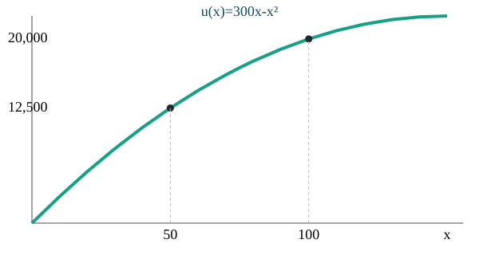
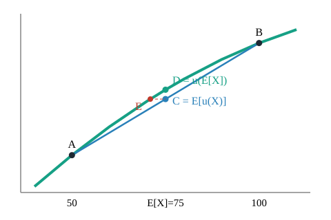
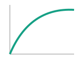
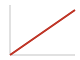
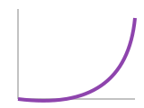
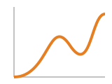
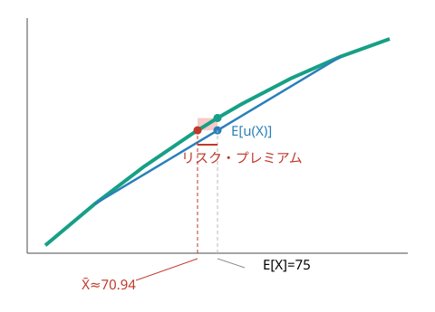
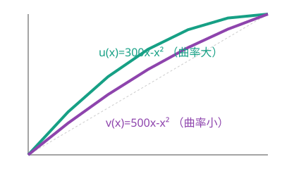
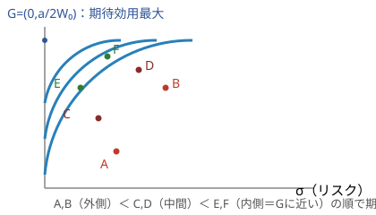

## 金融工学 勉強会

### 第1章　投資家の選好

---

# 本日の内容

1. リスクと効用関数
2. 期待効用最大化原理
3. 効用関数とリスク回避
4. 確実等価額とリスク・ディスカウント額
5. 効用関数の曲率とリスク回避度
6. 効用の単位
7. 効用関数に用いられる関数
8. 平均・分散アプローチと期待効用理論

底本：『新・証券投資論 I 理論篇』（日本証券アナリスト協会 編，小林孝雄・芹田敏夫 著，日本経済新聞出版社，2009）第1章

---

投資とは「不確実な将来の富」の中からどれを選ぶかという行為。結果が確率的にしか決まらない以上，まず不確実な結果に**順序をつける**枠組みと，その順序を**数値化**する道具が必要になる。これが**効用関数**と**期待効用理論**である。

---

# 投資＝「くじ」を選ぶこと

Part 1：リスクと効用関数

将来は不確実なので，投資の結果は**確率変数**として扱う。例えば，株価が確率1/2で100円，確率1/2で50円になる株式を考え，これを確率変数 $X$ とする。別の株式 $Y$ は確率1/2で120円，確率1/2で40円になるとする（今日の株価はどちらも同じとする）。

  

    
X

    
1/2→100円

    
1/2→50円

  

  

    
Y

    
1/2→120円

    
1/2→40円

  

上がるときは $Y$ の方が高く（120>100），下がるときは $X$ の方がまだマシ（50>40）。$X,Y$ のような「確率○％で結果がいくらになる」という将来の値を，くじ引きになぞらえて**確率くじ**と呼ぶ。この章を通じて $X,Y$ を共通の例として使う。

---

# リターンとリスクを数値にする

$Y$ は株価の散らばりが大きく，その意味でリスクが大きい。ただし$Y$の方が将来の株価の平均（期待値）も高い。実際に計算して確かめよう。

$$
\mathbb{E}[X]=\tfrac12{\cdot}100+\tfrac12{\cdot}50=75,\qquad
\mathbb{E}[Y]=\tfrac12{\cdot}120+\tfrac12{\cdot}40=80
$$

$$
\sigma(X)=\sqrt{\tfrac12(100-75)^2+\tfrac12(50-75)^2}=25,\qquad
\sigma(Y)=\sqrt{\tfrac12(120-80)^2+\tfrac12(40-80)^2}=40
$$

（一般に $\mathbb{E}[X]=\sum_i x_ip_i$，分散 $=\mathbb{E}[(X-\mathbb{E}[X])^2]$，標準偏差 $\sigma(X)=\sqrt{\text{分散}}$）

Yの方が期待値が大きく，標準偏差も大きい——これをYはXよりハイリスク・ハイリターンであるという

---

# 効用関数とは

**定義：効用関数**

投資家が富 $x$ を得たときの満足度を**効用**といい，$u(x)$ と書く。

- 効用は「点数」のようなもの。**絶対値に意味はなく，大小関係だけが意味を持つ**（第6節で詳しく）
- 本章を通じて具体例として
$$
u(x) = 300x - x^2 \qquad (0 \leqq x \leqq 150)
$$
を使う（$x=150$ を超えると減少するため，富の範囲をここに限定）

---

# 効用関数 $u(x) = 300x - x^2$

$u(0)=0,\ u(50)=12{,}500,\ u(100)=20{,}000,\ u(150)=22{,}500$

---

# 効用関数が満たすべき2つの性質

**性質1：単調性**　富が大きいほど効用も大きい（$u$ は増加関数）

**性質2：限界効用の逓減**　富が大きくなるほど，追加1円がもたらす満足度の増分は小さくなる（$u$ は凹関数）

身近な例：福引で1万円当たった学生の喜び ≫ お金持ちが1万円もらった喜び。
空腹時のリンゴ1個目は嬉しいが，2個目はそれほどでもない。
実際 u(50)-u(0)=12,500，u(100)-u(50)=7,500，u(150)-u(100)=2,500 と，同じ50の増分でも効用の増分は小さくなっている。

---

# 補足：なぜ期待値だけでは投資判断できないか

素朴な「期待金額最大化」がなぜ破綻するか，という動機づけの一例（教科書の展開ではなく，発想を掴むための補足）。

**サンクトペテルブルクのパラドックス（1738）**：コインを表が出るまで投げ，$k$回目に初めて表が出たら $2^k$円もらえるくじ。賞金の期待値は $\sum_{k=1}^\infty 2^{-k}\cdot2^k=\infty$ と無限大だが，このくじに大金を払う人はいない。

Bernoulliの提案：金額そのものではなく，その**効用の期待値**で評価すべき。例えば $u(x)=\log_2 x$ なら期待効用は $\sum_{k=1}^\infty 2^{-k}\log_2(2^k)=2$ と有限に収束する。「いくら儲かるか」ではなく「どれだけ満足するか」を最大化する，という発想が期待効用理論の出発点。

---

# 期待効用最大化原理

Part 2：期待効用最大化原理

合理的な投資家は，複数の選択肢のうち**期待効用**が最大のものを選ぶ。

$u(x)=300x-x^2$ のもとで，くじ $X,Y$ の期待効用を計算すると

$$
\mathbb{E}[u(X)] = \tfrac12 u(100) + \tfrac12 u(50) = \tfrac12(20{,}000+12{,}500) = \mathbf{16{,}250}
$$
$$
\mathbb{E}[u(Y)] = \tfrac12 u(120) + \tfrac12 u(40) = \tfrac12(21{,}600+10{,}400) = \mathbf{16{,}000}
$$

期待リターンは Y の方が高いのに，投資家は X を選ぶ

$Y$ のリスクの高さが，効用の観点では割に合わない，ということ。

---

# 「確実」であることには価値がある

$X$ の期待値 $\mathbb{E}[X]=75$ を**確実に**もらえるくじ $\tilde X$ と比較すると

$$
u(75) = 300\cdot75-75^2 = \mathbf{16{,}875} \; > \; 16{,}250 = \mathbb{E}[u(X)]
$$

- 期待値が同じ75でも，**リスクなしの $\tilde X$ の方が好まれる**
- $Y$ についても同様に $u(80)=17{,}600 > 16{,}000=\mathbb{E}[u(Y)]$

> **注意：経済学的な意味**
>
> これは「リスクを嫌う」投資家の姿そのもの。次のPartで，これが効用関数の**凹さ**から生じることを図で確認する。

---

# なぜ確実な方が好まれるのか：凹関数の幾何学

Part 3：効用関数とリスク回避

弦 $AB$ の中点 $C$（＝期待効用）は，曲線上の点 $D$（＝確実にもらう効用）より**必ず下**にある。この直感は特定のくじに限らず一般に成り立つ。

---

# Jensenの不等式

**命題（Jensenの不等式）**

$u$ が限界効用逓減（凹関数）を満たす限り，どんな確率くじ$X$についても
$$
\mathbb{E}[u(X)] \leqq u(\mathbb{E}[X])
$$

左辺は確率くじ$X$そのものから得られる期待効用，右辺は賞金の期待値$\mathbb{E}[X]$を確実にもらえるときの効用。前者が後者を超えることはない——これが「凹関数 ⇔ リスク回避」の一般的な根拠になる。

---

# リスク回避・中立・追求の3タイプ

**定義：リスク態度**

くじ $X$ について
- $u(\mathbb{E}[X]) \geqq \mathbb{E}[u(X)]$ → **リスク回避型**（凹）
- $u(\mathbb{E}[X]) = \mathbb{E}[u(X)]$ → **リスク中立型**（直線）
- $u(\mathbb{E}[X]) \leqq \mathbb{E}[u(X)]$ → **リスク追求型**（凸）

回避型（凹）

中立型（直線）

追求型（凸）

混合型（S字）

---

# 現代ポートフォリオ理論と効用関数

現代ポートフォリオ理論（次章以降）は，投資家が**リスク回避型**であることを前提に組み立てられている。

- リスク回避型でなければ，「ハイリスク・ハイリターン」という市場の大原則自体が成り立たない
- リスクの高い証券を買ってもらうには，その対価（リスクプレミアム）を積む必要がある——これはリスクを嫌う投資家がいて初めて意味を持つ
- 市場が平均的にリスク回避型の投資家から構成されている，というのが以後の章の暗黙の前提になる

---

# 行動ファイナンス入門

現実の人間は，常にリスク回避型として振る舞うわけではない。

- 宝くじを買う（リスク追求的）一方で保険にも入る（リスク回避的）——**混合型（S字型）効用**で説明されることがある
- 期待効用理論そのものが破れる系統的な現象（次のPartのvNM公理の破れなど）も知られている
- こうした「人間は必ずしも合理的でない」という観察を正面から扱うのが**行動ファイナンス**

---

# 補足：vNM公理と効用理論の基礎づけ

「期待値の効用で比較してよい」というのは天下りのルールではなく，もっともらしい選好の公理から導ける定理（von Neumann–Morgenstern, 1944）。

> **注意：選好が満たすべき自然な性質**
>
> - **完備性**：どんな2つのくじでも必ずどちらかを好める
> - **推移性**：$A$ が $B$ より好き，$B$ が $C$ より好き，なら $A$ は $C$ より好き
> - **連続性**：好みは確率のわずかな変化で急に逆転しない
> - **独立性**：2つのくじに同じ「おまけ」を同じ割合で混ぜても優劣は変わらない

これらを満たす選好は，ある効用関数の期待値として表現できる（逆も成立）。

教科書自身は本文でこの4条件を列挙しておらず，「合理性の詳細は上級テキストを参照」として意図的に範囲外としている。ここでは発想の背景として簡単に触れるにとどめる。

---

# 補足：アレのパラドックス

現実の人間は，先の4条件のうち特に**独立性**を系統的に破ることが知られている。

**アレのパラドックス（Allais, 1953）**：多くの人は「確実な100円」（問題1）を選ぶ一方，問題2ではより手厚い方を選ぶ。理論上は矛盾（独立性公理からは同じ選び方をするはず）。

→ これを説明しようとするのが行動ファイナンスの出発点の一つ。

---

# 確実等価額（certainty equivalent）

Part 4：確実等価額とリスク・ディスカウント額

**定義：確実等価額・リスク・ディスカウント額**

くじ $X$ と同じ期待効用を確実にもたらす金額 $\bar X$ を
$$
u(\bar X) = \mathbb{E}[u(X)]
$$
で定め，**確実等価額**という。差 $\mathbb{E}[X]-\bar X$ を**リスク・ディスカウント額**という。

**経済的な意味**：$\bar X$ はそのくじを手放してもよいと思う**最低の売り値**であり，買ってもよいと思う**最高の買い値**。投資家が「リスクを織り込んで」くじに付ける主観的な値段。

---

# リスクプレミアムの図解

期待効用の高さ $C$ から水平線を引き曲線と交わる点が $\bar X$。$\mathbb{E}[X]$ との差がリスク・ディスカウント額。

---

# 数値例：$X$ と $Y$ の確実等価額

$u(x)=300x-x^2$ のもとで $u(\bar X)=16{,}250$ を解くと

$$
\bar X = 150-\sqrt{150^2-16{,}250} \approx \mathbf{70.94}
\qquad\Rightarrow\qquad
\mathbb{E}[X]-\bar X = 75-70.94 = \mathbf{4.06}
$$

同様に $Y$ について

$$
\bar Y \approx \mathbf{69.38}
\qquad\Rightarrow\qquad
\mathbb{E}[Y]-\bar Y = 80-69.38 = \mathbf{10.62}
$$

リスクが大きい Y の方が，リスク・ディスカウント額も大きい

---

# 分散投資でリスク・ディスカウント額は下がる

**計算例**：$X$と$Y$の結果が1つのコインの表裏で決まるとする（表なら$X=100,Y=120$／裏なら$X=50,Y=40$）。$X,Y$に半分ずつ投資した合成くじ $Z$（表：$\tfrac12{\cdot}100+\tfrac12{\cdot}120=110$円／裏：$\tfrac12{\cdot}50+\tfrac12{\cdot}40=45$円）を考える。

|  | $\mathbb{E}[\cdot]$ | 確実等価額 | リスク・ディスカウント額 |
|---|---|---|---|
| $Y$（単独） | 80 | 69.38 | 10.62 |
| $Z$（$X,Y$ 半分ずつ） | 77.5 | 70.55 | **6.95** |

2つのくじに半分ずつ投資してリスクを分散した結果，Yに単独で投資するよりもリスク・ディスカウント額が大きく下がった（10.62→6.95）

これが分散投資の力——次章「ポートフォリオ理論」で，この効果を定量的に扱う。

---

# リスク回避の強さ＝曲線の「曲がり具合」

Part 5：効用関数の曲率とリスク回避度

リスク・ディスカウント額は，効用関数の湾曲が大きいほど大きくなるはずである。$u(x)=300x-x^2$ の代わりに，より直線に近い $v(x)=500x-x^2$ を考えてみよう。直線に近ければリスク中立に近づくので，ディスカウント額が小さくなり，ハイリスク・ハイリターンの$Y$の方が$X$より好まれる方向に**逆転するかもしれない**。確かめてみよう。

| 効用関数 | $X$ のプレミアム | $Y$ のプレミアム |
|---|---|---|
| $u(x)=300x-x^2$（曲がり大） | 4.06 | 10.62 |
| $v(x)=500x-x^2$（曲がり小） | 1.78 | 4.64 |

予想通り，vのもとでは E[v(Y)]>E[v(X)] となり好みが逆転する（Yが選ばれる）

「曲がりが緩い」＝「よりリスク中立に近い」投資家。この曲がり具合こそがリスク回避の強さを定量化する鍵になる。

---

# 曲率からリスク回避度へ

一般に，関数 $u(x)$ の $x$ における**曲率**は $|u''(x)/u'(x)|$ の大きさで表される。$u$ はリスク回避型（$u''<0$）なので，符号を反転させて正の値になるようにしたものを**リスク回避度**と呼ぶ。

**定義：Arrow–Prattの（絶対的）リスク回避度**

$$
A_u(x) := -\frac{u''(x)}{u'(x)}
$$

（$1/A_u(x)$ を**リスク許容度**という）

**1階微分で正規化**するのがポイント → 効用の「単位」を取り替えても（$au+b$）値が変わらない（第6節）。

---

# リスク・ディスカウント額の近似公式

近似式：$\;\mathbb{E}[X]-\bar X \approx \dfrac12\,A_u(\mu)\,\sigma^2\quad(\mu=\mathbb{E}[X])$

$u$ の場合：$A_u(75)=\dfrac{2}{150}$ より $\dfrac12\cdot\dfrac{2}{150}\cdot625\approx4.17$（実測 4.06 とほぼ一致）

> **注意：相対的リスク回避度（やや上級）**
>
> $R_u(x):=x\cdot A_u(x)$ を**相対的リスク回避度**という。教科書でも本文の主定義ではなく脚注で補足的に扱われる概念で，富の水準に対する比率としてリスク回避度を測る（第7節の関数比較で再登場）。

---

# 補足：曲率の比較（スケールをそろえて重ねる）

両方とも0→1に正規化（正のアフィン変換なのでリスク回避度は変わらない）。$u$ の方が対角線から大きく膨らむ＝より凹＝よりリスク回避的。

---

# 効用に「絶対的な目盛り」はない

Part 6：効用の単位

- 効用関数 $u$ と $\tilde u = au+b$（$a>0$）は**同じ選好**を表す（正のアフィン変換で不変）
- 温度の摂氏・華氏のように，**原点（ゼロ点）も単位（目盛り幅）も自由**——摂氏0度は華氏32度，摂氏100度は華氏212度に対応し，$\tilde u=1.8u+32$ という具体的な変換式で結ばれる（正のアフィン変換の実例そのもの）
- したがって「効用が16,250」という**数値自体には意味がない**

---

# では何が「実質的な量」か

アフィン変換で**値が変わらない**量だけが意味を持つ：

- 確実等価額 $\bar X$（選好の順序そのものから決まる）
- Arrow–Pratt のリスク回避度 $A_u$（1階微分で正規化済み）
- 「限界効用が逓減する（凹関数である）」という性質そのもの——アフィン変換で凹性は保存される

摂氏・華氏の例：同じ気温でも数値は違うが，「今日の方が昨日より暑い」という順序（＝選好の順序に相当）はどちらの目盛りでも変わらない。

---

# 効用関数はどう決めるか

Part 7：効用関数に用いられる関数

効用関数の具体的な形は，本来は投資家に質問を繰り返して定めることもできるが，実務でそのまま使われることは少ない。多くの場合，特定の関数形をあらかじめ仮定し，パラメータだけを投資家に合わせて較正する，という方法がとられる。よく使われる4つの関数形を次に見る。

---

# 代表的な効用関数のファミリー

| 名称 | $u(x)$ | $A_u(x)$ |
|---|---|---|
| 2次型 | $ax-x^2$ | $\dfrac{2}{a-2x}$（増加） |
| 指数型（CARA） | $1-e^{-cx}$ | $c$（**一定**） |
| べき乗型（CRRA） | $\dfrac{x^{1-\gamma}}{1-\gamma}$ | $\dfrac{\gamma}{x}$（減少） |
| 対数型 | $\log x$ | $\dfrac{1}{x}$（減少） |

CARA = Constant Absolute Risk Aversion／CRRA = Constant Relative Risk Aversion。相対的リスク回避度$R_u(x)=xA_u(x)$で見ると，べき乗型は一定値$\gamma$，対数型は1（＝$\gamma=1$のべき乗型に相当）。

---

# 補足：富が増えるとリスク回避度はどう変わるか

$A_u(x)$ が単調**増加**→IARA，単調**減少**→DARA，**一定**→CARA と分類できる（この呼称・分類は教科書の範囲を超える整理だが，効用関数ファミリーの実務的な使い分けに直結する）。

- **DARAが現実的**とされる：お金持ちほどリスクを取りやすい，という直感に対応
- 2次効用（本章の $u(x)=300x-x^2$）はIARAという弱点がある → 実務ではCARA（指数型）やCRRA（べき乗・対数型）がよく使われる

---

# 次章への橋渡し：平均・分散アプローチ

Part 8：平均・分散アプローチと期待効用理論

次章のポートフォリオ理論は，期待値と分散だけで意思決定する枠組み。実は，期待効用最大化の**特別な場合**として正当化できる。まず2次効用の場合に，これを具体的に確かめよう。

今日の資産額を$W_0$，将来時点1の資産額を$W_1=RW_0$（$R$：増価率，確率変数）とし，$u(x)=ax-x^2$ とすると

$$
\mathbb{E}[u(W_1)]=aW_0\mu-W_0^2(\sigma^2+\mu^2)=-\Bigl(W_0\mu-\frac a2\Bigr)^2-W_0^2\sigma^2+\frac{a^2}{4}
$$

（$\mu=\mathbb{E}[R],\ \sigma^2=\mathrm{Var}(R)$，$\mathbb{E}[R^2]=\sigma^2+\mu^2$を使用）

期待効用は μ と σ だけで決まる——分布の他の性質（歪度・尖度）にはよらない

---

# 無差別曲線は同心円になる

$(\sigma,\mu)$平面上で期待効用を一定にする組み合わせを描くと，中心 $G=(0,a/2W_0)$（＝期待効用最大の点）を持つ**同心円**になる。

Gに近いほど期待効用が高い（E,F＞C,D＞A,B）。Gから離れる＝σが増える代わりμも増えないと同じ効用を保てない——**右上がり**の無差別曲線の起源そのもの。傾きが急なほどリスク回避が強い。一般の効用関数でも，無差別曲線はこれと同様に右上がり・下に凸になる（2次効用固有の性質は「同心円」の部分だけ）。

---

# この近似がいつ厳密に成り立つか

2次効用以外の一般の効用関数でも，平均・分散アプローチは期待効用理論と整合的だろうか。これは**2次効用とは独立なもう1つの十分条件**で答えられる。

将来の資産額の分布が正規分布に従うなら，効用関数がどんな形であっても期待効用は平均と分散だけで書ける

- 条件①：**効用が2次関数**（前スライドで確認した具体的な計算）
- 条件②：**リターンが正規分布**（効用関数の形によらず成り立つ，独立した根拠）

正規分布以外の分布では，期待効用は平均・分散だけでなく**歪度**（分布の非対称性）や**尖度**（裾の厚さ）といった高次モーメントにも依存するようになる。次章で扱う平均・分散アプローチは，この①または②のいずれかの仮定の下で正当化される特別な場合として理解しておく。

---

# まとめ

- 不確実な将来は**確率くじ**でモデル化し，期待値＝リターン，分散＝リスクとして測る
- 期待値だけでなく**効用の期待値**を最大化するのが合理的
- 効用関数が**凹** ⇔ **リスク回避的**（Jensenの不等式）
- **確実等価額**＝くじの主観的な値段，**リスク・ディスカウント額**＝リスクの対価
- リスク回避の強さは**Arrow–Prattのリスク回避度 $A_u=-u''/u'$** で定量化できる
- 効用の絶対値に意味はなく，**アフィン変換で不変な量**（確実等価額・$A_u$・凹性）だけが実質的
- 平均・分散アプローチは，2次効用または正規分布のもとで期待効用最大化の特別な場合として正当化される

---

## 金融工学 勉強会

### 次回：第2章　ポートフォリオ理論

複数の資産を組み合わせたときの期待値・分散を扱い，
分散投資によるリスク低減効果と効率的フロンティアへ
