## 証券投資論 勉強会

### 第2章　ポートフォリオ理論

---

# はじめに

投資対象を1つに絞らずに，資産を複数の資産や証券に分けて**バスケット**で保有せよ。これがポートフォリオ理論の出発点であり，どのようなバスケットを作るかという**バスケットのデザイン方法**を教えるのが，ポートフォリオ理論である。

本章では，まずポートフォリオの期待リターンとリスクを計算する方法を確かめ，相関係数が1未満であれば必ず生じる**リスク分散効果**を定量化する。次に2資産の最適化問題を解き，**投資可能集合と効率的フロンティア**を描く。最終目標は**トービンの分離定理**と，その一般形である**2基金分離定理**である。

---

# 2.1.1 リターンの意味

金額 $X_0$ の投資をして金額 $X_1$ を回収するとき
$$
R\equiv\frac{X_1}{X_0}-1
$$
を，投資の**収益率**ないしは投資の**リターン**と呼ぶ。100円を投資して120円を回収すればリターンは20%，90円しか回収できなければリターンはマイナス10%である。

「金額 $X_1$ を回収する」という場合，会計学では資産の売却が前提となるが，ファイナンスでは，**資産売却の有無にかかわらず**，$X_1$ は時点0から時点1までに受け取る現金収入と時点1での資産時価の合計を指す。したがってリターンは，利子・配当などの**インカムゲイン**と，資産価格の上昇（または下落）から得られる**キャピタルゲイン**（または**キャピタルロス**）との合計になる。

---

# 2.1.2 投資比率とリターン

資金を資産1と資産2に分けて運用するケースを想定する。資産 $i$ への投資金額を $X_{i,0}$，回収金額を $X_{i,1}$ とすれば，資産 $i$ のリターンは $R_i=X_{i,1}/X_{i,0}-1$ である。資産全体では $X_0\equiv X_{1,0}+X_{2,0}$ の投資に対して $X_1\equiv X_{1,1}+X_{2,1}$ が回収される。

そこで $w_i\equiv X_{i,0}/X_0$ を資産 $i$ への**投資比率**（または**投資ウェイト**）と呼ぶことにすると，$w_1+w_2=1$ となるので
$$
\frac{X_1}{X_0}=w_1(1+R_1)+w_2(1+R_2)=1+w_1R_1+w_2R_2
$$
となる。

---

ここで，複数の資産に投資をしたときの資産構成のことを**ポートフォリオ**と呼ぶ。つまりポートフォリオは，**何を投資対象資産にするか**と，**各資産にどれだけ投資するか**によって決まる。

上式の両辺から1を引くと，資産1と資産2からなるポートフォリオ $P$ のリターンは

**ポートフォリオのリターン**：
$$
R_P=w_1R_1+w_2R_2
$$

で与えられることがわかる。すなわちポートフォリオのリターンは，個別資産のリターンの**1次結合**である。

---

# 2.1.3 ロングとショート

投資比率 $w_i$ は，資産に対して買いポジション（**ロング・ポジション**）をとる場合は正の値になるが，資産を「空売り」する（**ショート・ポジション**をとる）場合には負の値になる。

**例**　資金10億円を持つ投資家が，資産1に8億円，資産2に2億円投資する場合は $w_1=0.8,\ w_2=0.2$ である。これに対して，資産2を2億円相当分「空売り」して，空売りで入手する資金と自己資金の合計12億円を資産1に投資する場合は $w_1=1.2,\ w_2=-0.2$ となる。

---

株式や債券などの現物資産に投資する場合には投資比率の合計は1となるが，先渡しや先物のロング・ポジションやショート・ポジションが加わる場合には，**その部分を除いた投資比率の合計が1**となる。

**例**　資金10億円を運用する投資家が，株式に6億円，債券に4億円投資して，3億円分の株価指数先物ショート・ポジションをとる場合，$w_1=0.6,\ w_2=0.4,\ w_3=-0.3$ となる。先渡しや先物の売買は，将来における取引の約定をするだけで，現時点で実際に資金を投下するわけではないので，投資比率の合計勘定には入らない。

> 話の混乱を避けるために，以下では株式，債券，短期金融資産などの**現物資産だけ**を念頭に置くことにする。

---

# 2.2.1 確率変数の和の期待値

将来への投資の場面では，$R_1,R_2,R_P$ はすべて**確率変数**になる。確率分布の最も重要なパラメータが分布の平均であり，確率変数の分布の平均のことを確率変数の**期待値**と呼ぶ。

2つの確率変数 $X$ と $Y$ があるとき，その和 $X+Y$ も新たな確率変数になる。そして

**和の期待値**：$E(X+Y)=E(X)+E(Y)$

**1次結合の期待値**：$E(aX+bY)=aE(X)+bE(Y)$

つまり，確率変数の和の期待値はそれぞれの確率変数の期待値の和に等しい。

> ファイナンスでは，株式・債券・短期金融資産・不動産など**資産クラス**を指すときは「資産」，資産クラスの中の**個別銘柄**を指すときは「証券」という用語を使うことが多い。

---

# 2.2.2 ポートフォリオの期待リターン

ポートフォリオのリターンは各資産のリターンの1次結合として表されるから，2個の資産からなるポートフォリオの期待リターンは

**ポートフォリオの期待リターン**：$E(R_1)\equiv\mu_1$，$E(R_2)\equiv\mu_2$，$E(R_P)\equiv\mu_P$ と書くと
$$
\mu_P=w_1\mu_1+w_2\mu_2
$$

で与えられる。すなわち，ポートフォリオの期待リターンは個別資産の期待リターンの**加重平均**に等しい。

---

**計算例2.1**　資産1の期待リターンを12%，資産2の期待リターンを6%とする。これら2つの資産に投資比率 $(w_1,w_2)=(0.4,0.6)$ で投資するポートフォリオの期待リターンは
$$
\mu_P=0.4\times0.12+0.6\times0.06=0.084\ (=8.4\%)
$$
となる。また，$w_2=1-w_1$ であるから，投資比率と期待リターンの関係は
$$
\mu_P(w_1)=0.12w_1+0.06(1-w_1)
$$

---

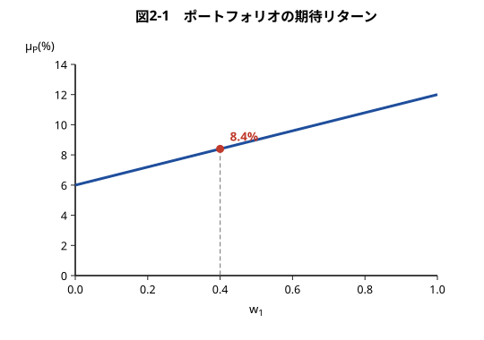

投資比率と期待リターンは**直線関係**にあることがわかる。なお，どちらかの資産を空売りする場合には，直線の延長線上を見ればよい。

---

# 2.3.1 確率変数の和の分散

ポートフォリオ理論では，投資リスクをリターンの**確率分布の広がりの大きさ**でとらえる。正確には，投資リターンの分布の**標準偏差**を投資の**トータル・リスク**と定義する。標準偏差が大きいほど，将来実現するリターンの大きさが読みにくくなる。

> ポートフォリオ理論では，トータル・リスク以外にも**ベータ・リスク**や**ファクター・リスク**といったリスクの尺度がある。これらの副次的なリスク概念については第3章，第4章で説明するが，投資リスクの基本的な尺度はトータル・リスクである。

---

確率変数 $X$ と $Y$ があるとき，その和 $X+Y$ の分散は

**和の分散**：$Var(X+Y)=Var(X)+Var(Y)+2Cov(X,Y)$

**1次結合の分散**：$Var(aX+bY)=a^2Var(X)+b^2Var(Y)+2ab\,Cov(X,Y)$

で与えられる。つまり，確率変数の和の分散は，それぞれの確率変数の分散の和に，**共分散の2倍**を加えたものになる。

---

# 2.3.2 ポートフォリオの分散

1次結合の分散の公式より，ポートフォリオの分散は
$$
Var(R_P)={w_1}^2Var(R_1)+{w_2}^2Var(R_2)+2w_1w_2Cov(R_1,R_2)
$$
で与えられる。そしてポートフォリオのトータル・リスクは分散の平方根（標準偏差）である。

$R_1,R_2$ の標準偏差を $\sigma_1,\sigma_2$，$R_P$ の標準偏差を $\sigma_P$，$R_1$ と $R_2$ の共分散を $\sigma_{12}$，**相関係数**を $\rho$ で表す。相関係数と共分散の関係は $\rho=\sigma_{12}/(\sigma_1\sigma_2)$ であるから
$$
{\sigma_P}^2={w_1}^2{\sigma_1}^2+{w_2}^2{\sigma_2}^2+2w_1w_2\rho\,\sigma_1\sigma_2
$$
となる。

---

**計算例2.2**　資産1のリターンの標準偏差を18%，資産2のリターンの標準偏差を12%とする。また，2つの資産のリターンに**相関はない**（$\rho=0$）ものとする。投資比率 $(w_1,w_2)=(0.4,0.6)$ で投資するポートフォリオの標準偏差は
$$
{\sigma_P}^2=0.4^2\times0.18^2+0.6^2\times0.12^2=0.010368
$$
となるので，$\sigma_P=\sqrt{0.010368}\simeq0.102\ (=10.2\%)$ である。

投資比率 $w_1$ と標準偏差の関係を関数 $\sigma_P(w_1)$ で表すと
$$
{\sigma_P}^2(w_1)=0.18^2{w_1}^2+0.12^2(1-w_1)^2
$$

---

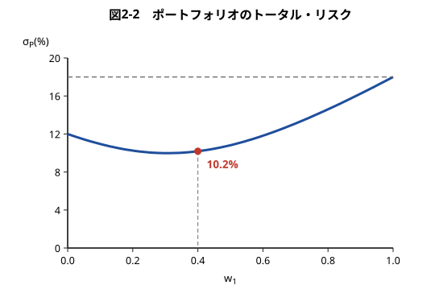

---

# 2.3.3 ポートフォリオによるリスク分散効果

図2-2 は，ポートフォリオのリスク分散効果について非常に重要な事実を示している。全部の資金を資産1に投資した場合のリスクは $\sigma_1=18\%$，資産2に投資した場合のリスクは $\sigma_2=12\%$ である。よって，全部の資金を資産1に入れるより，資産2に入れるほうがリスクは小さい。

しかし，**全部の資金をリスクの小さい資産2に入れるより，もっとリスクを小さくする方法がある**。例えば，資金の4割を資産1に，6割を資産2に投資して資金を2つのかごに分けると，リスクを **10.2%** にまで縮めることができる。これこそが**分散投資の力**である。

---

# 2.3.4 リスク分散効果の源泉

なぜこのような現象が起きるのか，数式で確認してみよう。分散の式を
$$
{\sigma_P}^2=(w_1\sigma_1+w_2\sigma_2)^2-2(1-\rho)w_1w_2\sigma_1\sigma_2
$$
と変形する。投資比率 $w_1$ と $w_2$ が非負であるならば，右辺の最終項は負の値をとることがない。なぜなら，相関係数 $\rho$ は必ず $-1$ と $1$ の間の値で，標準偏差 $\sigma_1,\sigma_2$ は必ず非負だからである。これより

**リスク分散効果**：
$$
\sigma_P\leqq w_1\sigma_1+w_2\sigma_2
$$

---

この不等式は，ポートフォリオのトータル・リスクが個別資産のトータル・リスクの**加重平均に等しい，ないしは加重平均を下回る**ことを示している。しかも，**相関係数が1でないかぎり，等号ではなく不等号になる**。

これがポートフォリオによるリスク分散効果である。さらに図2-2 に見るように，$\sigma_P(w_1)$ は **U字型**の曲線となっている。したがって，リスクの小さなほうの資産2に100%投資するよりも，$w_1$ の値を $0.2\sim0.4$ 近辺の値にするほうが，ポートフォリオの標準偏差をよりいっそう小さくすることができる。

---

# 2.3.5 リスク分散効果への相関係数のインパクト

リスク分散効果によってトータル・リスクがどれほど小さくなるかは，2資産間の相関係数 $\rho$ の大きさに依存する。

2つの資産が**負の完全相関**をするとき（$\rho=-1$）には
$$
{\sigma_P}^2=(w_1\sigma_1-w_2\sigma_2)^2,\qquad \sigma_P=\bigl|w_1\sigma_1-w_2\sigma_2\bigr|
$$
となり，V字型の折れ線で表される。この場合にはリスク分散効果が最大限に発揮され，特に $w_1=0.4$ のポートフォリオを作れば，ポートフォリオのトータル・リスクは**ゼロ**になる。

---

2つの資産が**正の完全相関**をするとき（$\rho=1$）は
$$
{\sigma_P}^2=(w_1\sigma_1+w_2\sigma_2)^2,\qquad \sigma_P=w_1\sigma_1+w_2\sigma_2
$$
となり，トータル・リスクは個別資産の加重平均に等しくなる。一方の資産価格が下落するときには他方の資産価格も必ず下落してしまうので，両方の資産に分散投資してもリスクの平均化が起こるだけで，**リスクが小さくなることはない**。

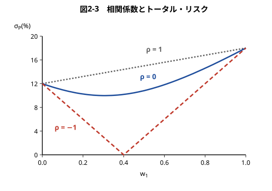

---

# 2.4.1 2資産を対象とする資産配分問題

株式と安全資産を対象とする資産配分問題（2資産アセット・アロケーション問題）を考える。株式のリターンを $R_S$，安全資産のリターン（リスクフリー・レート）を $r_f$，運用資産全体のリターンを $R_P$ とする。また，投資家の目的関数は
$$
E(R_P)-\frac{\gamma}{2}Var(R_P),\qquad \gamma>0
$$
で与えられるとする。ここで $\gamma$ は投資家の**リスク回避度**を表すパラメータである。

> この目的関数は，一定の仮定の下で期待効用最大化原理に基づく投資家の目的関数に合致する。その仮定とは，効用関数がべき乗あるいは対数効用関数で，かつ将来の資産価値の分布が**対数正規分布**に従う場合である。

---

株式への投資比率を $w_S$，安全資産への投資比率を $w_f$ とすると $R_P=w_SR_S+w_fr_f$ であり
$$
E(R_P)=w_SE(R_S)+w_fr_f,\qquad Var(R_P)={w_S}^2Var(R_S)
$$
となる（$r_f$ は確定した値なので定数として扱う）。目的関数は
$$
E(R_S)w_S+r_fw_f-\frac{\gamma}{2}Var(R_S){w_S}^2
$$
となり，投資比率の和は1でなければならないので，制約条件 $w_S+w_f=1$ の下でこれを最大にする $(w_S,w_f)$ を求めるのが，いまの問題ということになる。

---

# 2.4.2 2資産最適化問題の解法

$w_f=1-w_S$ を代入して目的関数を $w_S$ だけで表すと
$$
f(w_S)=\bigl(E(R_S)-r_f\bigr)w_S-\frac{\gamma}{2}Var(R_S){w_S}^2+r_f
$$
となる。これは2次関数の最大化問題である。$f'(w_S)=0$ を満たす $w_S$ が最適解を与えるが，この方程式は
$$
f'(w_S)=\bigl(E(R_S)-r_f\bigr)-\gamma Var(R_S)w_S=0
$$

---

となり，$E(R_S)=\mu_S,\ Var(R_S)={\sigma_S}^2$ と表すと，答えは

**最適資産配分ルール**：
$$
w_S=\frac{1}{\gamma}\cdot\frac{\mu_S-r_f}{{\sigma_S}^2}
$$

である。

---

# 2.4.3 最適資産配分ルールの解釈

右辺の $\mu_S-r_f$ は，リスク資産の期待リターンとリスクフリー・レートの差（**リスクプレミアム**と呼ばれる）である。また $\gamma$ は投資家のリスク回避度を表すパラメータである。

この式によれば，リスク資産に対する最適な投資比率は，**リスク資産の分散1単位当たりのリスクプレミアムに比例する**。すなわち

- リスク資産のリスクプレミアムが**高い**ほど，投資比率を上げるべきである
- リスク資産の分散が**小さい**ほど，投資比率を上げるべきである
- リスクプレミアムと分散を一定にすれば，投資家のリスク回避度が**小さい**ほど，投資比率を上げるべきである

> 章末付録では，3資産および $n$ 資産の場合の最適資産配分問題の解法ならびに結果の解釈について解説されている。

---

# 2.5.1 2資産ポートフォリオのリスクとリターン

2個の資産の期待リターンと分散が計算例2.1 および2.2 のように与えられ，両資産の間に相関がないとき，この2資産からできるポートフォリオの期待リターンと標準偏差の関係を図示すると次のようになる。

「資産2」と書いた点から出発して，資産1への投資比率を $w_1=0.2$ に上げると $A$ 点が，$w_1=0.4$ に上げると $B$ 点が，$w_1=0.8$ に上げると $C$ 点が実現する。$w_1=1.0$ にすれば資産1に全額投資することになる。

---

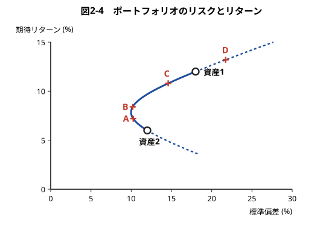

さらに $w_1$ の値を1以上にすることもできる。そのためには資産2を空売りすればよい。例えば $w_1=1.2$ とするには，自己資金の2割に相当する金額の資産2を空売りして，全資金を資産1に投資すればよい。これがポートフォリオ $D$ である。図では，資産の空売りをともなうポートフォリオの部分を**点線**で示している。

---

この曲線は**双曲線**であることが知られている。この双曲線は，資産1と資産2の相関が低いほど**左側に大きく切れ込み**，相関係数が $-1$ のときには標準偏差ゼロを示す縦軸に届く。

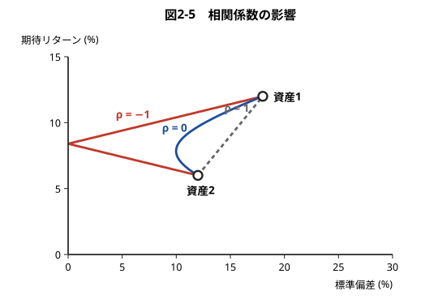

---

# 2.5.2 資産の数を増やす

ポートフォリオに組み込む資産の数を増やしていけば，ポートフォリオ全体のリスクとリターンの実現可能な組み合わせが広がっていく。つまり，分散投資の効果をさらに享受できるようになる。

資産1と資産2から作られるポートフォリオ $P$ に，新たに資産3を加えて，$P$ と資産3からなるポートフォリオを作る。このとき，$P$ 点と資産3を結ぶ曲線部分が投資可能領域に加わる。この操作は，資産1と資産2からなる別のポートフォリオ $Q$ についても行うことができる。

---

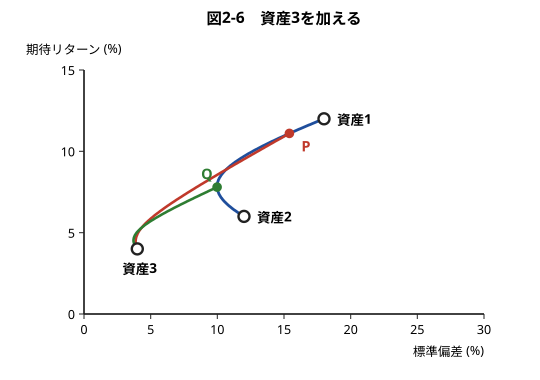

---

この操作を繰り返していけば，資産1，2，3からなるポートフォリオの投資可能領域を求めることができる。

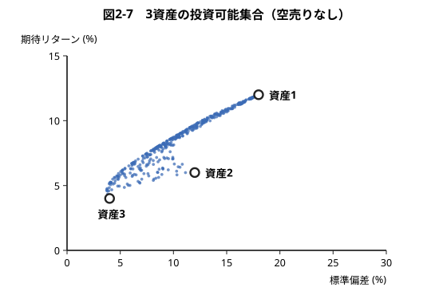

---

このように投資可能な資産を増やしていけば，実現可能な期待リターンと標準偏差の組み合わせが**北西方向**に広がっていく。資産の数が2個の場合，投資可能領域は曲線で与えられるが，資産の数が3個以上になれば，投資可能領域は**集合**の形になる。この集合を**投資可能集合**と呼ぶ。

資産の数の多寡にかかわらず，投資可能集合の左側の境界線は双曲線になることが知られている。

**効率的ポートフォリオと効率的フロンティア**：双曲線の**上半分**は，同じ標準偏差（リスク）を持つポートフォリオの中で期待リターンが最大のポートフォリオをなぞったものである。これらを**効率的ポートフォリオ**と呼び，その軌跡を**効率的フロンティア**と呼ぶ。

---

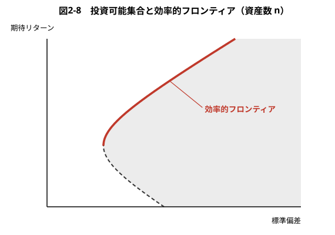

双曲線の**下半分**に属するポートフォリオは効率的ポートフォリオではない。同じ標準偏差で期待リターンのもっと大きなポートフォリオが，上部にいくらでも存在するからである。したがって，効率的フロンティアは投資可能集合の**北西方向の周縁部**に限られる。

---

# 2.5.3 安全資産を含めた投資可能集合

安全資産も投資対象に加える場合，投資可能集合はまったく違った形状になる。

まず，安全資産と1個のリスク資産からなるポートフォリオを考える。リスク資産への投資比率を $w$ とすると，$R_P=wR+(1-w)r_f$ であるから
$$
\mu_P=(\mu-r_f)w+r_f,\qquad Var(R_P)=w^2\sigma^2,\qquad \sigma_P=w\sigma
$$
となる。期待リターンも標準偏差も $w$ の1次関数であるから，$\mu_P$ と $\sigma_P$ は**直線的な関係**で結ばれる。

---

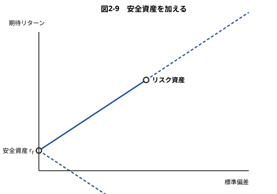

安全資産はリスクがゼロの資産であるから $y$ 軸上にプロットされる。リスク資産から右に伸びる直線の延長部分（破線）は，$r_f$ で資金を借り入れて（安全資産を空売りして），**レバレッジ**によってよりハイリスク・ハイリターンの投資を行う場合に相当する。$r_f$ から右下に伸びる破線は，リスク資産を空売りして全資金を安全資産に投資する場合に相当する。

---

2個のリスク資産からできる投資可能領域は双曲線で表されたが，**安全資産への投資を加えると，安全資産と双曲線上の各点を結ぶ直線上の点がすべて投資可能になる**。

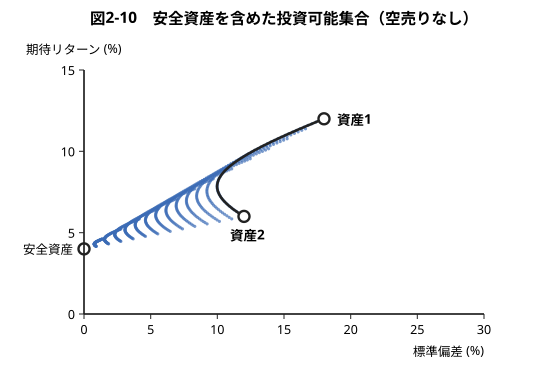

---

資産の空売りと資金の借り入れが可能な場合には，投資可能集合は次のようになる。

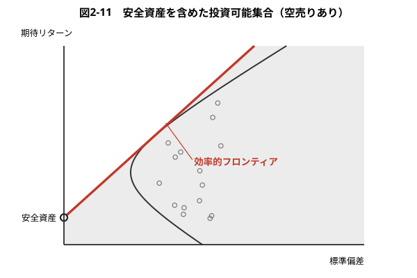

投資可能集合の北西側の境界線（効率的フロンティア）は，**$y$ 軸上の安全資産を示す点から双曲線に引いた接線**である。リスク資産だけから構築される投資可能集合は双曲線の内側であったが，これに安全資産への投資も含めると，投資可能集合が塗りつぶした領域へと**一気に拡大**する。

---

# 2.6.1 トービンの分離定理

安全資産と多数のリスク資産に投資する場合の**最適ポートフォリオ**の決定方法を考える。安全資産を示す $y$ 軸上の点からリスク資産だけに投資する場合の投資可能集合の周縁部（双曲線）に接線を引き，その接点に相当するポートフォリオを**ポートフォリオ $T$**（接点ポートフォリオ）と呼ぶことにする。

一方，曲線群 $\ell,\ell',\ell''$ は1人の投資家の**無差別曲線**を表している。それぞれの曲線上のポートフォリオは投資家に同じ期待効用をもたらす。つまり，各曲線は**効用の等高線**と考えればよい。$\ell$ よりも $\ell'$，$\ell'$ よりも $\ell''$ のほうが，高い効用水準を表す。

> 投資家の目的関数が $E(R_P)-(\gamma/2)Var(R_P)$ で与えられる場合には，無差別曲線は**放物線**になる。しかし無差別曲線は必ずしも放物線である必要はなく，右上がりで，下から見て凸の曲線と仮定される。

---

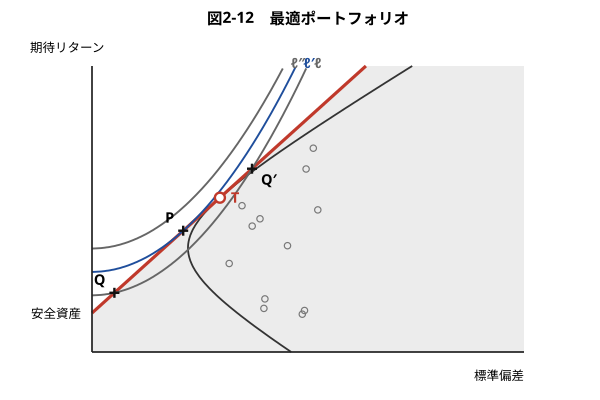

---

無差別曲線と効率的フロンティアの接点を $P$ 点と呼ぼう。$Q$ 点と $Q'$ 点は無差別曲線 $\ell$ 上に位置するので，ポートフォリオ $Q$ と $Q'$ がもたらす効用は $P$ よりも低い。一方，$P$ 点よりも高い効用を示す無差別曲線は $\ell'$ よりも上側に位置する（例えば $\ell''$）が，これらは**投資可能集合と交わらない**。

したがって，投資可能集合に属するポートフォリオの中で，最も高い効用をもたらすのは **$P$ 点のポートフォリオ**である。

---

3人の投資家の無差別曲線 $\ell_1,\ell_2,\ell_3$ と，それぞれの投資家にとっての最適ポートフォリオ $P_1,P_2,P_3$ を示す。$\ell_1$ はリスク回避度の高い投資家，$\ell_3$ はリスク回避度の低い（リスク許容度の高い）投資家，$\ell_2$ は中間の投資家の無差別曲線である。

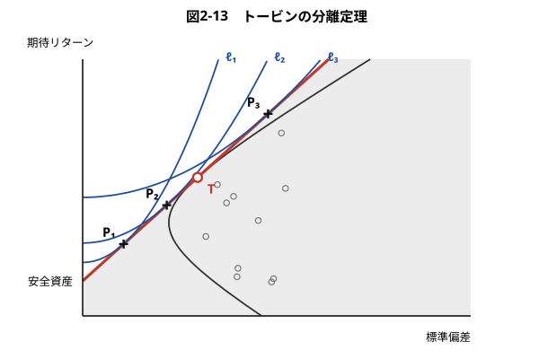

---

この図から，**どの投資家の最適ポートフォリオも，接点ポートフォリオ $T$ と安全資産の組み合わせで実現できる**ことがわかる。つまり，リスク資産のポートフォリオをどう作るかは投資家に依存しない。

**トービンの分離定理**：安全資産がある場合，効率的フロンティア上の任意のポートフォリオ（効率的ポートフォリオ）は，安全資産と接点ポートフォリオを適切な投資比率で組み合わせることによって実現できる。

個々の投資家は，自分のリスク回避度に合わせて，この接点ポートフォリオと安全資産の間の投資比率を決めればよいということになる。

---

# 2.6.2 トービンの分離定理の実践的意義

トービンの分離定理は，資産運用の実務にきわめて大きな示唆を与える。株式への投資だけを考えても，取引可能な株式は**国内で約3,000銘柄，米国の場合には約8,000銘柄**存在する。これらを組み合わせて，リスク選好の異なる個々の投資家ごとに最適なポートフォリオを構築するには，膨大なデータと大変な計算量を必要とする。

しかし，トービンの分離定理によれば，$T$ 点に相当する接点ポートフォリオさえ見つければ，あとは投資家の目的関数（無差別曲線）に応じて，この接点ポートフォリオと安全資産の投資比率を決めれば事足りる。いいかえれば，**接点ポートフォリオを計算して提供する運用会社が1つあれば**，すべての投資家は，その会社が提供するポートフォリオの購入を前提にして，あとは安全資産との投資比率を適切に選択するだけで，最適なポートフォリオ運用を実現できる。

---

# 2.6.3 借入金利と貸出金利の区別

無差別曲線が $\ell_3$ で与えられる投資家が最適ポートフォリオ $P_3$ を実現するには，安全資産のレートで資金を借り入れることが必要になる。しかし，現実に資金を借り入れるには，安全資産のレートよりも高い金利を払わなければならない。つまり，一般の投資家にとって，**借入利子率は貸出（運用）利子率よりも高い**。

この現実的な条件を考慮すると，接点ポートフォリオは $T_1$ と $T_2$ の**2種類**存在する。貸出利子率 $r_\ell$ から双曲線に引いた接線の接点が $T_1$，借入利子率 $r_b$ から双曲線に引いた接線の接点が $T_2$ である。この領域の周縁部，すなわち**直線・双曲線・直線**を結んだ太線が効率的フロンティアとなる。

---

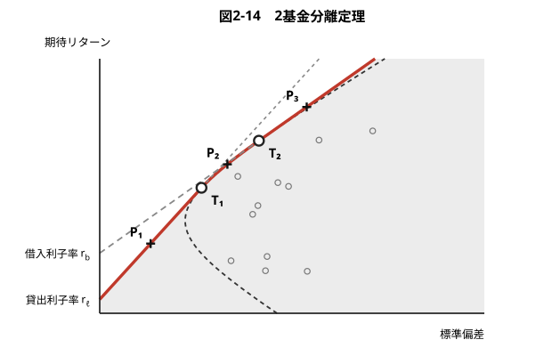

---

- 無差別曲線が $\ell_1$ の投資家の最適ポートフォリオは，$r_\ell$ と $T_1$ を結ぶ**線分上**に来る（$P_1$）。
- $\ell_2$ の投資家は $T_1$ よりも高リスク・高リターンを望むが，線分 $r_\ell T_1$ の延長線上は実現不可能である（$r_\ell$ で借り入れられないため）。したがって中程度のリスク回避度の投資家は資金の貸し出しも借り入れも行わず，$T_1$ と $T_2$ を結ぶ**双曲線部分**から選ぶ（$P_2$）。
- $\ell_3$ の投資家にとって最適なポートフォリオは，借入資金によって**レバレッジ**をかけて接点ポートフォリオ $T_2$ に投資することで実現される（$P_3$）。

---

トービンの分離定理はこうした状況に拡張できる。

**2基金分離定理**：2種類の効率的ポートフォリオに正の投資比率で投資するポートフォリオは，必ず効率的ポートフォリオである。また逆に，任意の効率的ポートフォリオは，任意の2種類の効率的ポートフォリオを適切な投資比率で組み合わせることによって実現できる。

この定理によれば，図2-14 のポートフォリオ $P_2$ は，2個の接点ポートフォリオ $T_1,T_2$ を組み合わせて作ることができる。**トービンの分離定理は，この2基金分離定理に特殊ケースとして含まれる。**

このように，トービンの分離定理や2基金分離定理は最適なポートフォリオの構築に大きな示唆を与える。この示唆をもう一段強化するのが，次章で解説する **CAPM** である。

---

# まとめ（1）

- ポートフォリオのリターンは個別資産のリターンの**1次結合** $R_P=w_1R_1+w_2R_2$。空売りをすれば投資比率は負になる。
- 期待リターンは**加重平均** $\mu_P=w_1\mu_1+w_2\mu_2$（直線関係）。
- 分散は ${\sigma_P}^2={w_1}^2{\sigma_1}^2+{w_2}^2{\sigma_2}^2+2w_1w_2\rho\sigma_1\sigma_2$。**相関係数が1でないかぎり** $\sigma_P<w_1\sigma_1+w_2\sigma_2$ となり，これが**リスク分散効果**である。
- 走る例：資産1（$\mu=12\%,\sigma=18\%$），資産2（$\mu=6\%,\sigma=12\%$），$\rho=0$，$(w_1,w_2)=(0.4,0.6)$ → $\mu_P=8.4\%$，$\sigma_P=10.2\%$。

---

# まとめ（2）

- 平均・分散型の目的関数の下で，リスク資産への最適投資比率は $w_S=(1/\gamma)\cdot(\mu_S-r_f)/{\sigma_S}^2$ である。
- 2資産の軌跡は**双曲線**。資産数を増やすと投資可能集合は北西へ広がり，その北西周縁部が**効率的フロンティア**。
- 安全資産を加えると，効率的フロンティアは $r_f$ から双曲線に引いた**接線**になる。
- **トービンの分離定理**：任意の効率的ポートフォリオ＝安全資産＋接点ポートフォリオ $T$。借入金利＞貸出金利の場合は接点が2つになり，**2基金分離定理**に一般化される。

---

## 証券投資論 勉強会

### 次回：第3章　CAPM

すべての投資家が分離定理に従って行動した結果，
市場価格はどう決まるのかを問う
