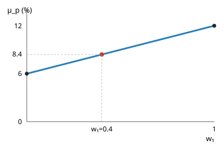
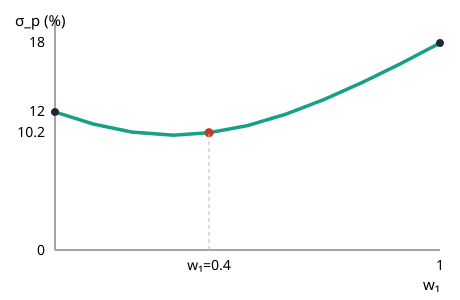
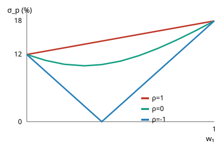
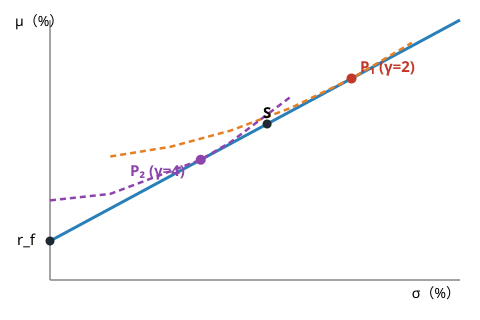
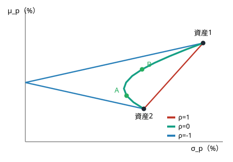
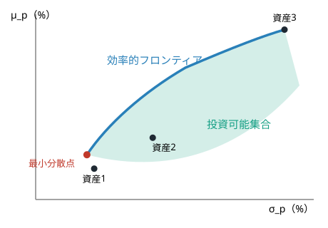
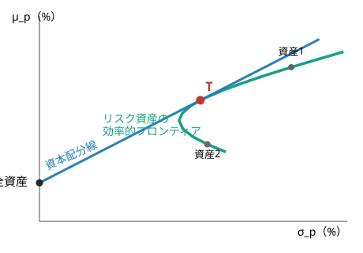
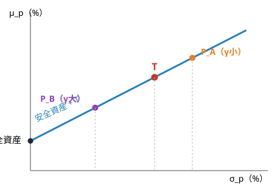
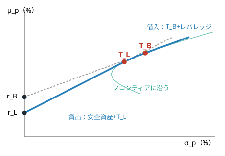

<!-- _class: title -->
<!-- _header: '' -->
<!-- _footer: '' -->

# 第2章　ポートフォリオ理論

金融工学　社内勉強会スライド

底本：『新・証券投資論 I 理論篇』（日本証券アナリスト協会 編，小林孝雄・芹田敏夫 著，日本経済新聞出版社，2009）第2章

前章：1資産の効用理論 → 本章：複数資産を組み合わせる「ポートフォリオ」へ

---

# 本日の内容

1. 投資のリターンと投資比率
2. ポートフォリオの期待リターン（加重平均）
3. ポートフォリオのリスクと分散効果
4. リスク資産・安全資産への最適配分
5. 投資可能集合と効率的フロンティア
6. トービンの2基金分離定理

---

この章のねらい

前章では，不確実な富を確率くじとして表し，期待効用と平均・分散でリスクとリターンを測った。

- 本章では複数の資産を組み合わせる**ポートフォリオ**を主役に据える
- 相関が1未満なら必ず生じる**リスク分散効果**を定量化する
- 安全資産＋リスク資産の最適配分から，効率的フロンティア・接点ポートフォリオへ
- 最終目標：**トービンの2基金分離定理**（全員が同じ「接点ポートフォリオ」を持つ）を理解する

---

# Part 1：投資のリターンと期待リターン

---

# 投資のリターンと投資比率

定義：リターンと投資比率

金額 $X_0$ を投資して $X_1$ を回収するとき，リターンは $R:=\dfrac{X_1}{X_0}-1$。
資産 $i$ への投資比率は $w_i:=\dfrac{X_{0i}}{X_0}$（$\sum_i w_i=1$）。

- 100円投資して120円回収 → リターン20%
- 回収額はインカムゲイン＋キャピタルゲイン（or ロス）の合計
- 将来の $X_1$ は不確実 → $R$ は確率変数

空売り（ショート）：$w_i<0$ もありうる。例：$(w_1,w_2)=(1.2,-0.2)$ は資産2を20%空売りし資産1に120%投資

---

# ポートフォリオのリターン＝1次結合

投資額を資産ごとに配分すると，全体のリターンは

$$
R_p=\frac{X_1}{X_0}-1=\sum_i w_i R_i
$$

**各資産リターンの，投資比率を重みとした1次結合**になる。

ポイント

このように複数資産に分けて投資したときの資産構成を<b>ポートフォリオ</b>という。以降，このリターンの1次結合構造がすべての計算の出発点になる。

---

# 期待リターンは加重平均

期待値の線形性

$$
\mathbb{E}\!\left[\sum_i w_i R_i\right]=\sum_i w_i\,\mathbb{E}[R_i]
$$

各資産の期待リターンを $\mu_i=\mathbb{E}[R_i]$ とすると

$$
\mu_p=\mathbb{E}[R_p]=\sum_{i=1}^n w_i\mu_i
$$

ポートフォリオの期待リターンは個別資産の期待リターンの加重平均

---

# 数値例：2資産の期待リターン

資産1（$\mu_1=12\%$），資産2（$\mu_2=6\%$）に $(w_1,w_2)=(0.4,0.6)$ で投資すると

$$
\mu_p=0.4\times12\%+0.6\times6\%=8.4\%
$$

$w_1$ の関数とみると $\mu_p(w_1)=6+6w_1$ で**直線**を描く。

---

# Part 2：ポートフォリオのリスクと分散効果

---

# 共分散・相関係数と分散の公式

定義：共分散・相関係数

$$
\mathrm{Cov}(X,Y):=\mathbb{E}\bigl[(X-\mathbb{E}[X])(Y-\mathbb{E}[Y])\bigr],\qquad
\rho_{XY}:=\frac{\mathrm{Cov}(X,Y)}{\sigma_X\sigma_Y}
$$

1次結合の分散

$$
\mathrm{Var}(aX+bY)=a^2\mathrm{Var}(X)+b^2\mathrm{Var}(Y)+2ab\,\mathrm{Cov}(X,Y)
$$

2資産では ${\sigma_p}^2={w_1}^2{\sigma_1}^2+{w_2}^2{\sigma_2}^2+2w_1w_2\rho\sigma_1\sigma_2$。リターンと違い**単純な加重平均にはならない**。

---

# 数値例：2資産のリスク

$\sigma_1=18\%,\sigma_2=12\%,\rho=0$，$(w_1,w_2)=(0.4,0.6)$ のとき

$$
{\sigma_p}^2=0.4^2\times0.18^2+0.6^2\times0.12^2=0.010368
\;\Rightarrow\;
\sigma_p\approx10.2\%
$$

資産2単独の12%より小さい！これがリスク分散効果

$w_1$ の関数として見ると**下に凸**の曲線を描く。

---

# リスク分散効果の不等式

${\sigma_p}^2$ を平方完成すると

$$
{\sigma_p}^2=(w_1\sigma_1+w_2\sigma_2)^2-2(1-\rho)\,w_1w_2\,\sigma_1\sigma_2
$$

$w_i\geqq0$ なら第2項は非負なので

定理：リスク分散効果

$$
\sigma_p\leqq\sum_i w_i\sigma_i
$$
等号は $\rho=1$ のときかつそのときに限る。

右辺は全資産が完全連動する最悪の場合のリスク。連動が不完全なら一方が下がっても他方は下がるとは限らず，リスクは押し下げられる。

---

# 相関係数と分散効果の大きさ

3つの極端なケース（σ₁=18%，σ₂=12%）

- $\rho=1$（完全正相関）：$\sigma_p=w_1\sigma_1+w_2\sigma_2$ —— **直線**，分散効果なし
- $\rho=-1$（完全負相関）：$w_1=\sigma_2/(\sigma_1+\sigma_2)$ で $\sigma_p=0$ —— **リスクを完全消去**できる
- $-1<\rho<1$：下に凸の曲線 —— 相関が小さいほど分散効果は大きい

---

# Part 3：最適配分と効率的フロンティア

---

# 平均・分散効用と最適な株式比率

投資家の選好を**平均・分散効用** $U(R_p)=\mathbb{E}[R_p]-\dfrac{\gamma}{2}\mathrm{Var}(R_p)$（$\gamma$：リスク回避度）で表す。

リスク資産と安全資産の最適配分

$$
w_s^{\ast}=\frac{1}{\gamma}\cdot\frac{\mu_s-r_f}{{\sigma_s}^2}
$$

- 分子 $\mu_s-r_f$：**リスクプレミアム**が大きいほど株式を多く持つ
- 分母 $\sigma_s^2$ とリスク回避度 $\gamma$ が大きいほど株式を減らす
- $\mu_s<r_f$ なら $w_s^\ast<0$（空売りが最適）

---

# 数値例：最適株式比率の計算

$\mu_s=12\%,\sigma_s=18\%,r_f=3\%$ のとき

$$
\gamma=2:\ w_s^\ast=\frac{1}{2}\cdot\frac{0.09}{0.0324}\approx1.39
\qquad
\gamma=4:\ w_s^\ast=\frac{1}{4}\cdot\frac{0.09}{0.0324}\approx0.69
$$

解釈

γ=2の投資家は安全資産のレートで39%借入れして株式に139%投資。γ=4の投資家は借入れせず安全資産も保有する。

---

# 資本配分線と無差別曲線

安全資産 $r_f$ と株式 $S$ を結ぶ直線上に達成可能なポートフォリオが並ぶ。最適点はこの直線と無差別曲線が接する点。

リスク回避度が小さい投資家（γ=2）は $S$ より右（借入れ），大きい投資家（γ=4）は左（安全資産保有）を選ぶ。

---

# 2資産ポートフォリオの軌跡＝双曲線

2資産ポートフォリオの軌跡

$\mu_1\neq\mu_2$，$-1<\rho<1$ のとき，$w_1$ を動かすと $(\sigma_p,\mu_p)$ は $(\sigma,\mu)$ 平面上の**双曲線**を描く。

実線は空売りなし（$w_1\in[0,1]$）の投資可能部分。相関係数が小さいほど左（低リスク側）に膨らむ。

---

# 投資可能集合と効率的フロンティア

3資産以上を組み合わせると，投資比率の自由度が2次元以上になり，投資可能集合は**領域**に広がる（傘形）。

定義：効率的フロンティア

投資可能集合のうち，**同じリスクで期待リターンが最大**のポートフォリオ全体。その上のポートフォリオを効率的ポートフォリオという。

---

# 接点ポートフォリオと資本配分線

定義：接点ポートフォリオ

点 $(0,r_f)$ からリスク資産の効率的フロンティアに引いた接線が接する点に対応するポートフォリオを**接点ポートフォリオ** $T$ という。

安全資産を含めた効率的フロンティアは，$(0,r_f)$ から $T$ を通って延びる**直線**になる。

---

# Part 4：トービンの2基金分離定理

---

# 最適ポートフォリオ＝直線と無差別曲線の接点

安全資産を含めると，効率的フロンティアは $(0,r_f)$ から $T$ を通る**1本の直線**。最適ポートフォリオはこの直線に無差別曲線が接する点。

リスク回避度によらず，**リスク資産部分の中身は常に $T$ で同一**。違いは安全資産と $T$ への配分比率だけ。

---

# トービンの2基金分離定理

トービンの2基金分離定理1

安全資産が存在するとき，平均・分散効用を最大化する投資家の最適ポートフォリオは，**安全資産と接点ポートフォリオ $T$ との組み合わせ**として表せる。リスク資産の構成比はリスク回避度 $\gamma$ に依存しない。

分離定理の実践的意義

- **第1段（運用者の仕事）**：市場のリスク資産から最良の組み合わせ $T$ を1つ作る（投資家の好みに依存しない客観的作業）
- **第2段（投資家の仕事）**：自分のリスク回避度に応じて安全資産と $T$ の配分を決める

---

# 借入・貸出金利が異なる場合

現実には貸出金利 $r_L$ より借入金利 $r_B$ の方が高い（$r_B>r_L$）。効率的フロンティアは**折れ線**になる。

- 貸出のみの投資家：$(0,r_L)$ からの接線上（接点 $T_L$）
- 借入れをする投資家：$(0,r_B)$ からの接線上（接点 $T_B$，傾きはより緩い）
- 両接点の間：リスク資産フロンティア自体に沿う

---

# 分離定理2（安全資産がない場合）

トービンの2基金分離定理2

2種類の効率的ポートフォリオがあるとき，最適ポートフォリオは**その2つの組み合わせ**として表せる。リスク資産の構成比はリスク回避度に依存しない。

2つの分離定理の関係

定理2の2基金はフロンティア上であれば何でもよい。安全資産を市場に加えると一方を安全資産にとれ，もう一方が接点ポートフォリオ $T$ に定まる —— これが定理1で，**定理1は定理2の特別な場合**とみなせる。

---

# まとめ

- ポートフォリオのリターンは個別資産リターンの**1次結合**，期待リターンは**加重平均**
- リスクは加重平均**以下**になる（**リスク分散効果**）。効果の大きさは相関係数 $\rho$ で決まる
- 平均・分散効用のもとで最適な株式比率は $w_s^\ast=\dfrac{1}{\gamma}\cdot\dfrac{\mu_s-r_f}{\sigma_s^2}$
- 2資産の軌跡は双曲線，3資産以上では投資可能集合が領域に広がり，左上の境界が**効率的フロンティア**
- **トービンの2基金分離定理**：全員が同じ接点ポートフォリオ $T$ を持ち，違いは安全資産との配分比率だけ
- 次章：この $T$ が市場均衡のもとで**マーケット・ポートフォリオ**と一致することを見る（CAPM）

---

<!-- _class: title -->
<!-- _header: '' -->
<!-- _footer: '' -->

# 次回：第3章 CAPM

全員が同じ接点ポートフォリオを持つという結論に，
「市場が需給で清算する」均衡条件を重ねる

ご質問・ご議論のある方はぜひ

