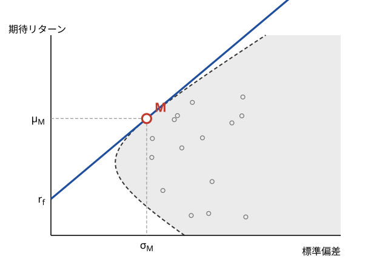
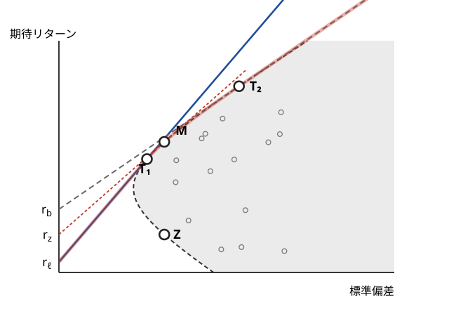
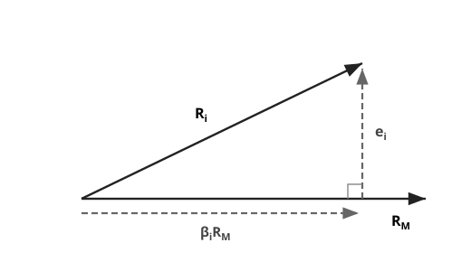
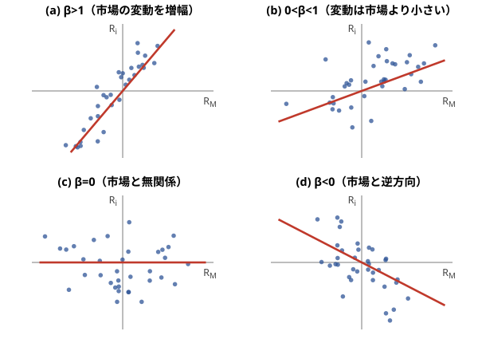
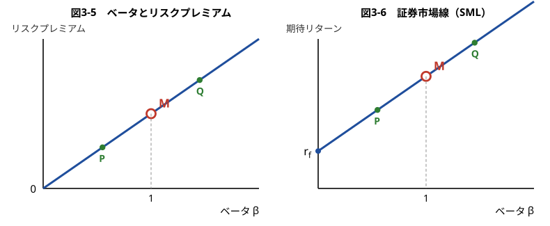
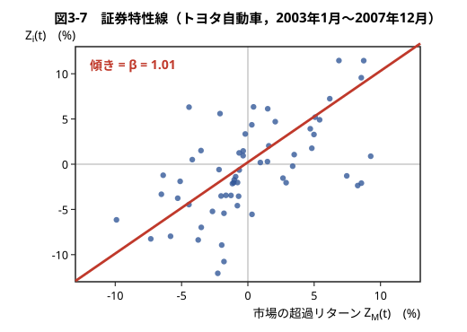

## 証券投資論 勉強会

### 第3章　CAPM

---

# はじめに

第2章では，投資家が平均・分散アプローチに従って最適なポートフォリオを選ぶ姿を描いた。本章では，**すべての投資家がそのように行動した結果として市場価格がどう決まるか**を問う。資本資産評価モデル（CAPM; Capital Asset Pricing Model）は，市場の均衡状態を記述する2つの定理からなる。第1定理は「マーケット・ポートフォリオは効率的である」，第2定理は「証券のリスクプレミアムはベータに比例する」と主張する。

---

# 3.1.1 マーケット・ポートフォリオ

**マーケット・ポートフォリオ**とは，市場に供給されるすべての証券のバスケットである。したがって，マーケット・ポートフォリオに投資することは，すべての証券を**時価総額に比例した投資比率**で保有することを意味する。

個々の証券の市場価格は多くの投資家による膨大な情報収集と計算活動の産物で，バスケットの時価総額比率にはその活動成果がすべて織り込まれている。このような観点に立って，マーケット・ポートフォリオに投資することの合理性にはじめて注目したのが，ウィリアム・シャープである（Sharpe [1964]）。

---

# 3.1.2 CAPMの中心命題（オリジナルCAPM）

CAPM の中心となる命題とその論証は，次のようにきわめて簡単である。

市場に参加する投資家が**平均・分散アプローチ**で想定された行動をとると仮定する。そして，安全資産が存在して，**トービンの分離定理**が成立する状況を考えよう。このとき，投資家は安全資産と接点ポートフォリオの組み合わせによって最適ポートフォリオを実現することができる。

どのような組み合わせを選択するかは投資家によって異なるが，**すべての投資家が投資しようとするリスク資産ポートフォリオは，接点ポートフォリオそのものである**。したがって，すべての証券の需要と供給が一致する市場均衡の状態では，マーケット・ポートフォリオはこの接点ポートフォリオでなければならない。

---

**CAPM第1定理（オリジナルCAPM）**：安全資産が存在するとき，市場の均衡状態においてマーケット・ポートフォリオは接点ポートフォリオと一致する。したがって，マーケット・ポートフォリオは**効率的ポートフォリオ**である。

---

マーケット・ポートフォリオが接点の位置にあれば，すべての投資家はこの接点ポートフォリオに投資して安全資産と組み合わせるので，市場に供給されている証券は投資家によって過不足なく需要され，**需給の一致**が達成される。

マーケット・ポートフォリオがこの接点から外れた場所に位置しているときには，次のような調整が起きる。すべての投資家は接点ポートフォリオを買いにいくが，市場に供給されているマーケット・ポートフォリオはこれに一致しないので，需給のバランスが崩れる。その結果，**需要が供給を上回る証券の価格は上昇し，下回る証券の価格は下落する**。

この価格調整がいっせいに起こり，個々の証券を表す点と投資可能集合が移動する。この調整過程は，マーケット・ポートフォリオが接点の位置に来るまで続く。

---

# 3.1.3 資本市場線

安全資産がある場合の効率的フロンティアは，$r_f$ から双曲線に引いた接線である。マーケット・ポートフォリオが接点に位置するので，この直線は $r_f$ と $M$ を結ぶ直線にほかならない。これを**資本市場線**（Capital Market Line, CML）と呼ぶ。

**資本市場線**：効率的ポートフォリオ $P$ の期待リターンと標準偏差は
$$
\mu_P=r_f+\frac{\mu_M-r_f}{\sigma_M}\,\sigma_P
$$
という直線関係を満たす。

傾き $(\mu_M-r_f)/\sigma_M$ を**シャープ比**と呼ぶ。投資可能集合の中でシャープ比最大のポートフォリオが，マーケット・ポートフォリオということになる。

---

# 3.1.4 ゼロベータCAPM

実は，安全資産がない場合や，貸出利子率よりも借入利子率のほうが高いという現実的な状況でも，CAPM の基本命題はそのまま成立する。この結果を最初に導いたのは，オプション理論で名高いフィッシャー・ブラックである。彼はこの理論に**ゼロベータCAPM**という名前をつけた（Black [1972]）。

**CAPM第1定理の一般化（ゼロベータCAPM）**：安全資産のあるなしにかかわらず，市場の均衡状態においてマーケット・ポートフォリオは効率的ポートフォリオである。

---

$r_\ell$ は貸出利子率，$r_b$ は借入利子率。網をかけた部分が投資可能集合であり，線分 $r_\ell T_1$，曲線 $T_1MT_2$，線分 $T_2N$ をつないだ線が効率的フロンティアである。$M$ から双曲線に引いた接線の $y$ 切片の高さを $r_z$ と表している。

---

リスク回避度の高い投資家は接点ポートフォリオ $T_1$ を，リスク回避度の低い投資家は接点ポートフォリオ $T_2$ を選び，中程度のリスク回避度の投資家は双曲線上 $T_1T_2$ からポートフォリオを選ぶ。**全投資家が同じポートフォリオを選ぶわけではない。**

ここで重要なことは，すべての投資家が双曲線上 $T_1T_2$ からリスク資産ポートフォリオを選ぶという点である。すべての投資家が選ぶリスク資産ポートフォリオを合わせたバスケットが市場の総需要になるが，**第2章6節の2基金分離定理**によって，複数の効率的ポートフォリオに正の投資比率で投資するポートフォリオは必ず効率的ポートフォリオであることが保証されている。

したがって，市場の総需要に相当するリスク資産バスケットも効率的フロンティア上のポートフォリオである。

> 図3-2 における $Z$ がベータゼロのポートフォリオ（ゼロベータ・ポートフォリオ）であり，$r_z$ が $Z$ の期待リターンとなることを示すことができる。

---

# 3.1.5 CAPM命題の頑健性

CAPM の論証では，すべての投資家が同じ予想（期待リターン・分散・共分散）を持つことを暗黙に仮定していた。しかし現実の投資家の予想は一様ではない。

リントナーは，投資家の予想が**同質的でない**場合にも，CAPM の基本命題が本質的には成立することを示した（Lintner [1969]）。CAPM の命題は，その仮定の強さから受ける印象よりもずっと**頑健**なのである。

---

# 3.2.1 ベータの定義

CAPM 第2定理を述べる準備として，**ベータ**を定義する。

**定義（ベータ）**：証券 $i$ のベータは
$$
\beta_i\equiv\frac{\mathrm{Cov}(R_i,R_M)}{\mathrm{Var}(R_M)}=\frac{\sigma_{iM}}{{\sigma_M}^2}
$$
で定義される。ポートフォリオ $P$ のベータも同様に $\beta_P\equiv\mathrm{Cov}(R_P,R_M)/\mathrm{Var}(R_M)$ で定義される。

定義式からわかるように，ベータとは**共分散をマーケット・ポートフォリオの分散で割ったもの**である。マーケット・ポートフォリオとの共分散を，証券やポートフォリオのある種のリスクととらえようというわけであるが，その際に**マーケット・ポートフォリオのリスクが 1 になるように規準化**して，ベータを定義する。

---

# 3.2.2 ポートフォリオのベータと個別証券のベータ

**命題**：個別証券 $i=1,2,\dots,n$ に $(w_1,w_2,\dots,w_n)$ の投資比率で投資するポートフォリオ $P$ のベータを $\beta_P$，個別証券のベータを $(\beta_1,\dots,\beta_n)$ とすると
$$
\beta_P=w_1\beta_1+w_2\beta_2+\dots+w_n\beta_n
$$
が成立する。

**証明**　1次結合の共分散に関する公式より
$$
\mathrm{Cov}(R_P,R_M)=w_1\mathrm{Cov}(R_1,R_M)+\dots+w_n\mathrm{Cov}(R_n,R_M)
$$
となる。この式の両辺を ${\sigma_M}^2$ で割れば命題の式が得られる。（証明終わり）

---

# 3.2.3 ベータの幾何学的意味

$R_i$ を証券 $i$ のリターン，$R_M$ をマーケット・ポートフォリオのリターンとする。これらを**ベクトル**と見て，$R_i$ を $R_M$ 方向の成分と $R_M$ に垂直な方向の成分に分解することを考える。

---

図の成分分解を
$$
\boldsymbol{R}_i=\beta_i\boldsymbol{R}_M+\boldsymbol{e}_i
$$
と書く。右辺の第2項 $\boldsymbol{e}_i$ が垂直方向の成分である。このとき右辺の係数 $\beta_i$ の大きさは，$\boldsymbol{e}_i$ と $\boldsymbol{R}_M$ が**直交する**という条件から決まる。直交するというのは，両者の**共分散がゼロ**に等しいことを意味する。

$\boldsymbol{e}_i=\boldsymbol{R}_i-\beta_i\boldsymbol{R}_M$ を $\mathrm{Cov}(\boldsymbol{e}_i,\boldsymbol{R}_M)=0$ に代入すると
$$
0=\mathrm{Cov}(R_i,R_M)-\beta_i\mathrm{Cov}(R_M,R_M)=\sigma_{iM}-\beta_i{\sigma_M}^2
$$
となり，これからベータの定義式が得られる。

このように $R_i$ を分解するとき，**$R_M$ 方向の成分が $R_M$ のベクトルの長さの何倍に相当するかを表すのがベータ**である。

---

# 3.2.4 ベータの符号と大きさ

ベータは，マーケット・ポートフォリオの変動に対して証券のリターンがどれだけ反応するかを表す。**マーケット・ベータ**とも呼ばれる。

---

# 3.2.5 トータル・リスク，市場関連リスク，非市場リスク

分解式 $R_i=\beta_iR_M+e_i$ の両辺の分散をとると
$$
\mathrm{Var}(R_i)={\beta_i}^2\mathrm{Var}(R_M)+\mathrm{Var}(e_i)+2\beta_i\mathrm{Cov}(R_M,e_i)
$$
であるが，直交条件 $\mathrm{Cov}(R_M,e_i)=0$ より第3項が消えて

**リスクの分解**：
$$
{\sigma_i}^2={\beta_i}^2{\sigma_M}^2+{\sigma_{e_i}}^2
$$

左辺 $\sigma_i$ が**トータル・リスク**，右辺第1項の平方根 $\beta_i\sigma_M$ が**市場関連リスク**，第2項の平方根 $\sigma_{e_i}$ が**非市場リスク**である。

---

また，$\beta_i=\sigma_{iM}/{\sigma_M}^2=\rho_{iM}\sigma_i\sigma_M/{\sigma_M}^2$ より
$$
\beta_i=\rho_{iM}\frac{\sigma_i}{\sigma_M},\qquad
\frac{{\beta_i}^2{\sigma_M}^2}{{\sigma_i}^2}={\rho_{iM}}^2
$$
が成り立つ。すなわち，**トータル・リスクに占める市場関連リスクの割合は，相関係数の2乗に等しい**。

---

**計算例3.1（リスクの分解）**　$\sigma_M=20\%$ とし，4つの証券のベータと非市場リスクが次のように与えられているとする。トータル・リスクは上の分解式から計算できる。

| 証券 | ベータ $\beta_i$ | 非市場リスク $\sigma_{e_i}$ | トータル・リスク $\sigma_i$ |
|---|---|---|---|
| 株式1 | 0.2 | 40% | 40.2% |
| 株式2 | 0.8 | 30% | 34.0% |
| 株式3 | 1.4 | 45% | 53.0% |
| 株式4 | $-0.2$ | 32% | 32.2% |

たとえば株式3は $\sigma_3=\sqrt{1.4^2\times0.20^2+0.45^2}=\sqrt{0.2809}=0.53$ である。

---

同じ4銘柄について，市場関連リスクと相関係数を求めると次のようになる。

| 証券 | 市場関連リスク $\beta_i\sigma_M$ | 相関係数 $\rho_{iM}$ | 市場関連リスクの割合 ${\rho_{iM}}^2$ |
|---|---|---|---|
| 株式1 | 4.0% | 0.10 | 1% |
| 株式2 | 16.0% | 0.47 | 22% |
| 株式3 | 28.0% | 0.53 | 28% |
| 株式4 | $-4.0\%$ | $-0.12$ | 2% |

個別銘柄では，トータル・リスクの大部分が**非市場リスク**であることがわかる。

---

**計算例3.2（ポートフォリオのベータと市場関連リスク）**　上の4銘柄に等金額で投資し，非市場要因 $e_i$ が互いに独立であるとする。ベータは加重平均だから
$$
\beta_P=\tfrac14(0.2+0.8+1.4-0.2)=0.55
$$
非市場リスクは $e_P=\tfrac14(e_1+e_2+e_3+e_4)$ より
$$
{\sigma_{e_P}}^2=\tfrac1{16}(0.40^2+0.30^2+0.45^2+0.32^2)=0.0347,\quad \sigma_{e_P}=18.6\%
$$
$$
\sigma_P=\sqrt{0.55^2\times0.20^2+0.0347}=21.6\%
$$

市場関連リスクの割合は ${\rho_{PM}}^2=(0.55\times0.20/0.216)^2\simeq26\%$ で，個別銘柄（1〜28%）より高い。**分散投資は非市場リスクだけを削減する。**

---

# 3.3.1 リスクプレミアム

いま，ある資産の1年後の価値が（インカムゲインを含めて）**102円**と確実にわかっているとする。この資産の今日の価格が**100円**ならば，リスクフリー・レートは2%である。

では，この資産の1年後の価値が不確実で，期待値が102円ならばどうか。第1章で扱った「確実等価額」の考え方を用いてリスク回避的な投資家に評価させれば，たとえば**96円**という答えになるであろう。市場でこの資産の価格が96円と決まったならば，1年間の期待リターンは $(102/96-1)\times100=6.25\%$ である。

この期待リターン 6.25% とリスクフリー・レート 2% の差 **4.25%** は，市場がこの資産のリスクを負担することの代償として求める対価であり，これをファイナンスでは**リスクプレミアム**と呼ぶ。

資産の価格と期待リターンは**表裏の関係**にあり，市場が求める期待リターンが高いほど市場価格は安くなる。

---

# 3.3.2 CAPM第2定理（表現その1）

「マーケット・ポートフォリオはリスク／リターン平面上の効率的なポートフォリオである」という CAPM 第1定理から，任意のリスク資産 $i$ について次の関係式が導かれる：
$$
\mu_i-r_f=\gamma\,\mathrm{Cov}(R_i,R_M)
$$
ここで $\gamma$ は正の定数である。この式の導出方法は**章末の数学付録**に示されている。

$\mathrm{Cov}(R_i,R_M)={\sigma_M}^2\beta_i$ を代入すると $\mu_i-r_f=\gamma{\sigma_M}^2\beta_i$ となるので，$k\equiv\gamma{\sigma_M}^2$ とおいて

**CAPM第2定理（表現その1）**：ある正の定数 $k$ が存在して
$$
\mu_i-r_f=k\beta_i,\qquad i=1,2,\dots,n
$$
が成立する。

---

すべての証券が原点を通る傾き $k$ の直線上に並ぶ。**1つでもこの直線から外れる証券があれば，それはマーケット・ポートフォリオが効率的フロンティアの内側にあることを示す**。第2定理式は，第1定理を数学的な1階条件の形で表現し直したものにほかならない。

---

# 3.3.3 ポートフォリオのリスクプレミアム

ポートフォリオ $P$ の期待リターンとベータは，いずれも個別証券の加重平均である：
$$
\mu_P=\sum_i w_i\mu_i,\qquad \beta_P=\sum_i w_i\beta_i
$$

したがって第2定理の式 $\mu_i-r_f=k\beta_i$ の両辺に $w_i$ を掛けて足し合わせれば
$$
\mu_P-r_f=k\beta_P
$$
を得る。**第2定理は個別証券だけでなく，任意のポートフォリオについても成立する。**

---

# 3.3.4 CAPM第2定理（表現その2）

マーケット・ポートフォリオ自身のベータは，定義から
$$
\beta_M=\frac{\mathrm{Cov}(R_M,R_M)}{\mathrm{Var}(R_M)}=1
$$
である。そこで $P=M$ とおくと $\mu_M-r_f=k\beta_M=k$ となり，**比例定数 $k$ の正体はマーケット・リスクプレミアムそのもの**であることがわかる。

**CAPM第2定理（表現その2）**：
$$
\mu_i-r_f=(\mu_M-r_f)\,\beta_i
$$

---

# 3.3.5 証券市場線

表現その2 を，横軸にベータ，縦軸に期待リターンをとって図示した直線を**証券市場線**（Security Market Line, SML）と呼ぶ。$y$ 切片は $r_f$，傾きはマーケット・リスクプレミアム $\mu_M-r_f$ である。

リスクを測るものさしはベータであり，**ベータ1単位当たりの単価が $\mu_M-r_f$** である，と読むことができる。

安全資産にかぎらず，ベータがゼロの証券があれば，市場がその証券に要求する期待リターンはリスクフリー・レートに等しい。ベータが正の値をとる証券に市場が要求する期待リターンは $r_f$ よりも大きくなり，ベータが負の値をとる証券があれば，それに市場が要求する期待リターンは $r_f$ よりも**小さくなる**。

> 資本市場線を表す図3-1 の $x$ 軸はトータル・リスク $\sigma$ であったが，証券市場線を示す図3-6 の $x$ 軸は**ベータ**であることに注意してほしい。

---

# 3.3.6 ベータが期待リターンを決定する理由

CAPM は，投資家が平均分散分析の枠組みで行動することを前提にしている。平均分散分析では，投資家は期待リターン $\mu$ と**トータル・リスク $\sigma$** に注目して最適なポートフォリオを選択する。ところが，市場の均衡状態においては期待リターンは**ベータ**によって決まる。個別の投資家は資産のシグマ・リスクに注目しているにもかかわらず，マーケットが個別投資家の行動を集計した結果，資産価格はベータ・リスクによって決まる。これはなぜであろうか。

---

ポートフォリオを組むことによって，各資産の変動の一部が打ち消しあい，リスクが削減される。CAPM では，**すべての投資家がこのリスク削減効果をフルに活用すると仮定**されている。その結果，市場は分散投資によって削減できるリスクに対して，対価を要求しないのである。

リスク分解の式に即していえば，**市場は市場関連リスクに対価を求めても，非市場リスクには対価を求めない**。

なお，ゼロベータCAPM でも第2定理は同じように成り立つ。このときは $r_f$ を図3-2 のゼロベータ・リターン $r_z$ に置き換えればよいことが知られている。

---

# 3.4.1 回帰分析によるベータの推定

ベータの推定には**回帰分析**を用いる。証券 $i$ とマーケット・ポートフォリオの超過リターンを $Z_i(t)\equiv R_i(t)-r_f(t)$，$Z_M(t)\equiv R_M(t)-r_f(t)$ として
$$
Z_i(t)=\alpha_i+\beta_iZ_M(t)+u_i(t),\qquad t=1,2,\dots,T
$$
という**回帰式**を立てる。$Z_M$ を**説明変数**，$Z_i$ を**被説明変数**，$u_i(t)$ を**残差項**と呼ぶ。

これは，$y$ 変数の散らばりを，$x$ 変数の散らばりと，$x$ 変数の散らばりでは説明できない残差項に分けることを意図している。証券のリターンをこの回帰式で表すモデルを**マーケット・モデル**と呼ぶ。

---

回帰係数は**最小二乗法**によって推定され，推定式は結果的に次の式で与えられる：
$$
\hat\beta_i=\frac{\sum_{t=1}^{T}(Z_i(t)-\bar Z_i)(Z_M(t)-\bar Z_M)}{\sum_{t=1}^{T}(Z_M(t)-\bar Z_M)^2},\qquad
\hat\alpha_i=\bar Z_i-\hat\beta_i\bar Z_M
$$

この推定値を**ヒストリカル・ベータ**と呼ぶ。分子は $\mathrm{Cov}(Z_i,Z_M)$ の推定値（**標本共分散**）の $T$ 倍，分母は ${\sigma_M}^2$ の推定値（**標本分散**）の $T$ 倍である。したがって，$\beta_i$ の推定に回帰分析を用いる場合，結果的には分子を標本共分散，分母を標本分散に置き換えて計算することになる。

---

# 3.4.2 ベータの推定例

過去のリターンとして月次データ**60カ月（5年）**分を用いる。月次データからベータを推定する場合，3年（36カ月）から5年（60カ月）のデータを用いるのが一般的である。市場ポートフォリオのリターンとしては**配当込み TOPIX** の変化率を用い，そこからリスクフリー・レート（1カ月物の短期金利）を引いた超過収益率を回帰分析に用いる。

---

2003年1月〜2007年12月の月次リターンによる推定結果は以下の通りである（カッコ内は**標準誤差**）。

$$
\text{トヨタ自動車：}\quad Z_i(t)=\underset{(0.53)}{0.22}+\underset{(0.13)}{1.01}\,Z_M(t)+u_i(t),\quad R^2=0.50
$$
$$
\text{輸送機械産業：}\quad Z_i(t)=\underset{(0.40)}{0.25}+\underset{(0.10)}{0.95}\,Z_M(t)+u_i(t),\quad R^2=0.60
$$

トヨタ自動車のベータの推定値は 1.01 であり，マーケット・ポートフォリオのベータである 1 にほぼ等しい。一方，輸送機械産業のベータは 0.95 と，トヨタ自動車と大きくは変わらない。このことは，**同一産業内の銘柄のベータが近い値をとる**ことを反映している。

推定誤差は輸送機械産業が 0.10 とトヨタ自動車の 0.13 より小さく，決定係数 $R^2$ は 0.60 と 0.50 より大きい。このように，**個別銘柄よりもポートフォリオのほうが，推定誤差が小さく決定係数は大きくなる**のが一般的である。

---

# 3.4.3 ベータの推定上の注意点

**第1は，変数の選択**である。リスクフリー・レートとしては短期金利の代表的指標が用いられる。より難しいのはマーケット・ポートフォリオの代理変数の選択である。マーケット・ポートフォリオは市場に供給されるすべての証券のバスケットと定義されるが，その時価総額加重リターンを計算するのには大きな困難がともなう。実務では TOPIX や MSCI インデックスなどが通常用いられている。

**第2は，推定誤差の問題**である。個別銘柄では非市場要因が大きな比重を占めるため，この問題は深刻になる。大きな推定誤差の存在を考慮して，個別銘柄のベータをその銘柄が属する**業種のベータで代用**する場合もある。

**第3は，ベータの推定値が時間的に変化すること**である。ある期間で推定されたベータが1より大きい（小さい）ときには，その後の期間で推定されたベータは小さくなる（大きくなる）というように，**ベータ値が1に平均回帰する傾向**があることも知られている。この性質を用いて推定値を修正する方法もいくつか考案されている。

---

# 3.5.1 インデックス運用

マーケット・ポートフォリオが効率的ポートフォリオであるならば，投資家はそれを保有するのが合理的である。この考え方が**インデックス運用**（パッシブ運用）の理論的根拠になっている。

CAPM の観点からいえば，非市場リスクは市場から対価を与えられないリスクであり，分散投資で消せる以上，これを抱えることは「百害あって一利なし」である。

株価指数にそのまま投資しない場合でも，**市場リスク以外のリスクを排除しながらポートフォリオのベータでリスク・エクスポージャーをコントロールする**という運用哲学は，様々な場面で実際のファンド運用に大きな影響を与えている。

---

# 3.5.2 ファンドのパフォーマンス評価

CAPM は，ファンドマネジャーのパフォーマンス評価にも使われる。このときも，バックグラウンドにあるのはマーケット・ポートフォリオの効率性である。そのため，マーケット・ポートフォリオをベンチマークにしてファンドを評価することになる。

ファンドの超過リターンを $Z_P(t)$ として回帰式
$$
Z_P(t)=\alpha_P+\beta_PZ_M(t)+u_P(t)
$$
を立て，回帰分析によって $\alpha_P$ と $\beta_P$ を推定する。$\alpha_P$ の推定値を**ヒストリカル・アルファ**，または最初にこの方法を提案したマイケル・ジェンセンの名前をとって**ジェンセンのアルファ**と呼ぶ。

---

回帰式の両辺の期待値をとると
$$
E(R_P)-r_f=\alpha_P+\beta_P\bigl(E(R_M)-r_f\bigr)
$$
となる。ファンドのリターンが証券市場線上にあれば $\alpha_P=0$ である。証券市場線よりも上側ならば $\alpha_P>0$，下側ならば $\alpha_P<0$ となる。

$\alpha_P>0$ ならば，市場が提供するリスク（ベータ）とリターンの関係を凌駕するリターンをファンドが獲得したことになり，このファンドマネジャーには**アクティブ運用のスキルがある**ということになる。したがって，帰無仮説 $\alpha_P=0$ を立てて**仮説検定**を行うことによって，ファンドマネジャーのスキルを判定することができる。

---

**計算例3.3（ファンドのベータ，アルファ，運用スキル評価）**　ある投資信託の月次データ（観測月数 $T=118$ カ月）を用いて回帰分析を行ったところ，次の結果を得た（カッコ内は標準誤差）：
$$
Z_P(t)=\underset{(0.0049)}{0.009}+\underset{(0.1024)}{1.156}\,Z_M(t)+u_P(t)
$$

ファンドのヒストリカル・ベータは 1.156 である。ベータが1を超えるので，このファンドは市場リスクに対するエクスポージャーを積極的にとる**アグレッシブなファンド**といえる。

---

帰無仮説 $\alpha_P=0$ の検定を行ってみよう。定数項 $\alpha_P$ についての $t$ 値は
$$
t_\alpha=\frac{0.009}{0.0049}\simeq1.84
$$
と計算される。統計量 $t_\alpha$ は帰無仮説の下で自由度 $(T-2)=116$ の $t$ 分布に従う。自由度116の $t$ 分布の上側確率 2.5%，5% の点は，それぞれ $t_{0.025}(116)=1.98$，$t_{0.05}(116)=1.66$ である。

したがって，**両側5%という強めの有意水準を設定すると帰無仮説は棄却されない**（運用スキルがないという結論に至る）が，**両側10%の有意水準では棄却される**（運用スキルがあるという結論に至る）。統計分析の結果からは，このファンドの運用スキルはある程度評価してよさそうである。

---

# 3.5.3 アクティブ運用

CAPM は，アクティブ運用における**銘柄選択**にも用いられる。この場合には，何らかの方法で投資対象銘柄のベータと期待リターンを予測する。そして，各銘柄のベータと期待リターンのデータを証券市場線の図にプロットして，証券市場線からの垂直方向の乖離（**CAPMアルファ**）を測る。

定量的手法に基づくクオンツファンドの運用の場合には，最適化計算を用いてファンドのリスクに一定の制限をかけながら，個別銘柄のアルファにティルトしたポートフォリオを求める。

---

なお，個別銘柄の期待リターンについては，**配当割引モデル**，**キャッシュフロー割引モデル**，**経済的付加価値モデル**（残余利益モデル）などの株式バリュエーション・モデルに将来の配当，キャッシュフロー，利益の予測値を代入し，投資時点での株価を正当化する割引率（**インプライド・リターン**）を計算してそれを期待リターンとするのが，代表的な方法である。

---

# 3.5.4 コーポレート・ファイナンス

CAPM はコーポレート・ファイナンス（企業財務）の分野にも多大な影響を与えてきた。M&A に際して行われる企業評価がその1つである。M&A では株式ではなく企業価値全体を評価することになるが，手法そのものは株式バリュエーションと同じで，将来のファンダメンタル変数の予測値を現在価値に割り引く割引率として，CAPM に基づく期待リターンが用いられる。

企業の事業投資についても，CAPM が投資判断の理論的基礎を与える。このときには投資によるリターンが**資本コスト**に見合うかどうかを判断することになるが，資本コストとは投資資金の提供者である資本市場が求める**機会費用**であり，CAPM 第2定理の期待リターンにほかならない。

実際には，株式と負債の資本コストを別個に求めて，両者から**加重平均資本コスト**（WACC）を計算する。この手法は公共投資の費用便益分析でも用いられる。

---

# 3.6.1 CAPMの検証可能な命題

1964年にオリジナル CAPM が提示されてから現在に至るまで，CAPM はリスクの価格付けを論じるうえで**ベンチマーク・モデル**の位置を占めてきた。それにともなって，CAPM が現実の市場にあてはまるかどうかを検証する実証研究も膨大な数にのぼる。

CAPM の本質を検証可能な命題にまとめると，以下の3つになる。

- **第1**：「マーケット・ポートフォリオは効率的ポートフォリオである」という CAPM 第1定理。
- **第2**：「すべての証券が証券市場線上に位置する」という CAPM 第2定理。この命題の検証は，リスクプレミアムとベータの比例関係を調べることになる。
- **第3**：第2定理を別の角度から検証するもので，「**リスクプレミアムを決定する証券のリスク属性はベータのみである**」という主張。

---

# 3.6.2 CAPMアノマリー

CAPM は，リスクプレミアムが1種類のリスク属性（ベータ）だけで決定されるという，きわめて強い主張をなすモデルだけに，それを否定する実証研究も多数発表されてきた。CAPM では説明できないリスクプレミアムの存在，つまりベータ以外のリスクプレミアム・ファクターの存在は，**アノマリー**（より厳密には**CAPMアノマリー**）と呼ばれている。

---

- **① 小型株効果**：小型株のポートフォリオに高い超過リターンが得られる現象で，米国で1980年代から広く知られた。
- **② バリュー株効果**：いわゆる「割安銘柄」（低PBR株あるいは低PER株）のポートフォリオに高い超過リターンが得られる現象。1990年代に米国で知られるようになり，その後ヨーロッパ，日本，アジアでも確認されている。

---

- **③ 短期モーメンタムおよび短期リバーサル**：直近のリターンがプラスの銘柄群のその後のリスク調整後リターンがプラスとなる現象。**米国では短期モーメンタム，日本では短期リバーサル**の存在が知られている。
- **④ 長期リバーサル**：過去数年間のパフォーマンスが悪かった銘柄群において，その後のリスク調整後リターンがプラスとなる現象。

これらのアノマリーを部分的に説明する理論は多く提示されているが，**統一的に説明する理論はまだ存在しない**。

---

# 3.6.3 CAPMの検証方法

CAPM 第1定理が主張するマーケット・ポートフォリオの効率性の検証については，**事前と事後の区別**が重要である。事後的アプローチとは，観測された証券リターンのデータを用いて効率的フロンティアを描き，その図にマーケット・ポートフォリオをプロットして，視覚的判断から効率性をうんぬんすることである。しかし，そうした判断はほとんど意味をなさないし，そもそもマーケット・ポートフォリオが事後的な効率的フロンティア上に来ることはほとんどありえない。

---

CAPM が主張する効率性は，証券リターンの平均，分散，共分散などの**母数の上で成立する性質**である。統計的仮説検定理論に即して「マーケット・ポートフォリオは（母数空間上の，事前的な）効率的フロンティア上に位置する」という帰無仮説を立てて検定する必要がある。実際の検定方法としては **Gibbons–Ross–Shanken [1989]** の提案した手法が標準になっている。

第2と第3の命題の検証については，**ファーマとマクベス（Fama–MacBeth [1973]）**が提唱したクロスセクション回帰による検証方法が代表的である。そのほかに，近年では**確率的割引ファクター（SDF）アプローチ**と呼ばれるものが登場している。

---

# 3.6.4 日本株式についての実証結果

ファーマ＝マクベスのクロスセクション法を用いた CAPM の検証は，**Fama–French [1992]** の論文で大変有名になった。ここでは，その手法に基づいて日本の株式について CAPM 第2定理が成立しているかどうかを検証する。

分析対象は**金融業を除く東京証券取引所の全上場企業**。データは PACAP の日本株データベースからとり，サンプル期間は**1985年9月から2005年12月までの244カ月**，リターンは配当込みの月次リターンである。

---

Fama–French の検証方法は次の3ステップからなる。

1. **第1ステップ**：100個の等金額ポートフォリオを作成し，それらの月次リターンの時系列を算出するとともに，各ポートフォリオのヒストリカル・ベータを推定する。
2. **第2ステップ**：分析期間の各月ごとに，個別銘柄の月次リターンを月初の属性値〔時価総額，BE/ME（簿価・時価比率），ヒストリカル・ベータなど〕にクロスセクションで回帰する。
3. **第3ステップ**：第2ステップで推定された回帰係数の月次時系列について $t$ 検定を行う。

---

表3-4 の主要な結果は次の通りである（カッコ内は $t$ 値，$^{*}$ は10%，$^{**}$ は5%で有意）。

| 回帰式 | $\beta$ | $\ln(\mathrm{ME})$ | $\ln(\mathrm{BE/ME})$ |
|---|---|---|---|
| (1) | 0.023 (1.96)$^{*}$ | | |
| (2) | | 0.008 (1.13) | |
| (3) | 0.034 (1.74)$^{*}$ | 0.008 (1.16) | |
| (4) | | | 0.006 (4.99)$^{**}$ |
| (7) | | $-0.001$ ($-1.49$) | 0.005 (4.58)$^{**}$ |

いずれのモデルでもベータが平均リターンに正の影響を与えているので CAPM と整合的な結果であるが，$t$ 値が 1.96 と 1.74 なので**統計的な有意性は強くない**。規模（時価総額）の影響は，表3-3 では明確な小型株効果が視認できたにもかかわらず，ファーマ＝マクベスの検定方法では**有意性が否定される**結果となった。

---

BE/ME については，リターンにプラスに作用するという結果が，単独ならびに他の変数を入れた場合とも，**高い有意性で確認できる**。日本のバリュー株効果が欧米諸国以上に強いことはよく知られた事実である。

レバレッジの影響については，$\ln(\mathrm{A/ME})$ の係数は正で有意，$\ln(\mathrm{A/BE})$ の係数は有意でないがマイナスとなった。
$$
\log\!\left(\frac{\mathrm{A}}{\mathrm{ME}}\right)=\log\!\left(\frac{\mathrm{BE}}{\mathrm{ME}}\right)+\log\!\left(\frac{\mathrm{A}}{\mathrm{BE}}\right)
$$
と分解して，右辺の第1項がバリュー株効果，第2項が財務レバレッジ効果をとらえると考えると，バリュー株効果が財務レバレッジ効果を抑えたと見ることもできる。いずれにせよ，**財務レバレッジの影響は有意ではなく**，これは Fama–French [1992] と同じ結果である。

---

以上の日本株についての実証結果をまとめると，**ベータが高いほど期待リターンが高くなるという CAPM 第2定理の主張はデータから確認できるが，やや統計的有意性が弱い**ということができる。一方，ベータ以外の変数では，**バリュー株効果が強く存在する**ことがわかった。また，規模効果と財務レバレッジ効果は有意には検出されなかった。

---

# 3.6.5 CAPMの実証における問題

CAPM の実証方法には，いくつかの大きな問題がある。

**第1はサンプリング・バイアスの問題**である。統計的調査ではランダム・サンプリングが前提とされるが，ファイナンスではアノマリーを追い求めて膨大な実証研究が行われる。その結果，発見されたアノマリーをより強く見せるようなデータの切り口が提供され，その切り口に沿って統計的分析がかけられる。これでは，どのようなベンチマーク理論でもきわめてバイアスのかかった攻撃的な検証を受けることになる。これを**データ・スヌーピング・バイアス**と呼ぶ。

**第2に，データベースに潜むバイアス**がある。通常の商用データベースでは，過去に倒産した企業は今日のデータベースには残っていない。倒産企業は倒産前には BE/ME が高い数値を示したはずであるが，これが分析対象から除外されるため，高 BE/ME ポートフォリオ（バリュー株ポートフォリオ）の平均リターンに上方バイアスが生じる。これを**サバイバーシップ・バイアス**と呼ぶ。

---

**第3は，リターン分布の非正規性の問題**である。多くの統計的検定では，株式リターンが平均と分散が時間を通じて一定の正規分布に従うことを前提にして有意水準を決める。現実の分布が正規分布よりもすその長い分布であるときに正規分布を前提として有意水準を決めると，**仮説を棄却しやすくなる傾向**が生じる。その場合には，正規分布の仮定を置かない GMM 推定など，より一般性の高い検定手法が必要になる。

**第4は，ロールの批判**と呼ばれる問題である（Roll [1977]）。真のマーケット・ポートフォリオとは市場で取引可能なすべての金融資産からなる時価総額加重バスケットであるが，**そんなバスケットはそもそも測定不可能である**。そこで多くの実証研究ではマーケット・ポートフォリオを TOPIX などの代理指数で代用するが，これでは代理変数となった指数バスケットが効率的かどうかを検証しているだけで，**CAPM の検証にはなっていない**とロールは主張している。

---

**第5は，CAPM の多期間モデルへの拡張**である。本章では CAPM を1期間モデルとして説明してきたが，実際の投資は時間軸を持って将来の投資環境の変化を織り込みながら行われる。CAPM は，そうした方向への理論モデルの拡張が多くなされてきており，一方で多期間モデルに対する検証方法もいくつか考案されてきている。

---

以上のような理由で，CAPM が現実の市場にあてはまるかどうかという問題に決着をつけるまでには，まだまだ時間がかかるであろう。

ただ，過去40年以上にわたる CAPM にかかわる膨大な実証研究の積み重ねによって，ファイナンス理論は大きな発展を遂げることができた。それは，**アノマリーの発見とそれを説明しうるより優れた理論モデルの模索**，また，**新たな実証方法の開発と計量経済学の発展**というポジティブ・フィードバックによって実現してきたことに言及しておきたい。