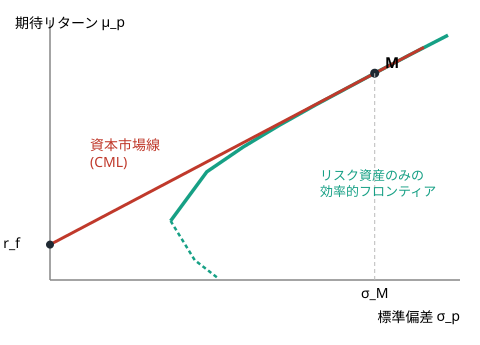
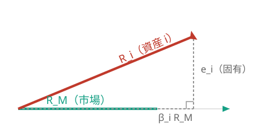
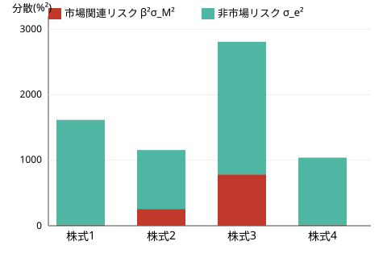
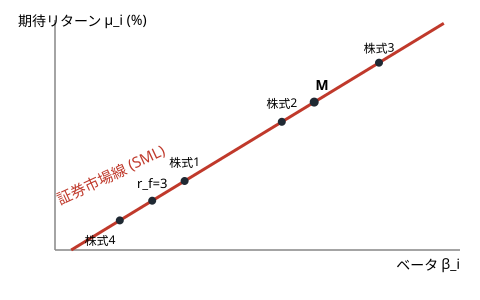
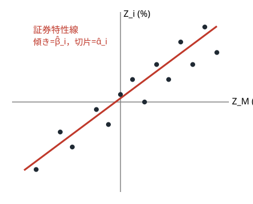

<!-- _class: title -->
<!-- _header: '' -->
<!-- _footer: '' -->

# 第3章　CAPM

金融工学　社内勉強会スライド

底本：『新・証券投資論 I 理論篇』（日本証券アナリスト協会 編，小林孝雄・芹田敏夫 著，日本経済新聞出版社，2009）第3章

前章：ポートフォリオ理論（個人の最適化）→ 本章：市場均衡を重ねる

---

# 本日の内容

1. マーケット・ポートフォリオと資本市場線（CML）
2. ベータ：市場との連動度でリスクを測る
3. 証券市場線（SML）：個別資産の期待リターン
4. ベータの推定と CAPM の実務利用
5. CAPM の実証とアノマリー

---

この章のねらい

前章のトービンの分離定理：安全資産があれば，どの投資家も**同一の接点ポートフォリオ**を持つ。

- 本章ではここに「**市場が需給で清算する**」という均衡条件を重ねる
- 全員が同じリスク資産バスケットを欲しがる → 需要と供給が釣り合うには，そのバスケット＝**市場に存在するリスク資産全体**でなければならない
- このたった一つの需給の条件から，**CAPM** の骨格がすべて導かれる

---

# Part 1：マーケット・ポートフォリオと資本市場線

---

# マーケット・ポートフォリオとは

定義：マーケット・ポートフォリオ

市場に存在するすべてのリスク資産を，その**時価総額**に比例した比率で保有するポートフォリオ。資産 $i$ の時価総額を $V_i$ とすると
$$
w_i^{M}=\frac{V_i}{\sum_j V_j}
$$

- TOPIX や S&P 500 のような時価総額加重の株価指数は，このバスケットの近似
- 「発行済み株式を全部集めたもの」＝「誰かが必ず保有している平均的な持ち高」

---

# 均衡の一言ロジック

均衡の一言のロジック

全員が同じ接点ポートフォリオ $T$ を欲しがる
→ 買われるリスク資産は，どの銘柄も $T$ の構成比どおりに需要される
→ 一方，供給側は時価総額構成（$M$）
→ 需要と供給が釣り合うには，両者の形が一致するしかない：$\;T=M$

CAPM 第1定理

市場が均衡しているとき，接点ポートフォリオはマーケット・ポートフォリオに一致する：$T=M$。
したがってマーケット・ポートフォリオは**効率的ポートフォリオ**である。

---

# なぜこれが重要か

- 前章では，接点ポートフォリオを見つけるのは**各投資家自身の最適化問題**だった（$N$ 資産なら期待リターン $N$ 個・共分散 $N(N+1)/2$ 個を推定）
- CAPM 第1定理は，市場が均衡している限りその答えが**「市場全体を時価総額比で丸ごと持つ」ことだ**と保証する

市場が最適化を代行してくれる

各投資家が自分なりに最適化した結果として売買が起こり，需給が釣り合う点では全員の需要の形が供給＝時価総額構成に一致する。
市場ポートフォリオを買い，あとは安全資産との配分だけ調整すればよい —— これが**インデックス（パッシブ）運用**の理論的支柱。

---

# 資本市場線（CML）

$T=M$ を前章の資本配分線に代入すると，安全資産と市場ポートフォリオを結ぶ直線がそのまま効率的フロンティアになる。

資本市場線（Capital Market Line）

効率的ポートフォリオ（期待リターン $\mu_p$，標準偏差 $\sigma_p$）は
$$
\mu_p=\frac{\mu_M-r_f}{\sigma_M}\,\sigma_p+r_f
$$
の上にある。傾きは**マーケット・リスクの価格**。

---

# CML の図解

安全資産（$\sigma=0,\mu=r_f$）と $M$ を結ぶ直線が，リスク資産だけの効率的フロンティア（双曲線）を突き抜けて**新しい効率的フロンティア**になる。

---

# シャープ比とゼロベータ CAPM

定義：シャープ比

$$
\mathrm{SR}=\frac{\mu-r_f}{\sigma}
$$
標準偏差1単位当たりに得られる超過リターン。

- CML の傾き＝**市場ポートフォリオのシャープ比**，かつあらゆるポートフォリオの中で最大
- 借入・貸出金利が異なる現実的な状況では，$r_f$ の代わりに市場と無相関な**ゼロベータ・ポートフォリオ**が同じ役割を果たす（ゼロベータ CAPM）

---

# Part 2：ベータ：市場との連動度

---

# ベータの定義

CML は効率的ポートフォリオにしか使えない。個別資産を測るには「**市場と一緒に動く部分**」だけを取り出す必要がある。

定義：ベータ

$$
\beta_i:=\frac{\mathrm{Cov}(R_i,R_M)}{\mathrm{Var}(R_M)}=\frac{\sigma_{iM}}{{\sigma_M}^2}=\rho_{iM}\frac{\sigma_i}{\sigma_M}
$$

- 市場が1%動いたとき，資産 $i$ が平均的に何%動くかという**感応度**
- 市場自身のベータは $\beta_M=1$（＝「市場並み」の基準点）

---

# ベータの読み方

ベータの読み方

- $\beta_i>1$：市場より大きく動く**攻撃的**な資産（景気敏感株など）
- $0<\beta_i<1$：市場より小さく動く**防御的**な資産（生活必需品株など）
- $\beta_i=0$：市場と無相関
- $\beta_i<0$：市場と逆に動く（金など）。暴落時に値上がりする**保険**的な価値

ポートフォリオのベータ＝加重平均

$$
\beta_P=\sum_{i=1}^n w_i\beta_i
$$
（共分散の双線形性からただちに従う）

---

# ベータの幾何学的な意味

共分散を内積とみなすと，資産 $i$ の変動 $R_i$ は市場方向の成分 $\beta_i R_M$（正射影）と，直交する固有成分 $e_i$ に分解できる。$\beta_i$ は「市場方向への影の長さの比」。

---

# トータル・リスクの分解

$$
R_i=\alpha_i+\beta_i R_M+e_i,\qquad \mathrm{Cov}(R_M,e_i)=0
$$

定理：トータル・リスクの分解

$$
\underbrace{{\sigma_i}^2}_{\text{トータル・リスク}}=\underbrace{{\beta_i}^2{\sigma_M}^2}_{\text{市場関連リスク}}+\underbrace{{\sigma_{e_i}}^2}_{\text{非市場リスク}}
$$

なぜこの分解が重要か

非市場リスクは銘柄ごとに固有 → 分散投資で打ち消し合って消える（**分散可能**）。
市場関連リスクはどの資産も共有 → 分散しても消えない（**分散不能**）。**市場が報酬を払うのは消せないリスクだけ**。

---

# 数値例：4銘柄のリスク分解（$\sigma_M=20\%$）

| | ベータ $\beta_i$ | 非市場リスク $\sigma_{e_i}$ | トータル $\sigma_i$ | 相関 $\rho_{iM}$ |
|---|---|---|---|---|
| 株式1 | $0.2$ | $40\%$ | $40.2\%$ | $0.10$ |
| 株式2 | $0.8$ | $30\%$ | $34.0\%$ | $0.47$ |
| 株式3 | $1.4$ | $45\%$ | $53.0\%$ | $0.53$ |
| 株式4 | $-0.2$ | $32\%$ | $32.2\%$ | $-0.13$ |

$\sigma_i=\sqrt{{\beta_i}^2{\sigma_M}^2+{\sigma_{e_i}}^2}$，$\rho_{iM}=\beta_i\sigma_M/\sigma_i$ より計算。

---

# 分散の内訳を可視化する

どの銘柄も**分散の大部分が非市場リスク**（分散投資で消せる部分）であることが一目でわかる。

---

# 数値例：等金額ポートフォリオの分散効果

4銘柄を等金額（$w_i=\tfrac14$）で保有すると

$$
\beta_p=\tfrac14(0.2+0.8+1.4-0.2)=0.55,\qquad
{\sigma_{e_p}}^2=\tfrac{1}{16}\textstyle\sum_i{\sigma_{e_i}}^2\approx0.0347
$$

$$
\sigma_p=\sqrt{0.11^2+0.186^2}\approx21.6\%,\qquad
\rho_{pM}\approx0.509,\qquad {\rho_{pM}}^2\approx0.259
$$

市場関連リスクはポートフォリオ分散のわずか26%。残り74%は分散投資で消えている

---

# Part 3：証券市場線とベータの推定

---

# リスクプレミアムは価格の裏返し

例：確実な資産 vs 不確実な資産

1年後に確実に102円 → 今日100円なら $r_f=2\%$。
1年後の**期待値**が102円で**不確実**なら，リスク回避的な投資家はこれを96円と評価する（第1章の確実等価額）。

$$
\frac{102}{96}-1\approx6.25\%,\qquad 6.25\%-2\%=4.25\%\ (\text{リスクプレミアム})
$$

価格が安いほど期待リターンは高くなる —— 価格とリターンは表裏一体。

---

# CAPM 第2定理（証券市場線）

分散して消せる非市場リスクに市場が報酬を払う理由はない。報われるのはベータだけ。

CAPM 第2定理（証券市場線 SML）

$$
\mu_i-r_f=\beta_i\,(\mu_M-r_f)
$$
リスクプレミアムはベータに**比例**し，比例定数は市場リスクプレミアム $\mu_M-r_f$。

- $\beta_i=0$ なら $\mu_i=r_f$：市場と無相関な資産に要求される期待リターンは無リスク金利と同じ

---

# 証明の直感：接線条件

資産 $i$ と市場 $M$ を比率 $a:(1-a)$ で混ぜたポートフォリオの軌跡は，$a=0$（＝$M$ そのもの）で**必ず CML に接する**
（$M$ は効率的フロンティアの境界上の点だから，内側からしか触れられない）。

2つの表現

接線の傾きを CML の傾きに等しいと置いて整理すると，共分散を使った同値な表現も得られる：
$$
\mu_i-r_f=\lambda\,\mathrm{Cov}(R_i,R_M),\qquad \lambda=\frac{\mu_M-r_f}{{\sigma_M}^2}
$$
（$i=M$ とすれば $\lambda(\mu_M-r_f)={\sigma_M}^2\cdot\lambda=\mu_M-r_f$ で整合性を確認できる）

---

# SML の図解

$r_f=3\%,\mu_M=9\%$ のとき $\mu_i=3\%+\beta_i\times6\%$。ベータが負の株式4は**期待リターンが $r_f$ を下回る**（市場の逆向きに動く「保険」的価値の対価）。

---

# CML と SML の違い

混同しやすい2つの直線

- **CML**：横軸は**全リスク $\sigma$**。**効率的ポートフォリオだけ**が直線上に乗る
- **SML**：横軸は**ベータ $\beta$**。効率的でない個別資産も含め**すべての資産**が均衡では直線上に乗る

非効率な資産は全リスクが大きい分 CML の右下方に散らばるが，横軸をベータに取り替えれば SML にきちんと乗る。

---

# ベータの推定：証券特性線

$$
Z_i(t)=\alpha_i+\beta_i Z_M(t)+e_i(t),\qquad Z=R-r_f\ (\text{超過リターン})
$$

過去データに最小二乗法を当てはめた回帰直線を**証券特性線**という。

---

# 推定の実務

$$
\hat\beta_i=\frac{\widehat{\mathrm{Cov}}(Z_i,Z_M)}{\widehat{\mathrm{Var}}(Z_M)},\qquad \hat\alpha_i=\bar Z_i-\hat\beta_i\bar Z_M
$$

こうして得たベータを**ヒストリカル・ベータ**という。

実務上の注意

月次リターン5年分（60ヶ月）程度を使い，市場の代理として TOPIX・S&P 500 などを用いるのが一般的。
推定されたベータは将来 $1$ に回帰する傾向があり，実務では調整（Blume 調整など）を施すこともある。

---

# Part 4：CAPM の応用と実証

---

# インデックス運用とパフォーマンス評価

CAPM 第1定理 → 市場ポートフォリオが効率的 → 時価総額加重で市場全体を持つ**インデックス運用**が理論上最も効率的。

ジェンセンのアルファ

$$
\alpha_P=\mu_P-\bigl[r_f+\beta_P(\mu_M-r_f)\bigr]
$$
実現リターンが SML から**上に離れた距離**。$\alpha_P>0$ は銘柄選択の付加価値を意味する。

---

# 3つの代表的なパフォーマンス指標

シャープ比・トレイナー測度・ジェンセンのα

- **シャープ比** $\dfrac{\mu_P-r_f}{\sigma_P}$：全リスク当たりの超過リターン。単独運用の評価向き
- **トレイナー測度** $\dfrac{\mu_P-r_f}{\beta_P}$：ベータ当たりの超過リターン。分散されたポートフォリオの一部として評価する場合向き
- **ジェンセンのα**：SML からの上方乖離そのもの

CAPM は企業の**資本コスト**（WACC）推定にも使われる：SML はプロジェクトのベータに見合った割引率を与える。

---

# CAPM の実証

実証研究がチェックする主張は2つ：

1. 市場ポートフォリオは効率的である（第1定理）
2. 期待リターンの違いはベータだけで説明され，リスクプレミアムはベータに比例する（第2定理）

$(\beta_i,\text{平均超過リターン})$ をプロットし，原点を通り傾き $\mu_M-r_f$ の直線（SML）に乗るかを検証する。

---

# アノマリー：ベータだけでは説明できない偏り

代表的なアノマリー

- **バリュー株効果**：簿価時価比率が高い（PBR が低い）割安株が CAPM の予測を超える超過リターン
- **サイズ効果**：時価総額の小さい小型株が，ベータで説明できる以上のリターン
- **モメンタム／リバーサル**：短期は勝者が勝ち続け，長期では反転する

→ ベータという**ただ一つの**リスク尺度では現実を説明しきれない。次章のマルチファクター・モデルへ。

---

# まとめ

- **CAPM 第1定理**：市場均衡では接点ポートフォリオ＝マーケット・ポートフォリオ（$T=M$），CML が効率的フロンティア
- **ベータ**：市場との連動度。トータル・リスク＝市場関連リスク＋非市場リスク（後者は分散投資で消える）
- **CAPM 第2定理**：$\mu_i-r_f=\beta_i(\mu_M-r_f)$（証券市場線 SML）。報われるのはベータだけ
- ベータは証券特性線の回帰係数として推定できる
- 実務では：インデックス運用・パフォーマンス評価（シャープ比／トレイナー／ジェンセンのα）・資本コスト推定に利用
- 現実にはバリュー・サイズ・モメンタムなどの**アノマリー**があり，次章のマルチファクター・モデルにつながる

---

<!-- _class: title -->
<!-- _header: '' -->
<!-- _footer: '' -->

# 次回：第4章 マルチファクター・モデルと APT

ベータという単一のリスク尺度を拡張し，
複数のリスク要因（ファクター）で期待リターンを説明する

ご質問・ご議論のある方はぜひ

