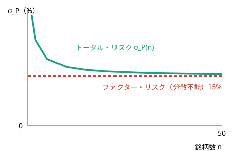

<!-- _class: title -->
<!-- _header: '' -->
<!-- _footer: '' -->

# 第4章　マルチファクター・モデルと APT

金融工学　社内勉強会スライド

底本：『新・証券投資論 I 理論篇』（日本証券アナリスト協会 編，小林孝雄・芹田敏夫 著，日本経済新聞出版社，2009）第4章

前章：CAPM（市場ベータ1本） → 本章：リスク要因を複数に拡張する

---

# 本日の内容

1. マルチファクター・モデル：リスクの源泉を複数に増やす
2. 裁定価格理論（APT）：無裁定だけから価格関係を導く
3. APTの実装：マクロファクター・モデルとファーマ＝フレンチ3ファクター

今回は教科書の記述がやや簡潔なため，具体的な数値例を補いながら進めます。

---

この章のねらい

前章のCAPMは，あらゆるリスクをただ一つの市場ベータに集約した。しかし現実のリターンには市場だけでは説明できない系統的な偏り（バリュー株効果・サイズ効果など）が観測される。

- リスクの源泉を**複数**に増やした**マルチファクター・モデル**を定式化する
- 市場均衡ではなく**無裁定**のみを仮定して期待リターンを導く**裁定価格理論（APT）を証明する**
- APTを実装した**マクロファクター・モデル**と**ファーマ＝フレンチ3ファクター・モデル**を見る

---

# Part 1：マルチファクター・モデル

---

# マーケット・モデルの復習

前章の証券特性線は，市場という**ただ一つの共通要因**でリターンを説明する**シングルファクター・モデル**だった。

$$
R_i=\alpha_i+\beta_i R_M+e_i,\qquad \mathrm{Cov}(R_M,e_i)=0
$$

ポートフォリオに集計すると

$$
{\sigma_P}^2={\beta_P}^2{\sigma_M}^2+{\sigma_{e_P}}^2
$$

と市場関連リスク・非市場リスクに分かれた。市場だけが共通要因とは限らない —— GDP成長率，金利，インフレ，信用スプレッドなど**複数**のマクロ要因が同時に証券を動かしうる。

---

# マルチファクター・モデルの定義

定義：マルチファクター・モデル

$K$個のコモンファクター $f_1,\dots,f_K$ を用いて
$$
R_i=a_i+b_{i1}f_1+b_{i2}f_2+\dots+b_{iK}f_K+e_i
$$
$b_{ik}$：証券 $i$ のファクター $k$ への**ファクター・エクスポージャー**。$e_i$：**固有リターン**（$\mathbb{E}[e_i]=0$，$\mathrm{Cov}(f_k,e_i)=0$，$\mathrm{Cov}(e_i,e_j)=0$）

$K=1,\,f_1=R_M-\mathbb{E}[R_M]$ とすればマーケット・モデルに戻る。エクスポージャー・ベクトル $\boldsymbol{b}_i$ が，証券がどのリスクにどれだけ晒されているかを特徴づける。

---

# ファクター・エクスポージャーの加重平均

命題：ポートフォリオへの集計

$$
b_{P,k}=\sum_{i=1}^n w_i b_{ik}\qquad(k=1,\dots,K)
$$
固有リターンが無相関なら
$$
{\sigma_P}^2=\underbrace{\sum_{k,l} b_{P,k}b_{P,l}\,\mathrm{Cov}(f_k,f_l)}_{\text{ファクター・リスク（分散不能）}}+\underbrace{\sum_i {w_i}^2{\sigma_{e_i}}^2}_{\text{固有リスク（分散可能）}}
$$

前章のリスク分解と同じ要領：ベータが加重平均されたように，**各ファクターへのエクスポージャーも加重平均**される。

---

# 数値例：3証券・2ファクター

ファクター：$f_1$（市場，$\sigma_{f_1}=15\%$），$f_2$（金利，$\sigma_{f_2}=10\%$），$\mathrm{Cov}(f_1,f_2)=0$。

| 証券 | $b_{\cdot1}$ | $b_{\cdot2}$ | $\sigma_e$ |
|---|---|---|---|
| A | 1.2 | 0.3 | 25% |
| B | 0.8 | -0.5 | 30% |
| C | 1.0 | 0.6 | 20% |

等金額（$w=\tfrac13$）ポートフォリオ $P$ は $b_{P1}=1.0,\ b_{P2}\approx0.133$。

$$
\underbrace{1.0^2\times0.15^2+0.133^2\times0.10^2}_{\text{ファクター・リスク}\approx0.0227}+\underbrace{\tfrac19(0.25^2{+}0.30^2{+}0.20^2)}_{\text{固有リスク}\approx0.0214}
\;\Rightarrow\;\sigma_P\approx21.0\%
$$

---

# なぜ固有リスクだけが消えるのか

分散投資で消えるのは固有リスクだけ

固有リスク $\sum_i w_i^2\sigma_{e_i}^2$ は，$n$銘柄に等金額投資すれば $\tfrac1n\overline{\sigma_e^2}\to0$ と消える。
ファクター・リスクはすべての証券が共有する $f_k$ に由来し，分散しても $b_{P,k}$ がゼロにならない限り残る。

固有リスクをほぼ消し去ったポートフォリオを**十分に分散されたポートフォリオ**と呼ぶ。次節のAPTは「消せないファクター・リスクにだけ価格がつく」という主張。

---

# 価格づけ以前の実務的な使い道

マルチファクター・モデルの応用

- **インデックス・トラッキング**：指数とファクター・エクスポージャーを一致させれば，全銘柄を保有せず少数銘柄で指数を複製できる
- **ファクター・ベッティング**：特定のファクターにだけ意図的にエクスポージャーを傾け，その要因に賭けるアクティブ運用ができる

これらは「価格が正しいかどうか」を問わない，リスク管理・ポートフォリオ構築のツールとしての使い方。次節では，このファクター構造から**価格関係**を導く。

---

# Part 2：APT — 裁定価格理論

---

# CAPMとは異なるアプローチ

CAPMは「全投資家が平均・分散最適化を行い，市場が均衡する」という強い前提からSMLを導いた。

裁定価格理論（Arbitrage Pricing Theory, APT）

投資家の効用や市場均衡を仮定せず，ただ**無裁定**（元手なしで確実な利益を生む機会は存在しない）だけから価格関係を導く（Ross, 1976）。

前提が弱いぶん結論も緩やかだが，複数ファクターを自然に扱える点で実務的。

---

# サプリのカプセルのアナロジー

ファクターを期待値0に基準化すると，$R_i=E_i+b_{i1}f_1+\dots+b_{iK}f_K+e_i$（$f_k$は「サプライズ」）。

サプリ（カプセル）のアナロジー

証券を，$K$種類の成分（ファクター）を $\boldsymbol{b}_i$ だけ含んだサプリのカプセルだと思おう。各成分に単価 $\lambda_k$ がつくなら，カプセルの正しい値段は成分価値の合計 $\sum_k b_{ik}\lambda_k$。
これより安ければ買って分解して売り，高ければ成分を買い集めて詰めて売れば元手なしで儲かる —— この**裁定**が消えるまで価格は調整される。

---

# APTの主定理

APTの主定理

十分に分散されたポートフォリオが自由に組成できるとき，任意の証券のリスクプレミアムは（近似的に）
$$
E_i-r_f=b_{i1}\lambda_1+b_{i2}\lambda_2+\dots+b_{iK}\lambda_K
$$
で表される。$\lambda_k$：ファクター $k$ の**リスクプレミアム**（ファクター価格）。

証明の骨格：**元手ゼロ・全ファクター・エクスポージャー0**の裁定ポートフォリオを組むと，無裁定より期待リターンも0でなければならない —— これだけから導かれる。

---

# 数値例：裁定ポートフォリオを実際に組む

単一ファクター（$b=1$）で十分に分散された3ポートフォリオ $P,Q,R$ の期待リターンが $E_P=E_Q=10\%,\ E_R=12\%$ だとする（$R$が割安＝無裁定でない状態）。

投資比率 $(w_P,w_Q,w_R)=(-\tfrac12,-\tfrac12,1)$ を組むと

$$
\textstyle\sum w_i=0\ (\text{元手ゼロ}),\qquad \sum w_ib_i=-\tfrac12-\tfrac12+1=0\ (\text{エクスポージャーも0})
$$

それなのに期待リターンは -½(10%)-½(10%)+1(12%) = 2%！ リスクなしで確実に2%の利益

これが裁定機会。無裁定ならこの機会は存在せず，同じエクスポージャーの資産は同じ期待リターンでなければならない。

---

# ファクター・ポートフォリオと近似の意味

系：ファクター・プレミアムの意味

ファクター $k$ にだけエクスポージャー1をもつ十分に分散されたポートフォリオ（**ファクター・ポートフォリオ**）のリスクプレミアムは，ちょうど $\lambda_k$。$\lambda_k$は「ファクター$k$のリスクを1単位負担して得られる超過リターン」。

- 主定理が個別証券では**近似**にとどまるのは，固有リスク $e_i$ が有限の銘柄数では完全には消えないから
- 銘柄数を増やし十分に分散されたポートフォリオに近づくほど，誤差は小さくなる

---

# CAPMはAPTの特別な場合

CAPMとAPTの関係

ファクターを1つ（$K=1$）とし，市場超過リターン $f_1=R_M-\mathbb{E}[R_M]$ にとると，$b_{i1}=\beta_i,\ \lambda_1=\mu_M-r_f$ となり，APTはSMLに一致する。CAPMはAPTの単一ファクター版とみなせる。

CAPMとAPTの対比

- **CAPM**：全投資家が最適化し市場が均衡する（**均衡**アプローチ）。リスク要因は市場ただ1つに一意に定まる
- **APT**：効用や均衡を仮定せず無裁定のみ要請（**無裁定**アプローチ）。リスク要因の個数も中身も理論からは特定されない

---

# Part 3：APTの実装：ファクターを選ぶ

---

# マクロファクター・モデル

APTはファクターが何であるかを**特定しない**。Chen–Roll–Ross (1986) はマクロ経済変数を使った。

| ファクター | リスクプレミアム $\lambda_k$ |
|---|---|
| GDP成長（景気） | 13.589% |
| 予想外インフレ | -0.629% |
| タームプレミアム | -5.211% |
| 信用スプレッド | 7.205% |

景気敏感株ほど高リターンを要求され，インフレの保険資産は低リターンで保有される。

---

# ファーマ＝フレンチ3ファクター・モデル

Fama–French (1993)：3ファクター

**マーケット**（$R_M-r_f$）／**SMB**（Small minus Big，サイズ）／**HML**（High minus Low，簿価時価比率＝バリュー）

$$
E_i-r_f=b_{i,M}\lambda_M+b_{i,SMB}\lambda_{SMB}+b_{i,HML}\lambda_{HML}
$$

| | マーケット | SMB | HML |
|---|---|---|---|
| $\lambda$ | 5.92% | 3.94% | 4.47% |

---

# 数値例：3ファクターによる期待リターン

$r_f=3\%$，あるバリュー寄り小型株が $b_M=1.1,\ b_{SMB}=0.6,\ b_{HML}=0.4$ のとき

$$
E_i-r_f=1.1\times5.92\%+0.6\times3.94\%+0.4\times4.47\%=10.66\%
\;\Rightarrow\; E_i\approx13.66\%
$$

CAPM（市場ベータ1.1のみ）で評価すると E_i-r_f=6.51%，E_i≈9.51%にとどまる

3ファクター・モデルは，小型・割安であることへの上乗せ（+4.15%）を期待リターンに織り込む点がCAPMと異なる。

---

# 他のファクターモデルと章のまとめ

その他の代表的なモデル

- **ICAPM**（Merton, 1973）：投資機会集合の変化をファクターに
- **CCAPM**：消費の変動をただ1つのファクターに
- **Carhart 4ファクター**（1997）：FF3にモメンタムを追加

いずれも「リスクプレミアム＝エクスポージャー×ファクター価格の和」という裁定プレミアム構造を共有する。

---

# まとめ

- **マルチファクター・モデル**：$K$個のコモンファクターでリターンを説明。リスクは**ファクター・リスク**（分散不能）と**固有リスク**（分散可能）に分解
- **APT主定理**：無裁定だけから $E_i-r_f=\sum_k b_{ik}\lambda_k$ を導出。裁定ポートフォリオ（元手0・全エクスポージャー0）の期待リターンが0であることが核心
- CAPMは**単一ファクターのAPT**とみなせる（均衡 vs 無裁定という異なる原理から同じ形の式に到達）
- 実装にはマクロファクター（CRR）やファーマ＝フレンチ3ファクターなど，ファクターを具体的に選ぶ必要がある
- 次章：無裁定の考え方をさらに一般化し，**リスクニュートラル・プライシング**へ

---

<!-- _class: title -->
<!-- _header: '' -->
<!-- _footer: '' -->

# 次回：第5章 リスクニュートラル・プライシング

「無裁定」という考え方を状態価格・リスク中立確率へと一般化し，
デリバティブの価格づけの土台を作る

ご質問・ご議論のある方はぜひ

