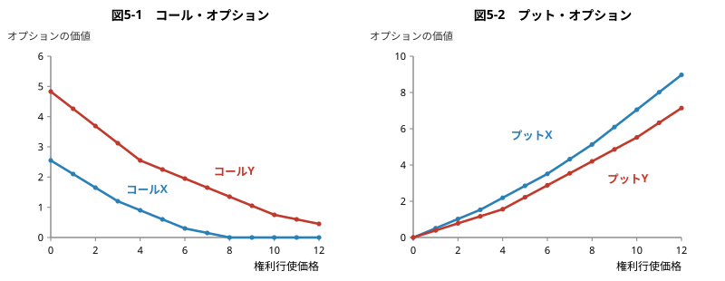
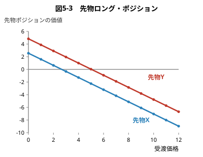
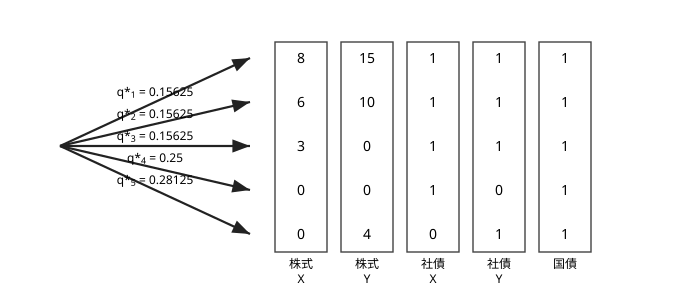

## 証券投資論 勉強会

### 第5章　リスクニュートラル・プライシング

---

# はじめに

第4章で紹介した**ノー・フリーランチの原理**が，より広範な金融資産のプライシングに使えることを説明する。APT では資産のリスクプレミアムを求めるためにこの原理を用いたが，この章では同じ原理を用いて，**リスクニュートラル・プライシング**という証券プライシングの基本手法を確立する。

---

# 5.1.1 状態価格

**例**：今日から1年後の経済の状態について5通りのシナリオが考えられるとする。株式や債券は1年で満期を迎えるものとし，債券の額面は1円とする。

| 証券 | 価格 | 状態1 | 状態2 | 状態3 | 状態4 | 状態5 |
|---|---|---|---|---|---|---|
| X 社の株式 | 2.55 | 8 | 6 | 3 | 0 | 0 |
| Y 社の株式 | 4.83 | 15 | 10 | 0 | 0 | 4 |
| X 社の社債 | 0.69 | 1 | 1 | 1 | 1 | 0 |
| Y 社の社債 | 0.72 | 1 | 1 | 1 | 0 | 1 |
| 国債 | 0.96 | 1 | 1 | 1 | 1 | 1 |

社債には貸し倒れがあるので，貸し倒れのない国債に比べて割安になっている。この例では1年後のキャッシュフローが確定した**国債が安全資産**となる。

---

第4章の**健康サプリ**の話を思い出そう。健康サプリは，含まれる個々の成分の分量によって商品が特徴づけられ，その価格は各成分の分量と単価の掛け算で決まると考えた。この考え方をいまの状況に適用してみる。

状態1で生まれるキャッシュフローを商品成分 A，状態2で生まれるキャッシュフローを商品成分 B，……，状態5で生まれるキャッシュフローを商品成分 E と考えれば，表にあげた5個の金融資産はいずれも**商品成分 A〜E の組み合わせ**と見なすことができる。

各成分の単価を $q_1,q_2,\dots,q_5$ で表そう。X 社の株式は8単位の成分 A，6単位の成分 B，3単位の成分 C の組み合わせであるから，その $t=0$ における価格について
$$
8q_1+6q_2+3q_3=2.55
$$
という等式が成り立つと考えられる。

---

残りの4つの金融資産についても同様に考えると
$$
\begin{align*}
8q_1+6q_2+3q_3&=2.55\\
15q_1+10q_2+4q_5&=4.83\\
q_1+q_2+q_3+q_4&=0.69\\
q_1+q_2+q_3+q_5&=0.72\\
q_1+q_2+q_3+q_4+q_5&=0.96
\end{align*}
$$
が成り立つはずである。これは $(q_1,\dots,q_5)$ に関する5本の1次方程式で，これを解くと
$$
(q_1,q_2,q_3,q_4,q_5)=(0.15,\ 0.15,\ 0.15,\ 0.24,\ 0.27)
$$

**定義**： 状態 $i$ が起きたときに1円もらえる証券の現在価格を表す $q_i$ を，状態 $i$ の**状態価格**と呼び，各状態価格をまとめた $(q_1,q_2,\dots,q_m)$ を**状態価格ベクトル**と呼ぶ。

このように成分 A〜E の単価がわかれば，デリバティブをはじめ，様々な金融資産の価格を求めることができる。

---

# （補足）状態依存型請求権

> 状態ごとに財を区別することによって不確実性下の経済モデルを考えたのは Arrow [1964] と Debreu [1959] である。この例の5種類の商品成分（状態 $s$ が起きたときのみ1円支払う証券）のように，すべての証券のプライシングの元になる基本証券を，**状態依存型請求権**（state-contingent claim）あるいは **Arrow–Debreu 証券**と呼ぶ。

---

# 5.1.2 コール・オプションの価格

X 社株のコール・オプション3本についてキャッシュフローを考える（表は次スライド）。これらは満期日が $t=1$ で，満期日にしか権利行使が行えない**ヨーロピアン・オプション**であるとする。

$K=2$ 円のコール・オプションの場合，満期日に2円の価格で X 社の株式1株を買うことができる。X 社株の株価は $(8,6,3,0,0)$ であるから，満期日の状態1，状態2，状態3でこのオプションは**イン・ザ・マネー**になる。したがって，このオプションの $t=1$ でのキャッシュフローは $(6,4,1,0,0)$ となる。

そこで，このオプションの $t=0$ での価値を**成分単価の積み上げ**により計算すると
$$
6q_1+4q_2+1\cdot q_3=6\times0.15+4\times0.15+1\times0.15=1.65
$$

---

他のコール・オプションのキャッシュフローと今日のオプション価値も，同じように計算できる。

| 証券 | 今日の価値 | 状態1 | 状態2 | 状態3 | 状態4 | 状態5 |
|---|---|---|---|---|---|---|
| X 社の株式 | 2.55 | 8 | 6 | 3 | 0 | 0 |
| コール X $(K{=}2)$ | 1.65 | 6 | 4 | 1 | 0 | 0 |
| コール X $(K{=}4)$ | 0.90 | 4 | 2 | 0 | 0 | 0 |
| コール X $(K{=}6)$ | 0.30 | 2 | 0 | 0 | 0 | 0 |
| Y 社の株式 | 4.83 | 15 | 10 | 0 | 0 | 4 |
| コール Y $(K{=}2)$ | 3.69 | 13 | 8 | 0 | 0 | 2 |
| コール Y $(K{=}4)$ | 2.55 | 11 | 6 | 0 | 0 | 0 |
| コール Y $(K{=}6)$ | 1.95 | 9 | 4 | 0 | 0 | 0 |

---

# 5.1.3 プット・オプションの価格

プット・オプションについても，同じように計算できる。X 社株のプット・オプションで $K=2$ のものを例にとると，満期日にイン・ザ・マネーになるのは状態4と状態5で，このオプション1単位の満期日のキャッシュフローは $(0,0,0,2,2)$ となる。したがって，オプションの今日の価値は
$$
2q_4+2q_5=2\times0.24+2\times0.27=1.02
$$
と計算される。

---

他のプット・オプションについても同様に計算できる。

| 証券 | 今日の価値 | 状態1 | 状態2 | 状態3 | 状態4 | 状態5 |
|---|---|---|---|---|---|---|
| X 社の株式 | 2.55 | 8 | 6 | 3 | 0 | 0 |
| プット X $(K{=}2)$ | 1.02 | 0 | 0 | 0 | 2 | 2 |
| プット X $(K{=}4)$ | 2.19 | 0 | 0 | 1 | 4 | 4 |
| プット X $(K{=}6)$ | 3.51 | 0 | 0 | 3 | 6 | 6 |
| Y 社の株式 | 4.83 | 15 | 10 | 0 | 0 | 4 |
| プット Y $(K{=}2)$ | 0.78 | 0 | 0 | 2 | 2 | 0 |
| プット Y $(K{=}4)$ | 1.56 | 0 | 0 | 4 | 4 | 0 |
| プット Y $(K{=}6)$ | 2.88 | 0 | 0 | 6 | 6 | 2 |

---

# 5.1.4 オプション価値と権利行使価格の関係

これらのオプションについて，権利行使価格を0円から12円まで動かして，上の方法で計算したオプション価値を図示すると次のようになる。

第7章ではこのオプション価値を二項モデルやブラック・ショールズ公式を使って求めることになるが，権利行使価格とオプション価値の関係は同様の形になる。

---

以上の説明を振り返ると，この手続きは**きわめて一般性の高いプライシングの原理**を示唆していることに気がつく。すなわち，5つの状態と表が与えられるとき

> 1年後のキャッシュフローが表にきっちり書き込めるような金融商品については，今日の価値を簡単に計算できるのである。

---

# 5.1.5 先物の価格

もう1つ，**先物**についての計算例を示しておく。ある投資家が X 社の株式を $t=1$ で売買する複数の先物契約を過去 $(t=0$ 以前$)$ に結んでいるとする。約定した受渡価格を $K$ で表す。ここでは先物の**ロング・ポジション側**（買い手側）に立って説明する。

$K=2$ の場合を例にとれば，$t=1$ になるとこの投資家は X 社の株式を2円で買うことになる。$t=1$ での X 社の株価は $(8,6,3,0,0)$ であるから，この先物ポジション1単位の $t=1$ でのキャッシュフローは $(6,4,1,-2,-2)$ となる。よって，この先物ポジションの $t=0$ での価値は
$$
\begin{align*}
&\phantom{=} 6q_1+4q_2+1\cdot q_3+(-2)q_4+(-2)q_5\\
&=6 \times 0.15+4 \times 0.15+1\cdot 0.15+(-2) \times 0.24+(-2) \times 0.27\\
&=0.63
\end{align*}
$$
と計算される。

---

他の受渡価格についても同様に計算できる。

| 証券 | 今日の価値 | 状態1 | 状態2 | 状態3 | 状態4 | 状態5 |
|---|---|---|---|---|---|---|
| 先物 X $(K{=}2)$ | 0.63 | 6 | 4 | 1 | $-2$ | $-2$ |
| 先物 X $(K{=}4)$ | $-1.29$ | 4 | 2 | $-1$ | $-4$ | $-4$ |
| 先物 X $(K{=}6)$ | $-3.21$ | 2 | 0 | $-3$ | $-6$ | $-6$ |
| 先物 Y $(K{=}2)$ | 2.91 | 13 | 8 | $-2$ | $-2$ | 2 |
| 先物 Y $(K{=}4)$ | 0.99 | 11 | 6 | $-4$ | $-4$ | 0 |
| 先物 Y $(K{=}6)$ | $-0.93$ | 9 | 4 | $-6$ | $-6$ | $-2$ |

> 先物のショート・ポジション側（売り手側）のキャッシュフローは，ロング・ポジション側のキャッシュフローの正負の符号を逆にしたものになる。
> 
---

オプションと違い，先物の価値は受渡価格 $K$ の**1次関数**（直線）になる。

先物市場は毎日，先物の買い手側と売り手側にとって**契約の価値がちょうどゼロになるような受渡価格**を探している。つまり，今日金銭の授受がなくても，買い手と売り手が対象資産の売買を契約できる受渡価格を市場が探しているといえる。したがって，図5-3の直線が $x$ 軸と交わる受渡価格が，今日の**先物価格**である。いまの例で計算すると，X 社株の今日の先物価格は **2.656円**，Y 社株の今日の先物価格は **5.031円**となる。

---

# 5.1.6 先物のキャリー公式

X 社株の今日の現物価格は2.55円で，先物価格は2.656円と計算された。すなわち，X 社株を今日買えば2.55円であるが，1年後に買う約束を今日行うとすれば，価格2.656円でその約束を結ぶことができる。

いまの場合，先物の満期日までに配当支払いはないので，X 社株を今日買っても $t=1$ で買っても同じことである。したがって，$t=0$ での2.55円は $t=1$ での2.656円と同じ経済価値であることを，X 社株の先物価格が教えていることになる。

**先物のキャリー公式**：
$$
\text{先物価格}=\text{現物価格}\times(1+\text{金利})
$$

---

この式の成立を確認しよう。安全資産（国債）の価格から，今日の1年の金利（リスクフリー・レート）は
$$
\frac{1}{0.96}-1\simeq4.167\%
$$
と計算されるが，キャリー公式の右辺は
$$
2.55\times\frac{1}{0.96}=2.656
$$
となる。これは X 社株の先物価格と一致する。Y 社株についても $4.83\times(1/0.96)=5.031$ で同様の関係が確認できる。

今日の2.55円は $t=1$ での2.656円と等価値であり，今日の4.83円は $t=1$ での5.031円と等価値であることが，今日の現物価格と先物価格の関係に映し出されているのである。

---

# （補足）プット・コール・パリティ

$K=2$ の X 社株について
$$
\underbrace{1.65}_{\text{コール}}-\underbrace{1.02}_{\text{プット}}=\underbrace{0.63}_{\text{先物ロング}}
$$
が成り立っている。実際，コールのペイオフ $\max(S-K,0)$ からプットのペイオフ $\max(K-S,0)$ を引くと，どの状態でも $S-K$（＝先物ロングのペイオフ）になるからである。

状態価格による評価は**線形**（キャッシュフローの足し算が価値の足し算に対応する）なので，ペイオフの間に成り立つ恒等式は，そのまま価格の間の恒等式になる。Y 社株の $K=2$ でも $3.69-0.78=2.91$ で成立している。

---

# 5.2.1 一般的なモデル

前節の例を理論的に整理しよう。$t=0,1$ の2時点からなるモデルを考える。$t=1$ 時点に実現する状態について，経済のシナリオが $m$ 通りあるとする。市場で取引される金融資産は $i=1,2,\dots,n$ の $n$ 種類とし，資産 $i$ を1単位保有することによって得られる $t=1$ でのキャッシュフローをベクトル $(D_{i,1},D_{i,2},\dots,D_{i,m})$ で表す。また，$n$ 種類の金融資産の $t=0$ での価格を $(p_1,p_2,\dots,p_n)$ で表す（前節の例題えは $m=5,\ n=5$ であった）。

各資産を $m$ 種類の成分の集まりと考え，これらの成分の単価を $(q_1,q_2,\dots,q_m)$ と書くと，各資産の価格と成分単価の間には
$$
p_i=q_1D_{i,1}+q_2D_{i,2}+\dots+q_mD_{i,m},\qquad i=1,2,\dots,n
$$
の等式が成り立つはずである。

---

この連立1次方程式の解を求めたあと，新たな金融商品について，その価格を計算する。新たな金融商品が $t=1$ 時点で生むキャッシュフローのベクトルを $(D_{u,1},D_{u,2},\dots,D_{u,m})$ と書くと，その価格 $p_u$ は
$$
p_u=q_1D_{u,1}+q_2D_{u,2}+\dots+q_mD_{u,m}
$$
で与えられた。

<!-- > やや大げさにいえば，この簡単な理屈が，ブラック・ショールズのオプション・モデルをはじめ，デリバティブ評価理論のエッセンスである。 -->

本章では $t=0,1$ の2時点からなるモデルを考えているので，これで話がほぼ終わりになる。実際の問題では将来の時点が多数現れるので，多期間問題のモデル化が大きな課題になる。後者の問題は二項モデルをベースにして第7章で扱う。

---

# 5.2.2 状態価格の存在とノー・フリーランチの関係

前節の議論を進めるうえで前提にしたことが1つある。それは，**成分単価のベクトルが存在する**という前提である。もし単価のベクトル $(q_1,q_2,\dots,q_m)$ が存在しなければ，新たな金融商品の価格を決めることができない。

しかも，単価は**すべて正の値**でなければならない。成分単価が負になる状態 $s$ があれば，状態 $s$ で正のキャッシュフローを生み，$s$ 以外の状態でのキャッシュフローはゼロとなるような金融商品に対して，負の価格がつくことになる。そんなことがあれば，お金をもらって（負の価格）将来のキャッシュフローが負になることが決してないこの金融商品に，**際限のない需要が集中する**はずである。

<!-- > 会社などへ出資した者が，その出資した額についてのみ責任を負うという原理を**有限責任原理**という。株式，債券，オプションなどへの投資（買い）は有限責任である。これに対して，先物取引の場合は将来の価値が負になることがあるので，無限責任である。 -->

状態価格ベクトル $(q_1,q_2,\dots,q_m)$ が正の領域に必ず存在することを裏づけるのが，市場の無裁定条件を特徴づける次の定理である。

---

**定理（状態価格の存在定理）**：市場がノー・フリーランチであるための必要十分条件は，$p_i=q_1D_{i,1}+\dots+q_mD_{i,m}$ を満たす正の状態価格ベクトル $(q_1,q_2,\dots,q_m)$ が存在することである。

幾何学的なイメージによる直感的な証明が章末の数学付録にまとめられている（スライドでは省略する）。そこで与えた証明が，第4章で述べた**APTの主定理**の証明とよく似ていることに気づくであろう。どちらも無裁定条件を表す定理であるが，これらの定理の基礎には**幾何学的な論理が共通に潜んでいる**。

なお，定理を証明するには「市場にフリーランチがない」という表現の厳密な数学的定義が必要である。

**定義**：市場の**フリーランチ**とは，$t=1$ のあらゆる状態で正のキャッシュフローを生み出すような**裁定ポートフォリオ**が構築できることを指す。

---
このようなポートフォリオが存在すれば，資金の元手なしに将来確実に正のキャッシュフローが得られることになるので，裁定利益を求めて同一方向の取引が市場に集中する。その結果，安すぎる証券の価格は上昇し，高すぎる証券の価格は下落する。そうした市場の価格調節機能が働く結果，市場均衡ではフリーランチは存在しえない。これが**市場の無裁定条件の意味**である。

> 厳密にいうと，フリーランチとは2つのタイプがあり，
> - $t=0$ でのキャッシュフローがゼロまたは正で，$t=1$ でのペイオフが非負かつ少なくとも1つの状態で正のペイオフが得られること
> - $t=0$ でのキャッシュフローが正で，$t=1$ でのペイオフが非負となること
> 
> 前者を**タイプ1の裁定機会**，後者を**タイプ2の裁定機会**と呼ぶ。

---

# （補足）市場の完備性

**状態価格の存在定理**では，状態価格ベクトルの**一意性は保証されない**。状態価格ベクトルが複数見つかる場合を**不完備市場**の状態と呼ぶ。

そのようなケースでは，新しい金融商品を市場で取引される金融商品から完全に複製することはできなくなる。いいかえると，新しい金融商品の価格がノー・フリーランチの原理だけでは決まらないことになる。

先の例では資産の本数 $n=5$ と状態数 $m=5$ が一致し，連立1次方程式がちょうど一意に解けたので，市場は完備であった。

---

# 5.3.1 証券価格と割引率

ポートフォリオ理論では，投資から得られるリターンの不確実性を，平均値や標準偏差といった確率分布のパラメータでとらえた。このフレームワークで個別資産の価格を求めるには，将来のキャッシュフローの予測と，予測値（期待値）を現在価値に割り引く**割引率**が必要になる。

割引率は，投資対象のリスクならびに投資家のリスク選好を反映した**リスクプレミアム**をリスクフリー・レートに加算して求められるが，このリスクプレミアムの計算に CAPM や APT などの理論モデルが用いられる。先の例をこの考え方で解釈すると次のようになる。以下では，**すべての状態が等確率**（各 $0.2$）で起きるとして説明を進める。

---

| 証券 | 価格 | 状態1 | 状態2 | 状態3 | 状態4 | 状態5 |
|---|---|---|---|---|---|---|
| X 社の株式 | 2.55 | 8 | 6 | 3 | 0 | 0 |
| Y 社の株式 | 4.83 | 15 | 10 | 0 | 0 | 4 |
| X 社の社債 | 0.69 | 1 | 1 | 1 | 1 | 0 |
| Y 社の社債 | 0.72 | 1 | 1 | 1 | 0 | 1 |
| 国債 | 0.96 | 1 | 1 | 1 | 1 | 1 |

**(1) リスクフリー・レートと国債価格**

国債は1年後のキャッシュフローが1円と確定している。リスクフリー・レートは $4.167\%$ であったので，リスクフリー・レートから逆算すると，今日の国債価格は1年後の1円を $4.167\%$ の金利で割り引いて
$$
\frac{1}{1+0.04167}=0.96
$$

---

**(2) 社債のリスクプレミアム**

X 社の社債は状態5が起きるとデフォルトして回収額がゼロになる。Y 社の社債は状態4でデフォルトが起きる。X 社の社債も Y 社の社債も，デフォルトする確率は $20\%$ である。この確率を前提にキャッシュフローの期待値を計算すると
$$
1\times0.8+0\times0.2=0.8
$$

そこで，X 社の社債のリスクプレミアムを $\lambda^B_X$，Y 社の社債のリスクプレミアムを $\lambda^B_Y$ と書くと，表に与えられた価格から
$$
0.69=\frac{0.8}{1.04167+\lambda^B_X},\qquad
0.72=\frac{0.8}{1.04167+\lambda^B_Y}
$$
が成立するはずであり，これから
$$
\lambda^B_X\simeq11.78\%,\qquad \lambda^B_Y\simeq6.94\%
$$

---

**(3) 状態価格の意味**

上のプレミアムは社債のデフォルトに対して市場が求める**信用スプレッド**であるが，信用スプレッドの大きさにかなりの開きがある。投資家が予想するデフォルト確率は同じなのに，両社の信用スプレッドに大きな差が出るのはなぜであろうか。

求めた状態価格を振り返ると，状態 $1,2,3$ の価格が $0.15$ 円で，状態4の価格が $0.24$ 円，状態5の価格が $0.27$ 円であった。状態価格とは，$t=1$ でその状態が起きたときに支払われる1円に市場がつけた価格であった。これを健康サプリになぞらえて金融商品の「成分」単価と呼んだのである。

もう少し平たく説明しよう。世の中に**5つの保険会社**があると考える。第1の保険会社は状態1の発生に対する保険を販売している保険会社である。この会社の保険を1単位契約すると，$t=1$ で状態1の経済シナリオが起きたときにだけ保険金を1円受け取ることができる。

---

こう考えると，**状態価格とは各保険会社の保険料率のこと**で，状態5の保険が一番高く，状態4の保険がその次に高いということになる。

状態5の保険料率が高いのには2つの理由が考えられる。第1は状態5の生起確率が高い場合，第2は状態5が極度の業績不振や経済停滞の状態を指す場合である。ここでは各状態の生起確率は同じと仮定したので，**最も悪いマクロ経済の状態が状態5**であると考えることになる。

第5の保険会社が提供する保険は，景気の悪化，所得の停滞，企業の連鎖倒産などをともなうきわめて悪い経済シナリオに対する**格好のヘッジ手段**を提供する。したがって，第5の保険会社が提供する保険に対する市場の需要が大きく，保険料率は高くなる。

<!-- > こうした理由で，状態5でデフォルトする X 社の社債よりも，状態4でデフォルトする Y 社の社債のほうが**割高に買われている**のである。 -->

同じデフォルト確率でも「どの状態でデフォルトするか」によって価格が変わる——これがリターンの確率分布だけを見るポートフォリオ理論ではとらえきれない側面である。

---

**(4) 株式のリスクプレミアム**

最後に株式に話を移そう。X 社の株式から $t=1$ で回収されるキャッシュフローの期待値を計算すると
$$
8\times0.2+6\times0.2+3\times0.2=3.4
$$
Y 社の株式については
$$
15\times0.2+10\times0.2+4\times0.2=5.8
$$

そこで，X 社株のリスクプレミアムを $\lambda^S_X$，Y 社株のリスクプレミアムを $\lambda^S_Y$ と書くと，割引公式を適用して
$$
2.55=\frac{3.4}{1.04167+\lambda^S_X},\qquad
4.83=\frac{5.8}{1.04167+\lambda^S_Y}
$$
となり
$$
\lambda^S_X\simeq29.2\%,\qquad \lambda^S_Y=15.9\%
$$
X 社株に比べて Y 社株のプレミアムが小さいのは，Y 社株が**状態5で一定の価値を保つ**からである。

---

# 5.3.2 リスク調整割引公式

この節では，将来のキャッシュフローの期待値をリスク調整した割引率で割り引いて，今日の投資価値を求めた。これは**リスク調整割引公式**と呼ばれる。

これに対して，前節までの考え方から生まれるもう1つの割引公式が**リスク中立割引公式**と呼ばれる割引公式である。次に，これについて説明しよう。

---

# 5.4.1 金融商品価格決定の一般理論

ポートフォリオ理論では，投資から得られるリターンの不確実性を確率分布のパラメータでとらえると述べたが，実際の商取引や金融契約で，期待値や標準偏差といった値が契約書に明記されているわけではない。

例えば，**火災保険**の契約をするときに，火災が起きる確率や損害額の分布が保険契約の中に明記されるわけではない。にもかかわらず保険契約が成立するのは，**契約の対象となる事象が契約に明記されているから**である。火災保険の契約書を見れば，どのような条件が満たされれば支払い対象となる火災が起きたと認定され，その際にいくら支払われるかが記載されている。

このように，支払いの行われる事象が明確に定義されれば，売り手と買い手の間で保険契約が成立し，その価格が決定される。

---

将来の不確実性を，**状態という成分に分解**して，個々の状態価格の積み上げで金融商品の価格を説明するという発想は，金融契約の本質に即した考え方である。また，同じ貨幣1単位の価値が経済のシナリオによって異なるという可能性は，リターンの確率分布だけに注目するポートフォリオ理論ではとらえることができない。

> この意味で，本章で説明してきた価格理論は，デリバティブの価格を現物資産からの複製原理で説明する「派生理論」にとどまるものではなく，**金融資産価格の深い側面を掘り下げた一般理論**であるということができる。

この一般理論は，Harrison–Kreps [1979] によって，多期間の離散時間および連続時間モデルというより一般的なモデルの下で，初めて示された。

---

# 5.4.2 リスク中立確率

**状態価格の存在定理**に確率論的な装いをこらすこともできる。例に戻って，この方法を説明しよう。

1単位の安全資産のキャッシュフローはベクトル $(1,1,\dots,1)$ で表されるから，その価格は $\sum_{i=1}^m q_i$ で与えられる。この価格がわかっているとき，リスクフリー・レート $r_f$ は
$$
1+r_f=\frac{1}{\sum_{i=1}^m q_i}
$$
から計算される。

**定義**：状態価格 $(q_1,q_2,\dots,q_m)$ から
$$
q_i^{*}:=(1+r_f)q_i,\ i=1,2,\dots,m
$$
で $(q_1^{*},q_2^{*},\dots,q_m^{*})$ を定義する．この $q_i^{*}$ を状態 $i$ の**リスク中立確率**と呼ぶ。

---

**状態価格の存在定理**より，すべての $q_i^{*}$ は正で
$$
\sum_{i=1}^m q_i^{*}=(1+r_f)\sum_{i=1}^m q_i=1
$$
となるので，$(q_1^{*},q_2^{*},\dots,q_m^{*})$ を状態 $(1,2,\dots,m)$ の生起確率と見なすことができる。

---

# 5.4.3 リスク中立確率の存在定理

$(q_1^{*},q_2^{*},\dots,q_m^{*})$ を用いて価格の式を
$$
p_i=\frac{1}{1+r_f}\left(q_1^{*}D_{i,1}+q_2^{*}D_{i,2}+\dots+q_m^{*}D_{i,m}\right),\qquad i=1,2,\dots,n
$$
と書き直すことができる。この各式の右辺は，$t=1$ でのキャッシュフローの**期待値を $r_f$ で割り引いた現在価値**の形をしている。つまり，市場で取引される金融資産の価格を，将来のキャッシュフローの期待値の割引現在価値に等しいとするのがこの式である。

この理解に立って，**状態価格の存在定理**を次のようにいいかえることができる。

**定理（リスク中立確率の存在定理）**：市場がノー・フリーランチであるための必要十分条件は，上式を満たす正のリスク中立確率 $(q_1^{*},q_2^{*},\dots,q_m^{*})$ が存在することである。

---

# 5.4.4 リスク中立割引公式

リスク中立確率 $(q_1^{*},\dots,q_m^{*})$ が既知のとき，キャッシュフロー・ベクトル $(D_{u,1},D_{u,2},\dots,D_{u,m})$ で与えられる新しい金融商品の価格 $p_u$ は
$$
p_u=\frac{1}{1+r_f}\left(q_1^{*}D_{u,1}+q_2^{*}D_{u,2}+\dots+q_m^{*}D_{u,m}\right)
$$
で計算できることになる。この式も，将来のキャッシュフローの期待値を現在価値に割り引く割引公式の形をしているが，リスク調整割引公式と**2つの点で異なっている**。

- 割引率として市場の期待リターン（リスクフリー・レート＋リスクプレミアム）を用いず，**リスクフリー・レートを用いる**点である。将来回収できるキャッシュフローを，リスク調整した割引率で割り引くのではなく，リスクフリー・レートで割り引くということは，安全資産と同じリターンで満足する投資家を想定していることになる。この意味で，この式を**リスク中立割引公式**と呼ぶ。

---

- キャッシュフローの期待値を，実際に状態が起こる確率ではなく，**リスク中立確率**を用いて計算する点である。リスク中立割引公式を使って金融資産の価格計算をする主体は，市場の投資家ではなく，「**市場の神様**」であると考えることができる。この「市場の神様」は，投資家としては，効用関数が直線で表されるような**リスク中立的な投資家**である。そして，この神様の目には，将来のシナリオが確率 $(q_1^{*},\dots,q_m^{*})$ で生起するように見えている。つまり，$(q_1^{*},\dots,q_m^{*})$ は**神様のメガネに映る確率**と考えればよい。

> 「市場の神様」は**状態価格の存在定理**に別の解釈を与えるために作った**虚構**にすぎないが，このようなリスク中立的な神様がかけるメガネ $(q_1^{*},\dots,q_m^{*})$ が存在するという条件こそ，市場がノー・フリーランチであるための必要十分条件になる。

以上が**リスクニュートラル・プライシング**と呼ばれる考え方である。

---

# 5.4.5 金融資産価格の再評価

リスクニュートラル・プライシングの考え方を使って先の表を解釈し直してみる。次の図は，表の5本の金融資産のキャッシュフローを**確率のツリー**で書いたものである。

$(q_1,\dots,q_5)=(0.15,0.15,0.15,0.24,0.27)$，$r_f\simeq4.167\%$ であるので
$$
(q_1^{*},q_2^{*},q_3^{*},q_4^{*},q_5^{*})=(0.15625,\ 0.15625,\ 0.15625,\ 0.25,\ 0.28125)
$$

---

一方，投資家の頭にある状態確率は $(0.2,0.2,0.2,0.2,0.2)$ と仮定したので，市場の神様は状態 $1,2,3$ の生起確率を投資家よりも過小評価し，状態4，状態5の生起確率を過大評価している。

これは，最後の2つの状態がマクロ経済の停滞を意味するので，それに対する**市場の怨嗟が神様のメガネに映し出されて**，確率が過大評価になっているのである。

> **状態価格の存在定理**の場合，市場に参加する投資家の時間選好，投資家が予想する状態生起確率，各状態におけるマクロ経済シナリオなどの情報が**混然一体**となって，状態価格に織り込まれている。これに対して，投資家の時間選好の情報（利子率）とその他の情報を**切り離して**考えるのがリスク中立割引公式であるということができる。

---

確率のツリーに即して，リスク中立割引公式を各金融資産のキャッシュフローに適用すると
$$
\begin{align*}
\text{株式 X}&:\ 0.96\times(0.15625\times8+0.15625\times6+0.15625\times3)=2.55\\
\text{株式 Y}&:\ 0.96\times(0.15625\times15+0.15625\times10+0.28125\times4)=4.83\\
\text{社債 X}&:\ 0.96\times(0.15625\times1+0.15625\times1+0.15625\times1+0.25\times1)=0.69\\
\text{社債 Y}&:\ 0.96\times(0.15625\times1+0.15625\times1+0.15625\times1+0.28125\times1)=0.72\\
\text{国債}&:\ 0.96\times(0.15625\times3+0.25+0.28125)=0.96
\end{align*}
$$
となり，表の価格の数字と**一致することを確認できる**。

---

# 5.4.6 リスクニュートラル・プライシングの応用

本章で説明したリスクニュートラル・プライシングの考え方は，応用分野が急速に拡大している。

- デリバティブの評価，リスクヘッジ手段としてのデリバティブの利用
- イールドカーブ・モデルに基づいた債券ポートフォリオの運用
- 年金基金や保険会社の**資産負債管理**（Asset Liability Management，略して ALM）
- 企業財務戦略や**リアル・オプション**理論を使った経営戦略の策定
