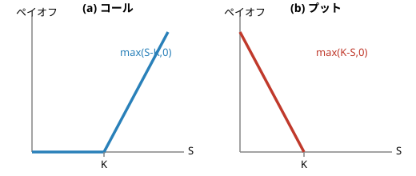

## 金融工学 勉強会

### 第5章　リスクニュートラル・プライシング

---

# 本日の内容

1. 状態価格・オプション・先物の価格づけ
2. 無裁定と状態価格の存在定理
3. リスクプレミアムとリスク調整割引公式
4. リスク中立割引公式

底本：『新・証券投資論 I 理論篇』（日本証券アナリスト協会 編，小林孝雄・芹田敏夫 著，日本経済新聞出版社，2009）第5章。具体的な5状態・5資産の数値例を最後まで一貫して使います。

---

前章のAPTは「無裁定」だけから価格関係を導いた。本章では，この無裁定原理を一期間・有限状態のモデルで徹底的に用い，あらゆる金融資産—とくにデリバティブ—の価格を決める枠組みを作る。各状態が起きたら1円もらえる証券の価格＝**状態価格**ですべての資産の価格を表し，**無裁定**と**正の状態価格の存在**が同値であること（資産価格の基本定理）を見る。最後に状態価格を確率に読み替えた**リスク中立確率**で，「価格＝割引いた期待値」を確立する。

---

# 5状態・5資産の世界

Part 1：状態価格・オプション・先物の価格づけ

今日（$t=0$）から1年後（$t=1$）にかけて，経済が5通りの状態のいずれかになるとする。

| 証券 | 今日の価格 | 状態1 | 状態2 | 状態3 | 状態4 | 状態5 |
|---|---|---|---|---|---|---|
| X株 | 2.55 | 8 | 6 | 3 | 0 | 0 |
| Y株 | 4.83 | 15 | 10 | 0 | 0 | 4 |
| X社債 | 0.69 | 1 | 1 | 1 | 1 | 0 |
| Y社債 | 0.72 | 1 | 1 | 1 | 0 | 1 |
| 国債 | 0.96 | 1 | 1 | 1 | 1 | 1 |

国債はどの状態でも1円払う安全資産。この表だけから，あらゆる証券の「正しい価格」を求めるのが目標。

---

# 状態価格（状態依存型請求権）

**定義：状態価格**

状態 $s$ が起きたときにだけ1円を支払い，他の状態では何も支払わない証券を**状態依存型請求権**（アロー証券）という。その今日の価格 $q_s$ を状態 $s$ の**状態価格**という。

前章の「サプリのカプセル」のアナロジーと同じ発想：証券を成分（＝状態ごとのキャッシュフロー）の詰め合わせとみなす。状態価格がわかれば，任意の証券の価格は

$$
p_i=\sum_{s=1}^{5} D_{is}\,q_s
$$

（$D_{is}$：証券 $i$ の状態 $s$ でのキャッシュフロー）で計算できる。

---

# 状態価格を解く

5資産の価格を連立方程式にすると

$$
\begin{aligned}
8q_1+6q_2+3q_3 &= 2.55 &(\text{X株})\\
15q_1+10q_2+4q_5 &= 4.83 &(\text{Y株})\\
q_1+q_2+q_3+q_4 &= 0.69 &(\text{X社債})\\
q_1+q_2+q_3+q_5 &= 0.72 &(\text{Y社債})\\
q_1+q_2+q_3+q_4+q_5 &= 0.96 &(\text{国債})
\end{aligned}
$$

国債からX社債・Y社債を引けば $q_5=0.96-0.69=0.27$，$q_4=0.96-0.72=0.24$ が直ちに定まり，残りを解くと

q = (q₁,q₂,q₃,q₄,q₅) = (0.15, 0.15, 0.15, 0.24, 0.27)

すべて正であることが，あとで見る「無裁定」の条件そのもの。

---

# 安全資産と割引率

国債はどの状態でも1円を払う安全資産だから，その価格は状態価格の総和に等しい：

$$
B_0:=\sum_{s=1}^{5} q_s=0.15\times3+0.24+0.27=0.96
$$

これは「1年後に確実な1円」の現在価値，すなわち割引率。対応するリスクフリー・レートは

$$
r_f=\frac{1}{B_0}-1=\frac{1}{0.96}-1\approx4.17\%
$$

---

# ヨーロピアン・オプション

**定義：ヨーロピアン・オプション**

満期 $t=1$ に権利行使価格 $K$ で原資産を**買う**権利をコール，**売る**権利をプットという。満期でのペイオフは

$$
\text{コール：}\max(S-K,0),\qquad \text{プット：}\max(K-S,0)
$$

---

# 数値例：コール・プットの価格

X社株式（満期ペイオフ $(8,6,3,0,0)$）に行使価格 $K=2$ のオプションを考える。

コールの満期ペイオフ $\max(S-2,0)=(6,4,1,0,0)$（状態1,2,3でイン・ザ・マネー）より

$$
C=6q_1+4q_2+1\cdot q_3=6(0.15)+4(0.15)+1(0.15)=1.65
$$

プットの満期ペイオフ $\max(2-S,0)=(0,0,0,2,2)$ より

$$
P=2q_4+2q_5=2(0.24)+2(0.27)=1.02
$$

---

# プット・コール・パリティ

**命題：プット・コール・パリティ**

同一の原資産・行使価格 $K$・満期をもつコールとプットの価格には

$$
C-P=S_0-K\,B_0
$$

が成り立つ（$S_0$：原資産の今日の価格，$B_0$：1円の割引現在価値）。

**証明の骨格**：各状態で $\max(S-K,0)-\max(K-S,0)=S-K$ が恒等的に成立。両辺を状態価格で評価すればよい。

数値確認：C-P = 1.65-1.02 = 0.63 ＝ S₀-KB₀ = 2.55-2×0.96 = 0.63 ✓

---

# 行使価格Kと価格の関係

コールは「安く買う権利」だから $K$ が高いほど価値が下がり，プットは「高く売る権利」だから $K$ が高いほど価値が上がる。

---

# 先物契約の価値を計算する

X社株を受渡価格$K$で$t=1$に売買する先物契約（買い手側，ロング・ポジション）を考える。まず**任意の**$K=2$で契約1単位の今日の価値を計算してみよう。

満期のキャッシュフローは$S-K=(8,6,3,0,0)-2=(6,4,1,-2,-2)$。状態価格で評価すると

$$
6q_1+4q_2+q_3-2q_4-2q_5=6(0.15)+4(0.15)+0.15-2(0.24)-2(0.27)=0.63
$$

K=2で契約を結ぶと，今日すでに0.63円の価値がある——ゼロではない

---

# 市場は価値ゼロの受渡価格を探す

$K=4,6$でも同様に計算すると，今日の契約価値は$K$が上がるほど下がる直線を描く（右下がり）。

| $K$ | 2 | 4 | 6 |
|---|---|---|---|
| 契約価値 | 0.63 | -1.29 | -3.21 |

先物市場は毎日，買い手・売り手どちらにとっても契約価値がちょうど**ゼロ**になる受渡価格を探している——今日お金のやり取りなしに，将来の売買だけを約束できる価格である。

**定義：先物（フォワード）価格**

契約価値がゼロになる受渡価格を$F$とすると，$\sum_s(S_s-F)q_s=0$より $F=S_0/B_0=S_0(1+r_f)$。

これを解くとX株の先物価格$F=2.55/0.96\approx2.656$円。

---

# キャリー公式の検算

$$
\text{先物価格}=\text{現物価格}\times(1+\text{金利})
$$

これを**キャリー公式**という。X社株：今日2.55円で買うのも，1年後2.656円で買う約束を今日結ぶのも同じ経済価値——2.656円を金利4.167%で割り引けば2.55円に戻ることで検算できる。

Y社株も同様：$4.83\times(1+0.04167)\approx5.031$円。1年持ち越すコスト（金利）のぶんだけ，先物価格は現物より高くなる。

---

# 一般のモデルへ

Part 2：無裁定と状態価格の存在定理

ここまでは5資産・5状態という具体例で考えてきたが，議論は $n$ 資産・$m$ 状態の一般のモデルにそのまま拡張できる。資産$i$の状態$s$でのキャッシュフローを$D_{i,s}$，状態価格を$(q_1,\dots,q_m)$とすると，各資産の価格は

$$
p_i=q_1D_{i,1}+q_2D_{i,2}+\cdots+q_mD_{i,m}\qquad(i=1,\dots,n)
$$

という連立方程式で決まる——5資産・5状態の例で解いた(5.1)式そのものの一般形。

やや大げさに言えば，この簡単な理屈がブラック＝ショールズ公式をはじめとする高度なデリバティブ評価理論のエッセンスである

本章は$t=0,1$の2時点だけを扱うのでこれでほぼ話が尽きるが，実際には将来の時点が多数ある——この多期間への拡張は**第7章**で二項モデルを使って扱う。

---

# 裁定機会（フリーランチ）

なぜ状態価格は正でなければならないのか。それはいつ存在するのか——これに答えるのが資産価格理論の基本定理。

**定義：裁定機会（フリーランチ）**

厳密には2タイプある——**タイプ1**：$t=0$のキャッシュフローが0以上，$t=1$のペイオフが非負かつ少なくとも1状態で正。**タイプ2**：$t=0$のキャッシュフローが正で，$t=1$のペイオフが非負。いずれかが組めることを**裁定機会**といい，存在しないことを**無裁定**（ノー・フリーランチ）という。

もし価格体系にこんな都合の良い組み合わせがあれば，誰もがそれを無限に繰り返して儲けようとし，安すぎる証券は買われて値上がりし，高すぎる証券は売られて値下がりする——その結果，価格はすぐに歪みが解消される方向へ動く。

---

# 有限責任原理

> **注意：有限責任原理**
>
> 株式・債券・オプションへの投資（買い）は，将来の価値が決して負にならない**有限責任**である。だからこそ「状態価格が負なら，その状態専用の証券を無限に買っても損をしない」という裁定が成立する。先物取引は将来価値が負になりうる無限責任で，この議論の前提が異なる。

---

# 資産価格の基本定理

**定理5.1：資産価格の基本定理（状態価格版）**

市場が無裁定であることと，正の状態価格ベクトル $\bm q>\bm 0$ が存在し全資産が $p_i=\sum_s D_{is}q_s$ を満たすことは同値である。

**直感**：$\bm q>0$ なら，どの状態でも損しないポートフォリオのコストは必ず正になり，裁定は組めない。逆に無裁定なら分離超平面定理により，このような正のベクトルが必ず存在する。

この証明の幾何学（ある部分空間と直交するベクトルの存在＝無裁定条件）は，前章のAPTの主定理の証明と全く同じ構造をしている——どちらも無裁定を表す定理の基礎に，共通の幾何学的な論理が潜んでいる。

---

# 市場の完備性

> **注意：市場の完備性と一意性**
>
> 5資産のペイオフが5つの状態を張る（ペイオフ行列が正則）ため，状態価格は一意に定まった。このように任意の状態別キャッシュフローを資産の組み合わせで再現できる市場を**完備市場**という。

完備でない（資産の数が状態の数より少ない）市場では，無裁定でも状態価格は一意に定まらず，正の $\bm q$ が複数存在しうる。この章の数値例は「たまたま」5資産・5状態で完備だったので一意に解けた。

---

# 状態価格を「保険料率」として読む

Part 3：リスクプレミアムとリスク調整割引公式

状態価格 $q_s$ は「価格」であって「確率」ではないが，主観的な発生確率 $p_s$ を仮定すれば，リスクプレミアムや信用スプレッドという言葉に翻訳できる。以下では5状態がいずれも等確率（$p_s=20\%$）で起こると仮定する。

X社債・Y社債はどちらも物理的デフォルト確率20%で同じなのに，価格は0.69と0.72で異なる。なぜか——状態ごとに「確率あたりの状態価格」$q_s/p_s$ が違うから，次のスライドで計算する。

---

# 数値例：信用スプレッドの正体

X社債は状態5（確率20%，デフォルト）で0円になる。期待キャッシュフロー $=0.8$ を使い，**リスク調整割引率** $r_f+\lambda^B_X$ で

$$
0.69=\frac{0.8}{1+r_f+\lambda^B_X}\ \Longrightarrow\ \lambda^B_X\approx11.78\%
$$

Y社債（状態4でデフォルト）は同様に $\lambda^B_Y\approx6.94\%$。

確率あたりの状態価格 q_s/p_s：状態1,2,3 → 0.75／状態4 → 1.2／状態5 → 1.35

状態ごとに1つずつ保険会社があると想像しよう：$q_s/p_s$ は「状態 $s$ の保険料率」。状態4,5（マクロ不況）は保険料率が高く，X社債はまさにその状態5で保険が効かない（返済が止まる）ため，スプレッドが高くなる。

---

# 数値例：株式のリスクプレミアム

同じ考え方を株式にも適用できる。X株の期待キャッシュフローは $0.2\times(8+6+3+0+0)=3.4$ だから，期待リターンは $3.4/2.55-1\approx33.3\%$，リスクプレミアムは $33.3\%-4.17\%\approx29.2\%$。

Y株は期待キャッシュフロー $0.2\times(15+10+0+0+4)=5.8$ より期待リターン $\approx20.1\%$，リスクプレミアムは $\approx15.9\%$。

X株の方がリスクプレミアムが高いのは，保険料率の高い状態4,5でともに0円になってしまう（保険が効かない）ため

Y株は状態5ではむしろ4をもらえる（部分的に保険が効いている）。状態価格は「どの状態でいくら支払うか」と「その状態がどれだけ高くつくか」を同時に織り込んだ量になっている。

---

# リスク調整割引公式

ここまでの計算——将来キャッシュフローの期待値を，リスクを織り込んだ割引率（リスクフリー・レート＋リスクプレミアム）で割り引く方法——を**リスク調整割引公式**と呼ぶ。ファイナンスの伝統的なバリュエーション公式である。

これから見る「リスク中立割引公式」は，同じ結果に至るもう1つのルート——割引率ではなく確率の方を調整する

---

# 本章の理論はデリバティブだけのものではない

Part 4：リスク中立割引公式

火災保険の契約書には，火災の確率や損害額の分布は明記されない。「どんな条件が満たされれば支払い対象になるか」と「そのときいくら支払うか」だけが書かれている——それでも契約は成立する。

将来の不確実性を状態という成分に分解し，状態ごとの価格を積み上げて金融商品を評価するという発想は，まさにこの**金融契約の本質**に即している。同じ1円の価値が経済のシナリオによって異なるという事実は，リターンの確率分布だけを見るポートフォリオ理論では捉えられない。

本章の価格理論は，デリバティブ評価にとどまる「派生理論」ではなく，資産価格づけそのものの一般理論である

---

# 保険のアナロジーからリスク中立確率へ

金融資産の価格づけも火災保険と同じ構造——状態価格には「確率」と「リスクの対価」が混ざっている。この2つを分離し，**割引率をリスクフリー・レートに固定したまま，確率の方を付け替える**ことで価格づけを単純化できないか，というのが本節のアイデアである。

状態価格は総和が1にならないため確率として読めない。安全資産の価格 $B_0$ で正規化すると，確率と期待値の言葉に翻訳できる。

---

# リスク中立確率

**定義：リスク中立確率**

$$
p^{*}_s=\frac{q_s}{\sum_u q_u}=(1+r_f)\,q_s
$$

$p^{*}_s>0$ かつ $\sum_s p^{*}_s=1$ なので，これは確かに確率分布である。

数値例：$p^{*}=(0.15625,\ 0.15625,\ 0.15625,\ 0.25,\ 0.28125)$（和は1）。

---

# リスクニュートラル・プライシング

**定理5.1'：リスクニュートラル・プライシング**

市場が無裁定なら，リスク中立確率 $\bm p^{*}$ が存在し，任意の証券の価格は

$$
p_i=\frac{1}{1+r_f}\sum_{s}p^{*}_s D_{is}=\frac{1}{1+r_f}\,\mathbb{E}^{*}[D_i]
$$

リスク調整割引公式との違いは**2点**：①割引率——市場の期待リターン（$r_f$＋プレミアム）ではなく$r_f$そのものを使う，②確率——実際の生起確率ではなくリスク中立確率$\bm p^*$を使う。

---

# 「市場の神様」という発想

この式を使って価格計算をする主体は，実在の投資家ではなく「**市場の神様**」——効用関数が直線（リスク中立的）の架空の投資家だと考えるとよい。

p*は，この神様の目に将来のシナリオがどう見えているか——いわば神様のメガネに映る確率である

---

# 「市場の神様」のメガネ

主観確率（各状態20%）とリスク中立確率 $p^{*}=(0.15625,0.15625,0.15625,0.25,0.28125)$ を比べると

$$
\underbrace{0.15625}_{p^{*}_1}<\underbrace{0.2}_{p_1},\qquad
\underbrace{0.25}_{p^{*}_4}>\underbrace{0.2}_{p_4},\qquad
\underbrace{0.28125}_{p^{*}_5}>\underbrace{0.2}_{p_5}
$$

好況寄りの状態1,2,3は過小評価，不況寄りの状態4,5は過大評価されて見える

最後の2状態はマクロ経済の停滞を意味する——**市場の怨嗟**がメガネに映し出され，確率が過大評価になっているのである。状態価格（定理5.1）には投資家の時間選好・予想確率・マクロシナリオの情報が渾然一体となって織り込まれているが，リスク中立割引公式は時間選好（金利）とそれ以外の情報を**分離**して考える点が特徴である。

---

# 再評価で検算する

リスク中立確率で最初の表の資産を評価し直すと，もとの価格に一致する。

$$
p_Y=0.96\times(0.15625{\cdot}15+0.15625{\cdot}10+0.25{\cdot}0+0.28125{\cdot}4)=0.96\times5.03125=4.83
$$

$$
\text{国債：}\ 0.96\times(0.15625{\cdot}3+0.25+0.28125)=0.96\times1=0.96
$$

$$
\text{コール（}K{=}2\text{）：}\ 0.96\times(0.15625{\cdot}6+0.15625{\cdot}4+0.15625{\cdot}1)\approx1.65
$$

---

# なぜ重要か

リスク中立プライシングは，実際の確率やリスク選好を一切知らなくても，無裁定だけからデリバティブを価格づけできる強力な枠組み。

- 次章以降の**デリバティブ評価理論**（二項モデル・ブラック＝ショールズ公式）の土台となる
- 実務では**イールドカーブ・モデルに基づく債券ポートフォリオの運用**，**年金基金・保険会社の資産負債管理（ALM）**，**企業財務戦略やリアルオプションを使った経営戦略の策定**など，応用分野は急速に拡大している

---

# まとめ

- **状態価格** $q_s$：状態 $s$ で1円もらえる証券の価格。あらゆる資産の価格は $p_i=\sum_s D_{is}q_s$
- **資産価格の基本定理**：無裁定 $\Leftrightarrow$ 正の状態価格の存在
- 状態価格を確率で割ると「保険料率」：信用スプレッドやリスクプレミアムの正体
- **リスク中立確率** $p^*_s=(1+r_f)q_s$：価格＝リスク中立期待値をリスクフリー・レートで割り引いたもの
- 割引率を固定し確率を付け替える——実際の確率やリスク選好を知らなくても価格づけできる
- 次章：この考え方を多期間の二項モデルへ拡張し，ブラック＝ショールズ公式に至る

---

## 金融工学 勉強会

### 次回：第6章　グローバル投資

視点を変えて，外国資産への投資に伴う為替リスクと
国際分散投資・国際CAPMを扱う
