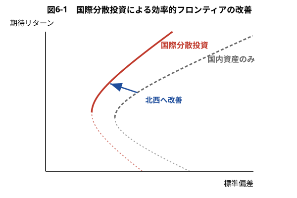

## 証券投資論 勉強会

### 第6章　グローバル投資

---

# はじめに

これまでの章では，暗黙的に投資対象を**為替リスクのない国内資産**に限定していた。本章では，為替リスクのある外国資産へも投資可能な状況を考える。また，投資家は通貨の異なる複数国に分散していると考える。

前半では為替リスクが自国通貨建てリターンに与える影響と，国際分散投資の利益を確かめる。後半では為替レートがどのように決まるかを長期理論（購買力平価）と短期理論（金利平価）に分けて説明し，最後に第3章の CAPM を国際版に拡張した**国際CAPM**へ進む。

---

# 6.1.1 為替リスクとは

為替レートは日々変動している。為替変動にともなうリスクは**為替リスク**と呼ばれる。

各国の投資家は，自国通貨を用いて自国内で消費をするため，**自国通貨建てのリターンに関心がある**。すなわち，日本の投資家は日本で円を用いて財を購入し消費するから，円建てのリターンに関心がある。外貨建て資産への投資には，現地通貨建ての価格変動リスクだけでなく，為替リスクをともなう。

外国資産を購入する場合，各国の投資家は，保有する自国通貨を外国為替市場で外国通貨に交換し，得られた外国通貨を用いてその外国資産を購入する。外国資産を保有する場合の自国通貨建てリターンは，期首と期末の為替レートと現地通貨建て価格を用いて計算することができる。そのリターンは，**現地通貨建てリターンと通貨リターンに分解する**ことができる。

---

# 6.1.2 数値例

日本の投資家と米国の投資家の例を用いて具体的に考えてみる。時点0での為替レートが100円/ドル，米国株 A 株が30ドル，日本株 J 株が500円であったとする。1年後，それぞれが110円，36ドル，600円となったとしよう。為替レートは10%の円安，A 株および J 株の現地通貨で測ったリターンはともにプラス20%である（期中の配当はともにゼロ）。

| 日付 | 為替レート① | 為替レート② | A 株 | J 株 |
|---|---|---|---|---|
| 0 | 100円/ドル | 1/100 ドル/円 | 30ドル | 500円 |
| 1 | 110円/ドル | 1/110 ドル/円 | 36ドル | 600円 |
| 変化率 | 10% | $-9.10\%$ | 20% | 20% |

---

日本の投資家が時点0で米国株 A 株1株を購入したとしよう。購入時点の円建ての金額は $30\times100=3{,}000$ 円であった。1年後の A 株の円建ての価値は $36\times110=3{,}960$ 円であるから，1年間の円建てのリターンは
$$
\frac{36\times110}{30\times100}-1=1.2\times1.1-1=0.32\ (32\%)
$$

この間に10%の円安となった結果，円建てのリターンは，現地通貨建てのリターンに加えて**円安によるプラスの通貨リターン**が発生した。日本の投資家の場合，円安（円高）になると，通貨リターンはプラス（マイナス）となり，円建てリターンは増加（減少）するのである。

---

一方，米国の投資家が日本株 J 株1株を購入すると，**通貨リターンが与える影響が日本の投資家と逆**になる。購入時点のドル建ての購入代金は $500\div100=5$ ドル，1年後の J 株のドル建ての価値は $600\div110=5.45$ ドルである。したがって，1年間のドル建てのリターンは
$$
\frac{600\times(1/110)}{500\times(1/100)}-1=1.2\times0.909-1=0.09\ (9\%)
$$

この間に10%の円安となった結果，ドル建てのリターンは，現地通貨リターンに加えて**円安によるマイナスの通貨リターン**が発生した。米国の投資家の場合，円安（円高）になると，通貨リターンはマイナス（プラス）となり，ドル建てリターンは減少（増加）するのである。

---

# 6.1.3 一般的な場合

以上のことを一般的に説明してみる。次の記号を準備する：
- $P_t$：$t$ 時点の外国資産の現地通貨建て価格
- $S_t$：$t$ 時点の為替レート
- $R^L$：現地通貨建てリターン
- $s$：通貨リターン

短期においては $R^Ls$ は無視できるため，外国資産の自国通貨建てリターン $R$ は
$$
R=\frac{P_1S_1}{P_0S_0}-1=(1+R^L)(1+s)-1=R^L+s+R^Ls\simeq R^L+s
$$
すなわち，近似的に**自国通貨建てリターン $\simeq$ 現地通貨建てリターン $+$ 通貨リターン**が成り立つ。

---

> 日本の投資家の通貨リターンと米国の投資家の通貨リターンは，厳密には，合計してプラスマイナスゼロとはならない点に注意してほしい。**合計すると必ずプラスになる**のである。このような現象が起こるのは，リターンを算術リターンで定義したことによる。

対数リターンの場合には，自国通貨建てリターンは，近似ではなく**厳密に**現地通貨建てリターンと通貨リターンに分解される：
$$
R:=\log\!\left(\frac{P_1S_1}{P_0S_0}\right)=\log\frac{P_1}{P_0}+\log\frac{S_1}{S_0}=R^L+s
$$

なお，これからは，外国資産の自国通貨建てリターンは，近似式である現地通貨建てリターンと通貨リターンの和として説明を行う。

---

# 6.1.4 ヘッジ付きリターン

ここまでは，為替リスクをまったくヘッジしない場合のリターンについて説明した。為替リスクは**為替のフォワード契約**などを用いて，ヘッジすることができる。

**定義**：為替リスクを含む外国資産総額に対するフォワード契約の金額の比
$$
h:=\frac{\text{為替フォワード契約の想定元本}}{\text{為替リスクにさらされた資産総額}}
$$
を**ヘッジ比率**という。

ヘッジ比率 $h$ が高くなるほど為替リスクの影響が小さくなる。$h=0$ のときは**ヘッジなし**，$h=1$ のときは**完全ヘッジ**，$0<h<1$ は**部分ヘッジ**と呼ばれる。

---

$h=0$ のヘッジなしのリターン $R^{UH}$ は，現地通貨建てリターンと通貨リターンの和として
$$
R^{UH}=R^L+s
$$

一方，$h=1$ の完全ヘッジでは，1年後の自国通貨建てリターンのうち通貨リターンのみを完全に相殺するようにフォワード契約の売りを行う。そのとき
$$
R^{H}=R^L+f,\qquad f\equiv\frac{F-S_0}{S_0}
$$

すなわち，完全ヘッジのリターン＝現地通貨リターン＋**フォワード・プレミアム率**となり，通貨リターンは消滅するが，フォワード・プレミアム率（直物レートと先物レートの差の%表示）が追加されるのである。

---

ヘッジ比率が $0<h<1$ の部分ヘッジのリターンは
$$
\begin{aligned}
\text{部分ヘッジリターン}&=R^L+(1-h)s+hf\\
&=(1-h)(R^L+s)+h(R^L+f)\\
&=(1-h)R^{UH}+hR^{H}
\end{aligned}
$$

すなわち，ヘッジしない場合に比べて，ヘッジ比率 $h$ だけ為替リスクが減少し，$h$ だけのフォワード・プレミアム率が付加することになる。これを書き換えると，**ヘッジしないリターン $R^{UH}$ と完全ヘッジ・リターン $R^{H}$ との加重平均**と表すこともできる。

> 以上の為替リスクのヘッジは為替のフォワード契約を用いた場合について説明したが，**外国リスクフリー資産を利用することによってまったく同じヘッジを行うことができる**。

---

# 6.2.1 国際分散投資の利益

第2章で見たように，相関の低い資産を組み合わせるほどリスク分散効果は大きくなる。各国の資産のリターンは国内資産どうしに比べて**相関が低い**ため，国際分散投資によって効率的フロンティアは**北西方向へ改善**する。

---

# 6.2.2 資産タイプ多様化の影響

国際分散投資の利益は，投資対象とする**資産タイプ**を多様化することによってさらに拡大する。株式だけでなく，債券，不動産，コモディティなど，異なる資産タイプを組み合わせれば，相関の低い資産の組み合わせが増えるからである。

とりわけ，新興国（エマージング）市場の資産は先進国市場との相関が低く，国際分散投資の効果が大きいことが知られている。ただし，新興国市場は流動性が低く，政治的リスクや制度的リスクをともなう点に注意が必要である。

---

# 6.2.3 国際的な資産リターン間の相関係数の決定要因

各国資産間の相関は，主に次の要因によって決まる。

- **経済のグローバル化**：多国籍企業の活動の進展や，各国企業が原料・部品調達や販売先をグローバルな市場に求める行動。自動車産業は国内で生産し世界へ輸出するスタイルから，現地に工場を建てたり部品をグローバルに調達する方向にシフトした。その結果，各企業の株価は，国内要因だけでなく**世界に共通の要因や国を超えた同業種に共通の影響**を受ける。
- **マクロ経済の相互依存度**：先進国間で協調的なマクロ経済政策が行われている。2000年代の世界的な低金利は日米欧の協調的な利下げによって実現された。
- **国際資本市場の統合度**：完全に統合されている状況とは，各国投資家が外国資産への投資をする際に取引の障壁（取引規制，取引コスト，税金，情報）が一切ないことを表す。

---

これらはいずれも，各国資産間の相関を**高め**，国際分散投資の利益を**縮小**する働きがある。

各国の資産間の相関は，市場環境の変化により時間を通じて大きく変動する。1987年のブラック・マンデーや2007年以降の金融危機など，世界的に市場が大きく変動する（ボラティリティが大きい）時期には，**各国の資産間の相関が一時的に高まる**。

> このような相関の一時的上昇は国際分散投資のメリットを大幅に低下させるため，ボラティリティの時間的な変動に注意する必要がある。これは Longin–Solnik [1995] による主要8カ国の株式市場の30年間（1960年代〜1990年代）のボラティリティと相関係数の変動についての統計的な分析などにより広く知られている。

---

# 6.2.4 国際分散投資の新たな手法

伝統的な国際分散投資の方法として，国単位での分散化すなわち**カントリー・アロケーション**が考えられてきた。しかし，カントリー・アロケーションによる国際分散投資には限界がある。EU 圏，北米圏など経済統合の進んだ国の中で分散化をしても，相関が高いため分散化の効果が小さくなる。

また，経済のグローバル化の進行により，カントリー・アロケーションや銘柄選択において，**意図しない業種の偏りやスタイルの偏り**が発生する可能性がある。業種の分散が十分ではないと，いくらカントリー・アロケーションで十分に分散化しても，国際分散投資のリスク低減が不十分となる。カントリー要因が低下する一方で**業種要因の重要性が高まっている**ことが，多くの実証研究により近年明らかになっている。

---

したがって，国際的に分散化されたポートフォリオの作成には**ファクター・モデルの利用**が有益である。カントリー以外のファクターとして，地域，業種，スタイル（バリュー，グロース，規模など）が考えられる。これがファクター・モデルの国際版である**グローバル・ファクター・モデル**であり，広く普及している。

---

# 6.3.1 長期理論——購買力平価（PPP）説

為替レートは異なる2通貨の交換比率であるが，別の見方として**円とドルの通貨の価値（購買力）の比率**と考えるのが**購買力平価**（Purchasing Power Parity, PPP）説である。

財の移動が完全自由で輸送コストがないとき，為替レートは財の内外価格差がなくなるように決定されると考える。いいかえると，平均的な財のバスケットのドル建ての価値を円建ての価値に等しくするように為替レートが決まると考えるのである。これは**財市場についての無裁定条件**である。

日本の物価と米国の物価をそれぞれ $P,P^{*}$ とし，為替レートを $e$ 円/ドルとする。1円の購買力は $1/P$，1ドルの購買力は $1/P^{*}$ である。1円をドルに換えたとき（$=1/e$ ドル）の購買力は $1/(eP^{*})$ となる。購買力平価が成立していれば
$$
\frac{1}{P}=\frac{1}{eP^{*}}\qquad\Longleftrightarrow\qquad e=\frac{P}{P^{*}}
$$

---

すなわち，購買力平価に基づく為替レートは2国の物価水準の比に等しくなる。これを為替レートの絶対水準を決定するという意味で**絶対的 PPP** と呼ぶ。

為替レートの絶対水準ではなく，その**変化率**に注目し，為替レートの変化率が両国のインフレ率の差で説明できるとき，**相対的 PPP** と呼ぶ：
$$
s_t=\pi_t-\pi_t^{*}
$$

すなわち，為替レートの変化率は，自国と外国のインフレ率の差となる。**インフレ率の大きい国の通貨ほど減価する**のである。絶対的 PPP が成立していれば相対的 PPP は成立する。しかし，絶対的 PPP が成立してなくとも相対的 PPP は成立する。

---

PPP に基づけば，為替レートの変動は2国の物価変動の大きさに応じて小さいはずである。このことは長期的にはある程度成立すると広く受け入れられている。少なくとも**長期の為替レート水準を決定するアンカー**（錨）となっている。

しかし，現実には，為替レートは2国の物価変動の大きさを大幅に超えて短期的に大きく変動する。すなわち，**短期的には PPP は成立しない**。短期での貿易による裁定は不十分だからである。

購買力平価は長期でも成立するとは必ずしもいえないことにも注意する必要がある。その主な理由は，**貿易の取引コストの存在**，**貿易財も完全代替ではないこと**，**非貿易財の存在**，**国際間での消費バスケットの違いとその時間を通じた変化**である。

---

# 6.3.2 実質為替リスク・名目為替リスク

為替リスクを考えるとき，実質為替リスクと名目為替リスクを区別することは重要である。私たちが日々観察する外国為替市場において決定される為替レートが**名目為替レート**である。**名目為替リスク**とは，名目為替レートの変動によって生じるリスクである。

一方，**実質為替レート**とは，名目為替レートを2国の物価水準で調整したものである：
$$
X=S\times\frac{P^{*}}{P}
$$

実質為替レートの変動が**実質為替リスク**である。したがって，実質為替リスクとは **PPP から乖離するリスク**と考えることができる。

---

もし実質為替リスクがないならば，PPP が成立することを意味し，為替レートの変動は常に2国間のインフレ格差に等しくなる。その場合は，投資家にとっては財の消費に影響がないため，外国資産への投資において**為替リスクは無視してもよい**。だから，投資家が関心を持つのは実質為替リスクなのである。

各国のインフレ格差の変動は短期的にはごく小さい。よって短期においては
$$
\text{実質為替レートの変動}\simeq\text{名目為替レートの変動}
$$
となる。しかし，現実には PPP は少なくとも短期においては成立しない。それゆえ，投資家にとって外国資産への投資において**実質為替リスクが重要**となる。

---

# 6.3.3 短期理論——カバーなしの金利平価

少なくとも短期においては，購買力平価では為替レートの変動を説明できない。それに対して，**日々の国際的な資産取引によって生じる各国通貨への需給が均衡するように為替レートは決定される**と考えるのが短期理論である。

短期理論の説明の準備として，外国為替市場の無裁定条件を表す**カバー付きの金利平価**を説明する。これは，国内のリスクフリー資産への投資のリターンが，為替リスクを先物為替でカバーした外国リスクフリーへの投資のリターンと等しくなるように，フォワードレートが決まることを表している：
$$
1+r=\frac{F}{S}(1+r^{*})
\qquad\Longrightarrow\qquad
\frac{F-S}{S}\ (\equiv f)\simeq r-r^{*}
$$

---

左辺は**フォワード・プレミアム率** $f$ である。これは $S,r,r^{*}$ が与えられたときのノー・フリーランチ定理に基づく**フォワードレート $F$ の決定式**とみなすことができる。すなわち，**カバー付きの金利平価は直物為替レートを決定する均衡条件ではない**のである。

---

次に，外国為替市場の**均衡条件**を考える。簡単化のため，投資家は**リスク中立的**であると仮定する。このときの均衡条件は，国内のリスクフリー資産への投資のリターンが，為替リスクをヘッジせずに外国リスクフリー資産に投資したときの期待リターンと等しくなることである：
$$
1+r=\frac{E(S_{t+1})}{S_t}(1+r^{*})
\qquad\Longrightarrow\qquad
E(s_{t+1})\simeq r-r^{*}\ (=f_t)
$$

右辺の分子がフォワードレートではなく**将来の為替レートの期待値**である点がカバー付きの金利平価と異なる。それゆえこの式は，不確実性下での投資家の選好を反映した外国為替市場の均衡条件となるのである。

これは，為替レートの期待変化率が内外金利差に等しいことを意味し，**カバーなしの金利平価**と呼ばれる。このとき，投資家はリスク中立的と仮定しているから，**為替のリスクプレミアムはゼロ**となっている。

---

他の条件が一定で，$r$ が上昇したときの影響を考えてみよう。その場合には，国内リスクフリー資産で運用したほうが外国リスクフリー資産で運用するより魅力的になる。このままではドルから円への資金のシフトが続く不均衡となる。

そのような資本移動が止まるように，現時点の為替レートが**円高**（$S_t\downarrow$）となることにより，通貨の期待リターンが上昇し（$E(S_{t+1})/S_t\uparrow$），新しい均衡状態が達成されるのである。

---

# 6.3.4 カバーなしの金利平価の実証

カバーなしの金利平価は現実の外国為替市場で成立しているであろうか。検証するには，為替レートの変化率 $s_t$ をフォワード・プレミアム率 $f_t$，あるいは内外金利差 $(r_t-r_t^{*})$ で回帰させる推定式
$$
s_t=a+bf_t+e_t
$$
を推定すればよい。カバーなしの金利平価が成立しているときには $b=1$ となるはずであるから，**$b=1$ かどうかを統計的に検証する**のである。

---

結論として，ほとんどすべての研究で統計的に有意に $b$ が1より小さく，多くの研究で $b$ が**マイナス**であることが得られている。これは，フォワード・プレミアム率（＝内外金利差）ほど将来通貨が減価しない，または逆に増価することを示している。この現象は**フォワード・プレミアム・パズル**（フォワード・ディスカウント・パズルとも呼ぶ）と呼ばれている。

---

このような実証結果を説明しうる仮説としては，次の2つの考え方がある。

1. **為替のリスクプレミアムが時間を通じて変動する**——為替のリスクプレミアムが経済環境の変化に応じてシステマティックに大きく変動することを示している。
2. **市場の非効率性**——投資家の過剰反応，金利差の変化に鈍い投資家の存在，通貨当局の介入などによると考えるもので，外国為替に対するアクティブ運用の有効性が示唆される。

しかし，現在までフォワード・プレミアム・パズルを統一的に説明する理論はなく，**依然としてパズルのまま**である。

---

# 6.3.5 為替のリスクプレミアム

前述のように，カバーなしの金利平価は，すべての投資家がリスク中立的としたときの外国為替市場の均衡条件であり，為替のリスクプレミアムはゼロとなる。ポートフォリオ理論で想定している投資家は**リスク回避的**であるので，自国のリスクフリー資産への投資に比べて，為替リスクをともなう外国リスクフリー資産への投資へのリターンには，為替リスクに対する市場の報酬であるリスクプレミアムが生じると考えるのが自然である。

**為替のリスクプレミアム**：為替ヘッジせずに外国リスクフリー資産へ投資したとき，期待リターンから自国リスクフリー資産のリターンを引いたもの
$$
SRP\equiv r^{*}+E\!\left[\frac{S_1-S_0}{S_0}\right]-r=r^{*}+E(s)-r
$$

これはカバーなしの金利平価からの**乖離**にほかならない。$SRP$ は，分散化によって除去できない為替リスクに対するプレミアムと考えることができる。

---

為替のリスクプレミアムは，株式や債券などの通常の危険資産に対するリスクプレミアムと異なる点がある。それは，通常の危険資産のリスクプレミアムがどの投資家にとってもプラスであるのに対し，為替のリスクプレミアムは**どの国の通貨建てのリターンで考えるかによって異なる**ことである。

すなわち，ある国の為替レート $S_0$ が対米ドルでプラスのリスクプレミアムとなることは，ドルからその国の為替レートをみると（$1/S_0$），**マイナス**のリスクプレミアムとなることを意味する。例えば，日本の投資家にとってドルがプラスのリスクプレミアムであるとすれば，米国投資家にとっての円はマイナスのリスクプレミアムとなる。

---

為替リスクをともなう外国資産への投資にもかかわらず，マイナスのリスクプレミアムとは奇異に感じられるかもしれない。また，為替リスクは，デリバティブや外国リスクフリー資産の利用によって容易にヘッジすることができるので，為替のリスクプレミアムはゼロと考えられるかもしれない。

しかし，為替リスクは，**世界全体で集計するとどうしてもヘッジすることのできない部分が生じる**。各国の投資家は，外国投資に対するネットポジションやリスク回避度が異なり，集計すると均衡においてプラス，あるいはマイナスのリスクプレミアムが生じるのである。

**例**　日本はこれまでの長期にわたる経常黒字を蓄積した結果，多額の対外純資産となっている。そのため，日本の投資家全体で，対外純資産額に相当する多額の外国通貨建て資産を為替リスクのヘッジなしに持たざるをえない。その結果，日本の投資家が外国資産への投資において負担する為替リスクには**プラスのプレミアム**が生じる。

---

# 6.4.1 国際CAPMの概要

各国の投資家が国際分散投資を行った結果，均衡において国際資産市場で証券のリスクプレミアムや為替のリスクプレミアムがどのように決定されるのかを考えてみる。

このような国際資産市場におけるプライシングについての問題を考えるために，最もシンプルな均衡モデルとして，第3章で扱った CAPM を国際的なモデルに拡張する。これがブルーノ・ソルニック（Solnik [1973]）によって初めて定式化された**国際CAPM**（International Capital Asset Pricing Model, 略して **ICAPM**）である。

国際 CAPM からは CAPM と類似のインプリケーションが導き出される。**最大の違いは，証券のプライシングにおいて為替リスクが影響を与える点にある。**

---

# 6.4.2 国際CAPMの前提

市場には $(K+1)$ 国が存在していると考えよう。したがって，第1国（例えば米国）を基準とすれば，為替レート（対米ドルレート）は $K$ 個あることを意味する。各国の投資家は，自国通貨で測ったポートフォリオのリターンに関心を持つ。各国の投資家は自国通貨建てのリターンに関心があるため，**為替リスクの影響は国ごとに異なる**。

為替レートについては，短期的には PPP は成立しないと考える。したがって，各国の投資家は**実質為替リスク**に直面する。その結果，同一国内の投資家間では効率的フロンティアは同一であるが，**異なる国の投資家間では実質為替リスクが存在するために効率的フロンティアは異なる**。

---

もし実質為替リスクがないならば，PPP が成立することを意味し，たとえ為替レートの変動があっても為替リスクが存在しない第3章の CAPM と同じ状況となる。

また，国内 CAPM と同じように，**国際資本市場は完全である**ことが想定される。これは，投資家の国際分散投資における制約は一切なく，国際金融市場は統合化されていることを意味する。

---

# 6.4.3 各国投資家の自国通貨建てリターン

最も単純な場合として，A 国と B 国の2国が存在し，各国に1つ危険資産とリスクフリー資産が存在するケースについて考えてみる。A 国の投資家のポートフォリオの自国通貨建てリターン $R_P^A$ は
$$
R_P^A=w_1R_A+w_2(R_B+s)+w_3(R_{BF}+s)+w_4R_{AF}
$$

- $R_A$：A 国の危険資産リターン，$R_B$：B 国の危険資産リターン
- $R_{AF}$：A 国のリスクフリー・レート，$R_{BF}$：B 国のリスクフリー・レート
- $s$：通貨リターン

---

各資産のリターンはすべて現地通貨建てのリターンで定義してある。B 国資産のリターンを A 国通貨建てリターンに直すために，B 国通貨建てリターンに**通貨リターンが加えられている**。

A 国投資家の自国通貨建てのポートフォリオ・リターンの期待値と分散は
$$
E(R_P^A)=w_1E(R_A)+w_2(E(R_B)+E(s))+w_3(R_{BF}+E(s))+w_4R_{AF}
$$

分散については，$w_2^2(Var(R_B)+Var(s)+2Cov(R_B,s))$ や $w_3^2Var(s)$ などの項が現れる。すなわち為替リスクの影響として，**期待リターンには通貨の期待リターンが，分散には危険資産と為替レートとの共分散および為替レートの分散が影響している**ことがわかる。

---

一方，B 国投資家の自国通貨建てポートフォリオ・リターンは
$$
R_P^B=w_1(R_A-s)+w_2R_B+w_3R_{BF}+w_4(R_{AF}-s)
$$

B 国投資家にとって外国資産である A 国危険資産および A 国リスクフリー資産のリターンに，通貨リターンが A 国投資家の場合とは**逆にマイナスで付加**されている。このように，A 国と B 国の投資家では，ポートフォリオの期待リターンと分散が為替リスクの影響で異なり，したがって**効率的フロンティアも異なる**。

---

# 6.4.4 世界マーケット・ポートフォリオ

国際 CAPM においても中心的な役割を果たすのは，CAPM と同様，マーケット・ポートフォリオである。国際 CAPM において，マーケット・ポートフォリオは**世界マーケット・ポートフォリオ**になる。これはすべての資産を含み，それらを時価総額に比例した投資比率で保有したときのポートフォリオである。その投資比率はどの国の通貨で測っても等しくなるため，**どの国の投資家にとっても共通**である。

世界マーケット・ポートフォリオは為替レート変動の影響を受けるため，為替変動の影響を排除した**ヘッジされた世界マーケット・ポートフォリオ**について考える必要がある。そのリターンは，各国の（現地通貨建てリターン＋先物プレミアム率）の時価総額加重平均に等しくなる。

---

**国際CAPMの第1定理（分離定理）**：各国の投資家の最適ポートフォリオは，以下の2つの資産のみの組み合わせで決定することができる。

- 自国リスクフリー資産
- **為替リスクを最適にヘッジした世界マーケット・ポートフォリオ**

第3章のオリジナル CAPM における分離定理（リスクフリー資産＋市場ポートフォリオ）と似ているが，**マーケット・ポートフォリオが異なっている**。国際 CAPM では異なる国の投資家間では為替リスクにより効率的フロンティアが異なるため，接点ポートフォリオも異なる。接点ポートフォリオは（為替リスクをヘッジしない）世界マーケット・ポートフォリオではなく，為替リスクを最適にヘッジした世界マーケット・ポートフォリオになり，**各国ごとに異なる**。

---

最適な為替ヘッジについては，完全ヘッジやヘッジなしではなく**部分ヘッジ**である。最適なヘッジ比率は各国の投資家の特性によって異なる。

---

**国際CAPMの第2定理（証券市場線）**：個々の危険資産のリスクプレミアムは，世界マーケット・ポートフォリオに対するベータによって
$$
E(R_i)=R_{iF}+\beta_i^{W}\bigl[E(R_W)-R_{MF}\bigr],\qquad
\beta_i^{W}\equiv\frac{Cov(R_i,R_W)}{Var(R_W)}
$$
と決定される。

$R_i$ は証券 $i$ の現地通貨建てリターン，$R_{iF}$ は証券 $i$ の存在する国のリスクフリー・レート，$R_W$ はヘッジされた世界マーケット・ポートフォリオのリターン，$R_{MF}$ は各国のリスクフリー・レートの加重平均である。

$\beta_i^{W}$ は証券 $i$ の**世界マーケット・ベータ**と呼ばれ，国際 CAPM の下では**唯一のリスクのメジャー**となる。

---

# 6.4.5 為替リスクプレミアムの決定

国際 CAPM では，各国の外国資産への取引にともなう為替の需給が均衡するように，為替レートおよび為替のリスクプレミアムが決定されると考える。

**為替のリスクプレミアムに影響を与える要因**

- 対外純資産の大きさ
- 為替リターンの分散
- 為替レートと世界マーケット・ポートフォリオとの共分散

---

対外純資産が大きいほど投資家が回避できない為替リスクにさらされる資産が大きくなり，為替のリターンの分散が大きいほど為替リスクの大きさ自体が大きくなり，為替レートと世界マーケット・ポートフォリオとの共分散がプラスで大きいほど**システマティック・リスク**が大きくなることを意味するからである。

---

# 6.4.6 国内CAPMとの比較

国際 CAPM では，すでに述べたように統合された国際資本市場を前提としている。そのため，各国投資家は世界マーケット・ポートフォリオを保有することができ，**各国の国内マーケット・ポートフォリオはもはや効率的ポートフォリオではない**。

また，世界マーケット・ベータがあれば個別資産のリスクプレミアムの違いをすべて説明することができるため，**国内版の証券市場線は成立せず**，国内マーケット・ポートフォリオに対するベータには十分な説明力はなくなる。

---

# 6.4.7 国際CAPMの実証

国際 CAPM が成立していれば第1定理の分離定理が成立し，各国投資家の危険資産のポートフォリオは世界マーケット・ポートフォリオとなるはずである。しかし，現実の各国投資家のポートフォリオは世界マーケット・ポートフォリオとは大きく異なり，後述のような**ホームバイアス**と呼ばれる自国資産に偏っている状況が生じている。これだけを見れば国際 CAPM は不成立のように見えるが，ホームバイアスが生じているからといって国際 CAPM が全面的に否定されているとはかぎらない。**プライシングについても検討する必要がある。**

---

国際 CAPM の検証とは，各国証券のリスクプレミアムが世界マーケット・ベータにより十分に説明されているかどうかを調べるものである。これまでの多くの実証研究の結果をまとめると，**世界マーケット・ベータが説明力を持つものの，国内マーケット・ベータも説明力を持つ，すなわち市場の分断が生じている**ことを示すものが多い。

為替のリスクプレミアムについては，フォワード・プレミアム・パズルのところで説明したように，現在まではっきりとした結論が出ていない。

---

# 6.4.8 グローバル・マルチファクター・モデル

国際的な市場均衡モデルにおいても，第4章と同様のマルチファクター・モデル，すなわち**グローバル・マルチファクター・モデル**を考えることができる。

世界マーケット・ベータ以外のファクターについて調べると，ファーマとフレンチ [1998] が示したように**バリュー株効果が国際的にも存在する**ことが明らかになっている。これは，国際的なバリューファクターの存在を示唆している。

代表的なグローバル・マルチファクター・モデルとして，ファーマ＝フレンチの3ファクター・モデルのグローバル版がある：
$$
E(R_{it})=a_i+\beta_i^{W}R_{Wt}+\beta_i^{HMLW}HMLW_t+\beta_i^{SMBW}SMBW_t+e_i
$$

ここで $HMLW_t$ は世界 HML ファクター，$SMBW_t$ は世界 SMB ファクターである。

---

# 6.4.9 ホームバイアス

国際 CAPM が成立しているならば，各国の投資家の最適な危険資産ポートフォリオは，世界マーケット・ポートフォリオに近いはずである。しかし，実際の各国投資家のポートフォリオは**自国通貨建て資産に大きく偏っている**。

**ホームバイアス**：世界マーケット・ポートフォリオに比べて，各国投資家の最適ポートフォリオにおいて自国資産のウェイトが大きく偏っている状態。国際分散投資における有名なパズルである。

---

表6-2 は，主要8カ国の株式保有について，外国株式の割合とホームバイアス尺度を1993年と2003年について示したものである。ホームバイアスの尺度は，**0のときにはホームバイアスなし**，値が大きいほどホームバイアスが深刻となることを意味する。

---

| 国 | 外国株式の割合 1993 | 2003 | ホームバイアス 1993 | 2003 |
|---|---|---|---|---|
| オーストラリア | 11.26 | 17.20 | 0.89 | 0.82 |
| カナダ | 26.00 | 30.27 | 0.73 | 0.69 |
| フランス | 12.86 | 28.15 | 0.87 | 0.71 |
| ドイツ | 23.75 | 44.70 | 0.75 | 0.54 |
| 日本 | 3.59 | 9.97 | 0.95 | 0.89 |
| スイス | 40.13 | 47.52 | 0.59 | 0.51 |
| 英国 | 23.16 | 29.51 | 0.75 | 0.68 |
| 米国 | 10.25 | 14.32 | 0.84 | 0.74 |
| 平均 | 18.88 | 27.71 | 0.80 | 0.70 |

---

どの国でも1993年から2003年にかけてホームバイアスは緩和されているものの，依然として深刻である。**日本については，外国株式保有割合が2003年でも10%に満たず，8カ国の中でもホームバイアスの程度が最も大きい**（出所：Sørensen et al. [2007] Table 2 より抜粋）。

---

# 6.4.10 ホームバイアスを説明する仮説

ホームバイアスを説明する仮説には様々なものが存在する。有力なものとして，次の3つがあげられる。

**第1に，国際金融取引に対する規制**。国際資本移動を制限し，国際資本市場を分断化する効果がある。具体的な規制には，取引の法的制約，国内取引に比べて高い取引コスト，内外投資家間での差別的な税制などがあげられる。各国は20年以上にわたり規制を大きく緩和してきた。その結果，**フローとしての国際的な資本取引は大きく増加している**。しかし，ストックとしての外国資産の保有比率が低いままなのである。依然として残存する規制は存在するが，これほど大きなホームバイアスを説明するには，現状よりはるかに厳しい規制や取引コストが必要となる。

---

**第2に，情報のアクセスのしやすさの違い**。国内投資家は外国投資家に比べて情報のアクセスが有利であることを示す。その結果，外国資産への投資が国内資産に比べて抑制されるのである。これは，現存するホームバイアスを説明する有力な要因の1つと考えられている。また，近年では行動ファイナンスのアプローチとして，投資家の**自国資産への自信過剰**（過度な楽観的予想）と**外国資産に対する曖昧性忌避**（外国資産のリターンに対する不確実性を回避する傾向）も説明力を持つことが実証研究で示されている。

**第3に，国際CAPMの限界**。より現実を説明するモデルの可能性を指摘するものである。ホームバイアスの議論の前提には，各投資家の最適ポートフォリオが世界マーケット・ポートフォリオに近いというものがあるが，これは国際 CAPM の成立を前提としている。それに対して，**ダイナミックなポートフォリオ理論への拡張**や**非貿易財の存在**をモデルに入れることにより，最適ポートフォリオにおける自国資産のウェイトが上昇することが説明できる。

---

しかし，どれもある程度ホームバイアスを説明することができるものの，これまでのホームバイアスの時間的変化や，いまなお大きなバイアスが残存する状況を説明するには不十分である。**依然として重要なパズルのまま**であり，現在も多くの研究が進行中である。

---

# （補足）シーゲル・パラドックス

日本の投資家の通貨リターンと米国の投資家の通貨リターンは，合計すると必ずプラスになる。これが**シーゲル・パラドックス**と呼ばれる現象である。

数値例で確かめると，円安10%のとき，日本の投資家から見た通貨リターンは $+10\%$，米国の投資家から見た通貨リターンは $1/1.1-1=-9.09\%$ で，合計は $+0.91\%$ となりゼロにならない。一般に，為替レートの変化率を $s$ とすると
$$
s-\frac{s}{1+s}=\frac{s^{2}}{1+s}\geqq0
$$
であり，必ず非負になる。

**対数リターンをとれば消滅する**。また，時間間隔を小さくとるほど近似のズレが小さくなり，極限である連続時間では，近似のズレはなくなり対数リターンと同様に和となる。

---

# （補足）ビッグマック指数

絶対的 PPP の有名な適用例が，英国のエコノミスト誌が公表している**ビッグマック指数**である。これはビッグマックの価格を国際比較することで，2国間の為替レートを算出するものである。

世界中でほぼ同一の規格・品質で販売されているビッグマックを「共通の財のバスケット」に見立て，各国での販売価格の比から PPP に基づく為替レートを求める。現実の為替レートがこれより円安ならば「円は割安」と判断する。

もっとも，ビッグマックには**非貿易財**（人件費・地代など）が大きく含まれるため，PPP からの乖離が生じやすい。前述の PPP が成立しない理由の実例と見ることができる。