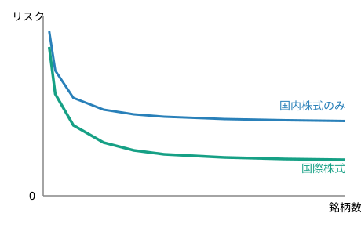

<!-- _class: title -->
<!-- _header: '' -->
<!-- _footer: '' -->

# 第6章　グローバル投資

金融工学　社内勉強会スライド

底本：『新・証券投資論 I 理論篇』（日本証券アナリスト協会 編，小林孝雄・芹田敏夫 著，日本経済新聞出版社，2009）第6章

前章：リスクニュートラル・プライシング → 本章：国境を越えた投資と為替リスク

---

# 本日の内容

1. 為替リスク：自国通貨建てリターンの分解とヘッジ
2. 国際分散投資：相関の低い外国資産で効率的フロンティアを改善
3. 為替レートの決定：購買力平価・金利平価・フォワード・プレミアム・パズル
4. 国際CAPM：為替リスクを含む価格づけと，現実のホームバイアス

---

この章のねらい

これまでの章では投資対象を暗黙のうちに国内資産に限定してきた。本章では国境を越え，外国資産への投資を考える。新たに主役となるのが**為替リスク**である。

- 自国通貨建てリターンが**外貨建てリターンと通貨リターン**に分解されること，為替予約による**ヘッジ**を学ぶ
- 相関の低い外国資産を組み入れる**国際分散投資**が効率的フロンティアを改善することを見る
- 為替レートを決める**購買力平価・金利平価**と，実証的な**フォワード・プレミアム・パズル**を扱う
- CAPMを国際市場へ拡張した**国際CAPM**と，現実に観測される**ホームバイアス**のパズルを論じる

---

# Part 1：為替リスクの影響

---

# 自国通貨建てリターンの分解

外国資産に投資すると，資産そのものの値動き（**現地通貨建てリターン**）に加えて，為替レートの変動による損益が乗る。

為替レートとリターンの分解

外貨建てリターン $R^*$，通貨リターン $R_S=S_1/S_0-1$ とすると

$$
1+R=(1+R^*)(1+R_S),\qquad R=R^*+R_S+R^*R_S
$$

交差項 $R^*R_S$ は小さいので近似的に $R\approx R^*+R_S$。連続複利では厳密に加法的：$\ln(1+R)=\ln(1+R^*)+\ln(1+R_S)$。

---

# 数値例：円建てリターンの分解

日本の投資家が米国株を1株30ドルで買う（$S_0=100$円／ドル，投資額3,000円）。

1年後，米国株が33ドルに値上がり（現地リターン $R^*=10\%$），為替が$S_1=110$円／ドルへ円安（通貨リターン $R_S=10\%$）。

$$
R=\frac{3{,}630}{3{,}000}-1=21\%=(1.10)(1.10)-1=0.10+0.10+0.01
$$

現地リターン10% ＋ 通貨リターン10% ＋ 交差項1% ＝ 21%

---

# ヘッジ比率の定式化

通貨リターンの不確実性が**為替リスク**。為替フォワード（為替予約）で消去できる。

ヘッジ比率 $h\in[0,1]$（$h=1$で完全ヘッジ）を用いると

$$
R^{UH}=R^*+R_S\ (\text{ヘッジなし}),\qquad R^{H}=R^*+f\ (\text{完全ヘッジ})
$$

（$f=(F-S_0)/S_0$：フォワード・プレミアム率）。部分ヘッジは加重平均：

$$
R(h)=(1-h)R^{UH}+hR^{H}=R^*+(1-h)R_S+hf
$$

カバー付き金利平価（後述）により f=r-r*。ヘッジ比率を上げるほど不確実なR_Sの影響を減らし，確定的な金利差の影響を増やすトレードオフになる。

---

# Part 2：国際分散投資の利益

---

# 相関の低さが生む分散効果

投資対象を外国資産まで広げると，組み合わせの自由度が増え投資可能集合は広がる。各国の景気循環は完全には同調しないため，国内・外国資産のリターンの相関は一般に低い。

相関の低い外国資産を加えると，リスク分散効果により効率的フロンティアは**北西**（同じリスクでより高いリターン）へ広がる。

---

# 分散効果の限界

分散効果の源泉は相関の低さ

国際分散の利益の大きさは，国内・外国資産の**相関**に依存する（前章までのリスク分散効果と同じ構造）。

- グローバル化が進むと国際間の相関は高まる傾向があり，分散効果は時代とともに変化する
- 外国資産には為替リスクが上乗せされるため，**分散効果と為替リスクのトレードオフ**を考える必要がある

---

# Part 3：為替レートの決定

---

# 購買力平価（PPP）

購買力平価（PPP）

一物一価を為替レートに適用。国内物価 $P$，外国物価 $P^*$ として

**絶対的PPP**：$S=P/P^*$　　**相対的PPP**：$R_S\approx\pi-\pi^*$（$\pi,\pi^*$：インフレ率）

絶対的PPPは貿易財・非貿易財の違いや輸送コストのため現実には成立しないが，相対的PPPは**長期**の為替トレンドをおおむね説明する。インフレ率の高い国の通貨は減価する。

---

# カバー付き金利平価（CIP）

カバー付き金利平価（CIP）

為替フォワード・レート $F$ が存在するとき，無裁定であれば

$$
1+r=\frac{F}{S}(1+r^*)
$$

**証明の骨格**：①国内で運用し確実に$1+r$円を得る戦略と，②外貨に替えて運用しフォワードで円に戻す戦略——どちらも今日1円・1年後に確実なキャッシュフローを生むので，無裁定なら等しくなければならない。

---

# カバーなし金利平価（UIP）とパズル

フォワード・レートを期待将来スポット・レートで置き換えると

$$
\frac{\mathbb{E}[S_1]}{S}=\frac{1+r}{1+r^*},\qquad \mathbb{E}[R_S]\approx r-r^*
$$

「金利の高い通貨は，期待上は金利差のぶんだけ減価する」という予測。

UIPは実証的に破れる：フォワード・プレミアム・パズル

現実には金利の高い通貨はむしろ**増価**する傾向がある。低金利通貨で借りて高金利通貨で運用する**キャリー・トレード**が平均的に利益を生んできた（急激な巻き戻しリスクとの引き換え）。

---

# 数値例：金利平価とキャリー・トレード

円金利 $r=0.5\%$，ドル金利 $r^*=5\%$，$S_0=100$円／ドルとする。

$$
F=100\times\frac{1.005}{1.05}\approx95.7\ \text{円／ドル（ドルはフォワード・ディスカウント）}
$$

UIPが成り立つなら，ドルは約4.3%減価し金利差4.5%を打ち消すはずだが，実際にはそこまで減価しないことが多い。

円で借りてドルで運用するキャリー・トレードが平均的に儲かってきた——これがパズル

---

# 為替リスクプレミアム（SRP）

為替リスクプレミアム（SRP）

$$
\mathrm{SRP}:=r^*+\mathbb{E}[R_S]-r
$$

UIPが成り立てば $\mathrm{SRP}=0$。UIPからの乖離がSRPの存在を示唆する。

SRPの非対称性

株式・債券のリスクプレミアムは常に非負だが，SRPは**どちらの国から見るかで符号が反転しうる**。対外純資産の大きさ・為替リターンの分散などが符号と大きさを左右する。

---

# Part 4：国際CAPM

---

# 国際CAPMの分離定理

為替リスクプレミアムを含むリスクプレミアムを決める市場均衡モデルが**国際CAPM**（Solnik, 1974）。

国際CAPMの分離定理

各投資家の最適ポートフォリオは，①**自国の**リスクフリー資産，②為替リスクを最適にヘッジした**世界マーケット・ポートフォリオ**の組み合わせで実現できる。リスク資産部分の構成はリスク回避度によらず全投資家に共通。

国内版の2基金（安全資産＋市場ポートフォリオ）に，為替ヘッジのための基金が加わった**多基金分離**が国際版の特徴。

---

# 国際CAPMの価格づけ式

国際CAPM（価格づけ式）

世界市場リターン $R_W$，通貨 $c$ の為替リターン $R_{S_c}$ とすると

$$
\mathbb{E}[R_i]-r_f=\beta_{iW}(\mathbb{E}[R_W]-r_f)+\sum_c \gamma_{ic}\lambda_c
$$

$\beta_{iW}$：世界市場感応度，$\gamma_{ic}$：通貨$c$への感応度，$\lambda_c$：通貨$c$の為替リスクプレミアム

世界市場ファクターに為替ファクターを加えた**マルチファクター・モデル**の形。為替リスクがなければ通常のCAPMに帰着する。

---

# 単一ベータ版との関係

Solnikのもとの定式化（単一ベータ版）

為替リスクプレミアムを金利差そのものに内包させた，より簡潔な形：

$$
\mathbb{E}[R_i]=R_{iF}+\beta_i^W(\mathbb{E}[R_W]-R_{MF})
$$

（$R_{iF}$：証券$i$の国のリスクフリー・レート，$R_{MF}$：各国レートの加重平均）

世界市場ベータだけを使う単一ベータ版。CIPを通じて，為替リスクプレミアムはすでに金利差の中に織り込まれているという立場。前ページの多因子版は，これを$\lambda_c$として陽に取り出した一般化とみなせる。

---

# ホームバイアスのパズル

国際CAPMが正しければ，各国投資家の最適な危険資産ポートフォリオは（為替ヘッジを除けば）世界マーケット・ポートフォリオに一致するはず。ところが現実には自国資産に大きく偏っている。

| | 外国株式の割合(%) | ホームバイアス指標 |
|---|---|---|
| 日本 | 9.97 | 0.89 |
| 米国 | 14.32 | 0.74 |
| ドイツ | 44.70 | 0.54 |
| スイス | 47.52 | 0.51 |
| 8カ国平均 | 27.71 | 0.70 |

出所：Sørensen et al., 2007（2003年，抜粋）。指標が大きいほど自国偏重が強く，日本は偏りが最大。

---

# ホームバイアスを説明する仮説

ホームバイアスを説明する仮説

- **為替リスク**：外国資産には為替リスクが乗るため，自国資産が相対的に好まれる
- **情報の非対称性**：自国企業のほうが情報を得やすく，外国企業の評価には不確実性が伴う
- **取引コスト・制度**：国際取引の手数料・税制・資本規制などが外国投資を妨げる

ただしこれらでも観測される偏りの大きさを完全には説明できず，依然パズルとして残っている（ホームバイアスは緩和傾向にはある）。

---

# まとめ

- 自国通貨建てリターン＝**現地リターン＋通貨リターン**（＋交差項）。ヘッジ比率$h$で為替リスクの負担量を調整
- 相関の低い外国資産で**国際分散投資**は効率的フロンティアを北西へ改善するが，為替リスクとのトレードオフがある
- **CIP**（無裁定）は成り立つが，**UIP**は実証的に破れる（フォワード・プレミアム・パズル）——為替リスクプレミアムSRPの存在を示唆
- **国際CAPM**：世界市場ベータ＋為替リスクへの感応度で期待リターンを説明。多基金分離が特徴
- 現実には**ホームバイアス**という大きな乖離が観測され，理論だけでは説明しきれないパズルが残る
- 次章：無裁定とリスク中立確率を多期間の二項モデルへ拡張し，デリバティブ評価理論へ

---

<!-- _class: title -->
<!-- _header: '' -->
<!-- _footer: '' -->

# 次回：第7章 デリバティブの評価理論

無裁定とリスク中立確率を多期間の二項モデルへ拡張し，
連続時間の極限としてブラック＝ショールズ公式に至る

ご質問・ご議論のある方はぜひ

