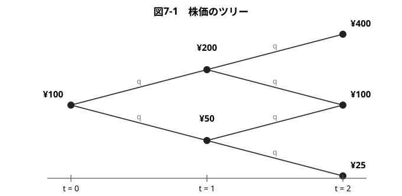
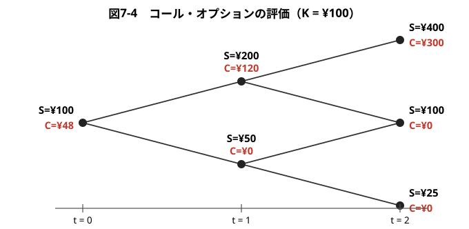
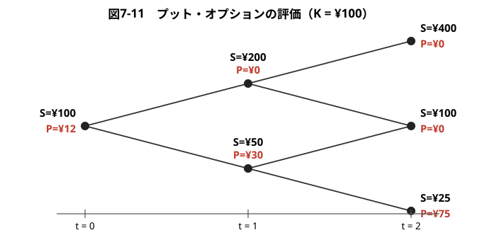
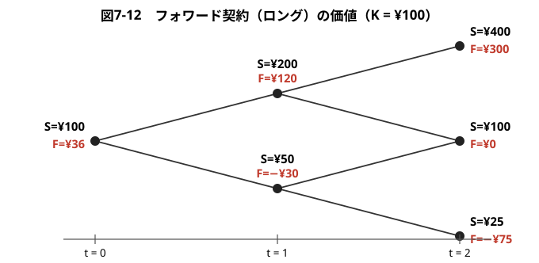
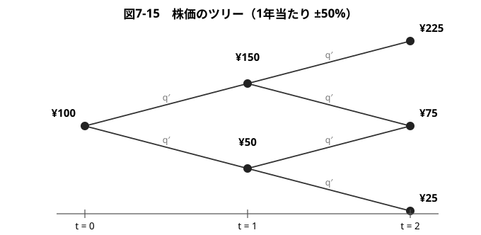
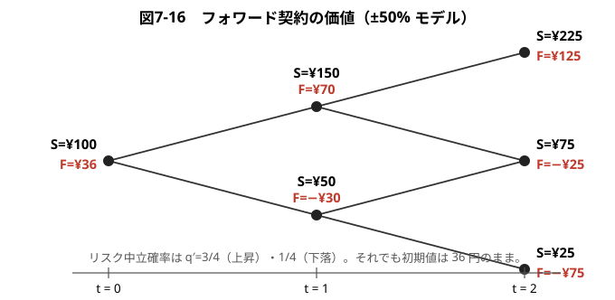
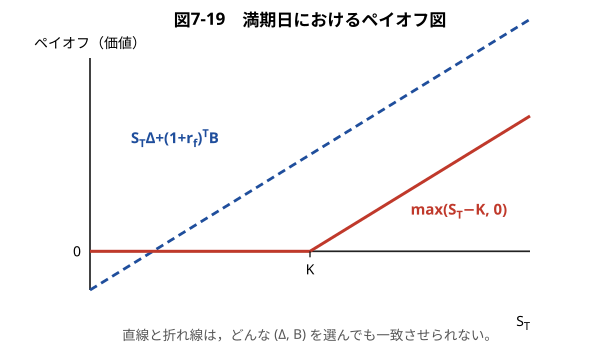
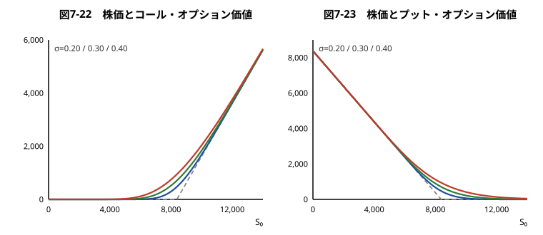
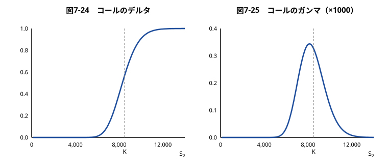
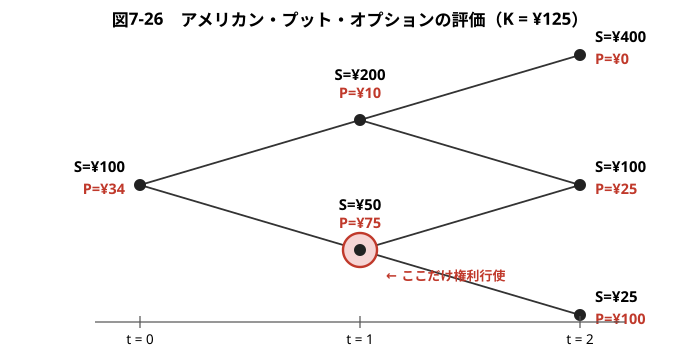

## 証券投資論 勉強会

### 第7章　デリバティブの評価理論

---

# はじめに

第5章では，状態価格やリスク中立確率を用いてデリバティブを評価する方法を学んだ。本章では，株価の動きを**二項モデル**という具体的な確率モデルで表し，オプション・フォワードといったデリバティブの価値を実際に計算する。

説明の順序は，典型的な教科書とはあえて逆にしてある。すなわち，**具体的な数値例（二項ツリー）を先に置き，$u,d,r_f$ による一般公式は最後（5節）にまとめる**。また，オプションの評価には原資産価格の確率モデルが不可欠であるが，**フォワード契約の場合にはどんな確率モデルを仮定しても同じ評価値が得られる**——この対比が本章の主題である。

---

# 7.1.1 株価のツリー

今日（$t=0$）の株価を100円とし，1年後に株価は2倍（200円）になるか，半分（50円）になるとする。さらに2年後も同じ変化率で動くとすれば，株価の動きは次のような**ツリー**（樹形図）で表される。このようなモデルを**二項モデル**と呼ぶ。

分岐点は $(t,\text{上昇回数})$ の形で表し，$(0,0)$，$(1,1)$，$(1,0)$ などと書く。

---

# 7.1.2 オプションのツリー

この株式を原資産とする**ヨーロピアン・コール・オプション**を考える。満期日は2年後（$T=2$），権利行使価格は $K=100$ 円とする。満期日のペイオフは $\max(S_T-K,0)$ であるから，株価が $(400,100,25)$ の3通りになるのに応じて
$$
\max(400-100,0)=300,\quad \max(100-100,0)=0,\quad \max(25-100,0)=0
$$
となる。

満期日のペイオフはこのように確定するが，**今日のオプション価格をどう決めるか**が問題である。以降，1年あたりのリスクフリー・レートを $r_f=0.25 \ (25\%)$ とする。

---

# 7.1.3 リスク中立確率を求める

第5章で学んだように，リスク中立確率とは「その確率で期待値をとってリスクフリー・レートで割り引くと，今日の価格に一致する」ような確率である。

分岐点 $(t,n)$ で株価が上昇するリスク中立確率を $q_{(t,n)}$ とすると，各分岐点で
$$
100=\frac{q_{(t,n)}\times200+(1-q_{(t,n)})\times50}{1+0.25}
$$
が成立しなければならない。これを解くと
$$
125=200q_{(t,n)}+50-50q_{(t,n)} \quad\Longrightarrow\quad q_{(t,n)}=0.5
$$
これは，どの分岐点 $(t,n)$ でもリスク中立確率が同じ $0.5$ であることを意味する。

---

# 7.1.4 オプション価格を求める

リスク中立確率が求まれば，あとはツリーの**右から左へ**向かって，1期分ずつ「期待値をとってリスクフリー・レートで割り引く」という作業を繰り返せばよい（**後退帰納法**）。

- 分岐点 $(1,1)$ では
$$
C_{(1,1)}=\frac{0.5\times300+0.5\times0}{1.25}=\frac{150}{1.25}=120
$$

- 分岐点 $(1,0)$ では
$$
C_{(1,0)}=\frac{0.5\times0+0.5\times0}{1.25}=0
$$

- 初期時点 $(0,0)$ では
$$
C_{(0,0)}=\frac{0.5\times120+0.5\times0}{1.25}=\frac{60}{1.25}=48
$$

---

以上の計算結果をまとめると，次のようなツリーになる。

よって，コール・オプションの今日の価値は **48円** である。

---

# 7.1.5 オプション価格の意味

以上の計算結果で求めたオプション価格について，いくつか注意すべき点がある。

- オプションの価格は，株価が上昇する**現実の確率**をまったく使わずに求められた。株価が上がる確率が0.9であろうと0.1であろうと，オプション価格は48円である。これは，オプションの価格が**投資家の主観的な予想に依存しない**ことを意味する。

**第2に**，リスク中立確率 $q=0.5$ は，株価の**上昇率 $u$・下落率 $d$・リスクフリー・レート $r_f$ だけ**から決まる。

---

**第3に**，リスク中立確率のもとでは，株式もオプションも「期待リターンがリスクフリー・レートに等しい」ように振る舞う。しかし，これは現実の投資家がリスク中立的であることを意味しない。**リスク中立確率は，あくまで計算のための便宜的な確率**である。

**第4に**，オプションの価格48円は，**裁定機会が存在しない**ことから決まる価格である。もし市場価格が48円と異なれば，次節で見る複製ポートフォリオを使って確実に利益を得られてしまう。

---

# 7.2.1 分岐点(1,1)でのオプションの複製

リスク中立化法とは別に，オプションのペイオフを**株式とリスクフリー資産の組み合わせで複製する**という方法がある。この方法によって，48円という価格の意味がいっそう明確になる。

分岐点 $(1,1)$（株価200円）から考えよう。株式を $\Delta$ 単位，リスクフリー資産を $B$ 円だけ保有するポートフォリオを組む。1年後（$t=2$）にこのポートフォリオの価値は
$$
400\Delta+1.25B \quad\text{または}\quad 100\Delta+1.25B
$$
となる。これをオプションのペイオフ $(300,\,0)$ に一致させるには
$$
400\Delta+1.25B=300,\qquad 100\Delta+1.25B=0
$$

---

2式を辺々引くと $300\Delta=300$ より $\Delta=1$，これを代入して $B=-80$ を得る。

したがって，分岐点 $(1,1)$ でのオプションの価値は，この複製ポートフォリオを組むのに必要な資金
$$
\Delta S+B=1\times200-80=120\ \text{円}
$$
に等しい。リスク中立化法で求めた $C_{(1,1)}=120$ と**一致する**。

$\Delta=1$，$B=-80$ とは，「80円を借り入れて株式を1単位買う」という戦略である。

---

# 7.2.2 分岐点(1,0)でのオプションの価値

分岐点 $(1,0)$（株価50円）では，$t=2$ での株価は100円か25円であり，オプションのペイオフはどちらも0である。したがって
$$
100\Delta+1.25B=0,\qquad 25\Delta+1.25B=0
$$
を解くと $\Delta=0,\ B=0$ となり，オプションの価値は0円である。

株価がこの水準まで下がると，満期日にイン・ザ・マネーになる可能性が完全に消えるため，オプションは無価値になる。

---

# 7.2.3 分岐点(0,0)でのオプションの価値

初期時点 $(0,0)$（株価100円）では，1年後のオプションの価値が $(120,\,0)$ であることがすでにわかっている。そこで
$$
200\Delta+1.25B=120,\qquad 50\Delta+1.25B=0
$$
を解けばよい。辺々引くと $150\Delta=120$ より
$$
\Delta=0.8,\qquad B=-32
$$

したがって今日のオプションの価値は
$$
\Delta S+B=0.8\times100-32=48\ \text{円}
$$
であり，やはりリスク中立化法の結果と一致する。

---

# 7.2.4 2年を通してのオプションの動的複製

以上をまとめると，オプションの売り手は次のように行動すればよい。

- **今日**：48円を受け取り，32円を借り入れて，合計80円で株式0.8単位を購入する。
- **1年後に株価が200円になったら**：株式保有を0.8単位から**1単位に増やす**。借入残高は $32\times1.25=40$ 円から80円へ増える（追加の株式購入資金40円を借り入れる）。
- **1年後に株価が50円になったら**：株式を**すべて売却**し，借入も返済する。ポジションはゼロになる。

---

このように，株価の変動に応じて**保有株数 $\Delta$ を調整し続ける**戦略を**動的複製**（デルタ・ヘッジ）と呼ぶ。

重要なのは，この戦略が**自己資金充足的**（self-financing）であることである。すなわち，最初に48円を用意した後は，**途中で追加の資金を投入する必要も，資金が余ることもない**。株式の売買はすべて借入の増減で賄われる。

そして満期日には，複製ポートフォリオの価値がオプションのペイオフに**ちょうど一致する**。だからこそ48円がオプションの正しい価格なのである。

---

# 7.2.5 2年を通してのオプションの静的複製

では，今日 $(\Delta,B)$ を組んで**満期日まで何もせずに持ち続ける**（**静的複製**）ことでオプションを複製できるだろうか。

$t=2$ での株価は $(400,100,25)$ の3通りなので，条件は
$$
400\Delta+1.25^2B=300,\qquad 100\Delta+1.25^2B=0,\qquad 25\Delta+1.25^2B=0
$$
の3本になる。

---

未知数は $(\Delta,B)$ の2個に対して方程式は3本であり，この連立方程式は**解なし**である（第2式と第3式から $\Delta=0$，したがって $B=0$ となるが，これでは第1式が満たされない）。

**オプションは静的複製できない。動的複製が本質的に必要なのである。**

---

# 7.3.1 満期日におけるプット・オプションの価値

同じ株式を原資産とする**ヨーロピアン・プット・オプション**（$K=100$，$T=2$）を考える。満期日のペイオフは $\max(K-S_T,0)$ であるから
$$
\max(100-400,0)=0,\quad \max(100-100,0)=0,\quad \max(100-25,0)=75
$$
となる。

コールとは逆に，**株価が下落したときにイン・ザ・マネー**になる。

---

# 7.3.2 リスク中立化法によるプット・オプションの評価

コールとまったく同じ手順で，右から左へ後退帰納法を適用する。リスク中立確率はやはり $q=0.5$ である。

$$
P_{(1,1)}=\frac{0.5\times0+0.5\times0}{1.25}=0,\qquad
P_{(1,0)}=\frac{0.5\times0+0.5\times75}{1.25}=\frac{37.5}{1.25}=30
$$
$$
P_{(0,0)}=\frac{0.5\times0+0.5\times30}{1.25}=\frac{15}{1.25}=12
$$

---

プット・オプションの今日の価値は **12円** である。

---

# 7.3.3 動的複製によるプット・オプションの評価

プットについても同様に複製ポートフォリオを求めることができる。初期時点 $(0,0)$ では
$$
200\Delta+1.25B=0,\qquad 50\Delta+1.25B=30
$$
を解いて
$$
\Delta=-0.2,\qquad B=32
$$
したがって $P=\Delta S+B=-0.2\times100+32=12$ 円となり，リスク中立化法の結果と一致する。

---

$\Delta$ が**負**であることに注意してほしい。プットを複製するには**株式を空売り**し，その資金をリスクフリー資産で運用する。プットは株価下落で価値が上がるので，複製にも株価下落で得をするポジションが必要になるのである。

---

# 7.4.1 フォワード契約

**フォワード契約**とは，将来のある時点にある資産をあらかじめ定めた価格（**受渡価格** $K$）で売買する契約である。買い手側（**ロング**）の満期日のペイオフは
$$
S_T-K
$$
である。オプションと違い，$S_T<K$ のときも契約を履行しなければならないので，ペイオフは**マイナスにもなる**。

ここでは同じ株式について，$K=100$ 円，$T=2$ のフォワード契約（ロング）を考える。満期日のペイオフは
$$
400-100=300,\qquad 100-100=0,\qquad 25-100=-75
$$

---

# 7.4.2 リスク中立化法によるフォワード・ロングの評価

後退帰納法を適用すると
$$
F_{(1,1)}=\frac{0.5\times300+0.5\times0}{1.25}=120,\qquad
F_{(1,0)}=\frac{0.5\times0+0.5\times(-75)}{1.25}=-30
$$
$$
F_{(0,0)}=\frac{0.5\times120+0.5\times(-30)}{1.25}=\frac{45}{1.25}=36
$$

---

受渡価格100円のフォワード契約（ロング）の今日の価値は **36円** である。

---

# 7.4.3 フォワード契約の複製

フォワード契約についても，今日 $(\Delta,B)$ を組んで満期日まで持ち続ける**静的複製**を試みてみよう。条件は
$$
400\Delta+1.25^2B=300,\qquad 100\Delta+1.25^2B=0,\qquad 25\Delta+1.25^2B=-75
$$
の3本である。

---

方程式3本に対して未知変数が2個なので，この連立方程式は普通は「解なし」となるのであるが（オプションの場合がそうであった），いまの場合は
$$
\Delta=1,\qquad B=-64
$$
と置けば，**3本の式が同時に成立する**。

したがってフォワード・ロングの初期時点での価値は $100\Delta+B=100-64=36$ 円となる。

---

# 7.4.4 フォワード契約を静的に複製できる理由

$\Delta=1,\ B=-64$ とは，「64円を借り入れて株式を1単位買い，満期日まで持ち続ける」という戦略である。満期日には株式1単位を持ち，借入残高は $64\times1.25^2=100$ 円になっている。

これはまさに「満期日に100円払って株式1単位を受け取る」というフォワード・ロングそのものである。**株数を途中で調整する必要はまったくない。**

---

一般に，満期日 $T$，受渡価格 $K$ のフォワード・ロングの静的複製は
$$
S_T\Delta+(1+r_f)^TB=S_T-K
$$
をすべての $S_T$ について成立させればよく，容易に
$$
\Delta=1,\qquad B=-\frac{K}{(1+r_f)^T}
$$
が答えとなる。

---

# 7.4.5 確率モデル変更の影響

実は，$t=1$ 以降の株価の確率モデルを変更しても，今日の株価が100円であればフォワード契約の価値や複製方法は**変わらない**。これを確かめてみる。

株価の1年当たりの変化を $\pm50\%$ と仮定してみよう。

---

各分岐点で株価が上昇するリスク中立確率を $q'$ とすると，たとえば分岐点 $(0,0)$ で
$$
100=\frac{q'\times150+(1-q')\times50}{1.25}\quad\Longrightarrow\quad q'=\frac34
$$
となる。他の分岐点でも同じく $q'=3/4$ である。

---

# 7.4.6 確率モデル変更後のフォワード契約の複製

この新しいツリーで，各分岐点のフォワード契約の価値をリスク中立化法で求めると次のようになる。

---

初期時点のフォワード・ロングの価値は，**確率モデルを変えたにもかかわらず 36円のまま**である。

静的複製についても，条件は
$$
225\Delta+1.25^2B=125,\quad 75\Delta+1.25^2B=-25,\quad 25\Delta+1.25^2B=-75
$$
となるが，これも $\Delta=1,\ B=-64$ で同時に成立する。**複製方法もまったく同じ**である。

---

# 7.4.7 オプション契約では静的複製が不可能な理由

なぜフォワード契約の場合には静的複製が可能で，オプション契約では不可能なのか。その原理を数式で説明しよう。

$t=0$ で構築する複製ポートフォリオを $(\Delta,B)$ とすると，満期日にこのポートフォリオの価値は $S_T\Delta+(1+r_f)^TB$ になる。

- **フォワード**のペイオフは $S_T-K$ という**直線**。左辺も傾き $\Delta$ の直線なので，$\Delta=1$，切片を合わせれば**完全に一致させられる**。
- **オプション**のペイオフは $\max(S_T-K,0)$ という，$S_T=K$ で折れ曲がった**折れ線**。直線を折れ線に一致させることは，$(\Delta,B)$ をどう選んでもできない。

---

オプションの場合に初期時点で構築したポートフォリオの買い持ちによって満期日のペイオフを複製できないのは，**オプションのペイオフが直線でない（非線形である）から**なのである。

---

# 7.4.8 リスク中立化法による検討

同じことをリスク中立化法の観点からも確かめておこう。フォワード契約の価値は
$$
F_0=\frac{1}{(1+r_f)^T}E_0^{Q}\bigl[S_T-K\bigr]
$$
である（$E^Q$ はリスク中立確率のもとでの期待値）。一方，株式についても「株価＝割引現在価値の期待値」が成り立つので
$$
S_0=\frac{1}{(1+r_f)^T}E_0^{Q}[S_T]
$$

したがって
$$
F_0=\frac{1}{(1+r_f)^T}E_0^{Q}[S_T]-\frac{K}{(1+r_f)^T}=S_0-\frac{K}{(1+r_f)^T}
$$

---

いま検討中のデータ $(S_0=100,\ K=100,\ T=2,\ r_f=0.25)$ を代入すると
$$
F_0=100-\frac{100}{(1.25)^2}=100-64=36
$$
となり，前に得られた結果と一致する。

これに対してコール・オプションの場合は
$$
C_0=\frac{1}{(1+r_f)^T}E_0^{Q}\bigl[\max(S_T-K,0)\bigr]
$$
となり，フォワードの場合のような単純化ができない。**満期日の株価 $S_T$ の確率分布の形状を定めないかぎり，右辺を計算できない**のである。

> フォワード契約に比べて，オプション契約の評価には「リスク中立化法」や「ペイオフの動的複製」といったより深い原理が必要とされる。それゆえにこそ，ブラック・ショールズ・モデルは1997年度のノーベル経済学賞の受賞対象に選ばれた。

---

# 7.4.9 フォワード契約の時価評価額

**フォワード契約の時価評価額**：受渡価格 $K$，満期 $T$ のフォワード契約の今日の価値は
$$
\text{ロング側：}\ F_0=S_0-\frac{K}{(1+r_f)^T},\qquad
\text{ショート側：}\ F_0'=\frac{K}{(1+r_f)^T}-S_0
$$

この式は次のように解釈すればよい。ロング・サイドの投資家は，満期日に $K$ 円を支払って株式1単位をもらう。満期日に支払う $K$ 円の現在価値は $K/(1+r_f)^T$，満期日にもらう株式の今日の価値は $S_0$ である。両者の差が今日時点の時価評価額になる。

これらの評価式には，**株価の将来の確率的な動きを記述するパラメータは何も含まれない**ことに留意してほしい。

---

# 7.4.10 市場フォワード価格

ここまでは，ある受渡価格のフォワード契約を所与としてその評価を行う問題を考えてきた。$t=0$ より以前に締結した契約を時価評価する話をしてきたと考えればよい。

今日，新たにフォワード契約を結ぶ状況を考えると，売り手・買い手の双方にとって，**結ばれるフォワード契約の評価値がゼロになるところに受渡価格が定まる**。そこで $F_0=0$ とおいて $K$ を求めると

**市場フォワード価格（先物のキャリー公式）**：
$$
f_0=S_0(1+r_f)^T
$$

つまり，市場で決まるフォワード価格（受渡価格）は，**今日の株価に満期までの金利を上乗せした値**に等しい。いまの例では $100\times1.25^2=156.25$ 円である。

---

# 7.5.1 リスク中立化法

ここで，二項モデルの1期分についてオプション評価の2つの解法の関係を整理しておこう。今日の株価を $S$，今日のオプション価格を $C$ とし，1期後に株価は $uS$ ないしは $dS$ になるとする。オプション価値はそれぞれ $C_u$，$C_d$ とする。

株価が $u$ 倍になるリスク中立確率を $q$ と表して，株価のツリーにリスク中立化原理を適用すると
$$
S=\frac{quS+(1-q)dS}{1+r_f}\quad\Longrightarrow\quad q=\frac{1+r_f-d}{u-d}
$$

この $q$ を用いて，オプションのツリーにリスク中立化原理をあてはめると
$$
C=\frac{qC_u+(1-q)C_d}{1+r_f}
=\frac{1}{1+r_f}\left\{\frac{(1+r_f)-d}{u-d}C_u+\frac{u-(1+r_f)}{u-d}C_d\right\}
$$

---

# 7.5.2 複製による解法

いま，株式 $\Delta$ 単位とリスクフリー資産 $B$ 円でオプションの1期後の価値を複製しようとすると，連立方程式
$$
\Delta uS+(1+r_f)B=C_u,\qquad \Delta dS+(1+r_f)B=C_d
$$
から
$$
\Delta=\frac{C_u-C_d}{(u-d)S},\qquad B=\frac{uC_d-dC_u}{(1+r_f)(u-d)}
$$
と求まる。

---

この複製ポートフォリオの今日の価値を求めれば，それがオプションの今日の価値になる：
$$
C=\Delta S+B=\frac{C_u-C_d}{u-d}+\frac{uC_d-dC_u}{(1+r_f)(u-d)}
$$

これを整理すると
$$
C=\frac{1}{1+r_f}\left\{\frac{(1+r_f)-d}{u-d}C_u+\frac{u-(1+r_f)}{u-d}C_d\right\}
$$
となり，**リスク中立化法の結果と完全に一致する**。

複数の期間にまたがる場合でも，ツリーの1期分ごとに上記の作業を繰り返していくだけなので，**リスク中立確率による解法と複製ポートフォリオによる解法は同一の結果をもたらす**。

---

$\Delta$ は，オプション・トレーダーの間でも本章の記号通り「**デルタ**」と呼ばれる。二項モデルでは，$\Delta$ はツリーの1ステップ当たりでみたオプション価格の上下幅と株価の上下幅の比率で定義される。

一般化していうと，デルタは**オプションの原資産価格に対するエクスポージャーを表すリスク指標**である。つまり，原資産価格が1円変化するとき，オプションの価格は $\Delta$ 円変化する。動的複製で確認したように，デルタの値は原資産価格の変動にともなって変化する。

---

# 7.6.1 ブラック・ショールズ公式

1年を1期とするツリーで株価の動きを表現するのは非現実的にすぎるが，**時間の刻みを十分小さくすれば二項モデルはきわめて実用性の高い解法**となる。実際，評価公式が存在しないアメリカン・オプションや，ペイオフの構造が複雑なオプション（**エキゾチック・オプション**）を評価する際に，二項モデルがよく用いられる。

しかしながら，オプションの評価といえば**ブラック・ショールズ公式**がその代名詞になっているほどであり，オプション評価理論はブラック・ショールズ公式から始まったといってよい。

---

このモデルは1973年にフィッシャー・ブラック，マイロン・ショールズ，ロバート・マートンの3人によって考え出された理論で，1997年度ノーベル経済学賞が授与された。二項モデルによるオプション評価法は，ジョン・コックス，マーク・ルビンスタイン，ステファン・ロスの3人の共同論文として1979年に発表された。

---

**ブラック・ショールズ公式**：配当のないヨーロピアン・オプションの評価式は
$$
C=S_0N(d_1)-\frac{K}{(1+r_f)^T}N(d_2),\qquad
P=\frac{K}{(1+r_f)^T}N(-d_2)-S_0N(-d_1)
$$
ただし
$$
d_1\equiv\frac{\log\bigl(S_0/K(1+r_f)^{-T}\bigr)}{\sigma\sqrt{T}}+\frac12\sigma\sqrt{T},\qquad
d_2\equiv\frac{\log\bigl(S_0/K(1+r_f)^{-T}\bigr)}{\sigma\sqrt{T}}-\frac12\sigma\sqrt{T}
$$

$N(x)$ は標準正規分布の累積分布関数である。オプション価値を決めるパラメータは $S_0$（今日の株価），$K$（権利行使価格），$\sigma$（ボラティリティ），$r_f$（リスクフリー・レート），$T$（満期までの時間）の**5つ**である。

---

公式の意味を見るために，コールの式を次のように書き直してみる：
$$
C=\frac{1}{(1+r_f)^T}\Bigl[S_0N(d_1)(1+r_f)^T-KN(d_2)\Bigr]
$$

確率 $N(d_2)$ は，**コール・オプションが満期日に権利行使されるリスク中立確率**を示す。$KN(d_2)$ はこの確率に権利行使価格 $K$ を掛けたものである。

コール・オプションの買い手は，満期日にオプションがイン・ザ・マネーになったときにだけ $K$ 円支払って株式1単位をもらう。この事象が起こる確率を考えて満期日のペイオフの期待値を計算し，それを現在価値に割り引いたのがこの式である。一方，フォワードの買いでは満期日に**必ず** $K$ 円支払って株式1単位をもらうので，フォワード・ロングの評価式は確率 $N(d_1)$ と $N(d_2)$ の項を**1に置き直した式**になる。それが $F_0=S_0-K(1+r_f)^{-T}$ である。

---

オプションの今日の価値が $\Delta\times S_0+B$ で与えられることを思い出して公式と対照させると，**コール・オプションを複製するために今日買い入れるべき株式は $N(d_1)$ 単位で，借り入れるべき金額は $K(1+r_f)^{-T}N(d_2)$** である。

また，プット・オプションの場合は，今日空売りすべき株式は $N(-d_1)$ 単位，リスクフリー資産で運用すべき金額は $K(1+r_f)^{-T}N(-d_2)$ である。

---

**計算例7.1（ブラック・ショールズの公式）**　株価指数が9000ポイントのときに，満期日まで半年，権利行使価格8500ポイントのコール・オプションとプット・オプションの価値を計算してみる。ボラティリティは年率20%，リスクフリー・レートは3%とする。

パラメータ値は $S_0=9000,\ K=8500,\ \sigma=0.20,\ r_f=0.03,\ T=0.5$ である。これより
$$
K(1+r_f)^{-T}=8500\times1.03^{-0.5}=8375.3
$$
$$
d_1=\frac{\log(9000/8375.3)}{0.20\sqrt{0.5}}+\frac12\times0.20\sqrt{0.5}=0.5087+0.0701=0.5794
$$
$$
d_2=0.5087-0.0701=0.4380
$$

---

このとき，標準正規分布の累積確率は
$$
N(d_1)=0.7188,\quad N(-d_1)=0.2812,\qquad N(d_2)=0.6693,\quad N(-d_2)=0.3307
$$

これらの結果より，ヨーロピアン・コールとプットの価値は
$$
C=9000\times0.7188-8375.3\times0.6693=\mathbf{864}
$$
$$
P=8375.3\times0.3307-9000\times0.2812=\mathbf{239}
$$

ちなみに，ボラティリティを $\sigma=0.30$ と仮定すると $C=1088,\ P=463$ と計算される。**ボラティリティが上がるとコールもプットも値上がりする。**

---

# 7.6.2 プット・コール・パリティ

ヨーロピアン・タイプのプットは，同一満期・同一権利行使価格のコールを用いて複製することができる。それには，**コール1単位の買いと株式1単位のショートを組み合わせ，リスクフリー資産に $K/(1+r_f)^T$ 円だけ投資すればよい**。

満期日にコールがアウト・オブ・ザ・マネー（$S_T<K$）のときは，リスクフリー資産の残高 $K$ 円から株式の買い戻し資金を出せば，手元に $(K-S_T)$ 円が残る。イン・ザ・マネーのときは，残高 $K$ 円を使ってコールを権利行使し，手に入る株式でショートポジションを解消すれば，手元には何も残らない。これはプットを1単位買ったのと同じである。

**プット・コール・パリティ**：
$$
P=C-S_0+\frac{K}{(1+r_f)^T}
$$

---

この式を
$$
C=P+S_0-\frac{K}{(1+r_f)^T}
$$
と書き直せば，今度は**コールの静的複製**に対応する式になる。右辺は，プット1単位・株式1単位の買いと $K/(1+r_f)^T$ 円の借金を組み合わせたポジションの作成を示唆している。

---

この式は，**株価の確率モデルが何であっても成立する裁定式**であるので，ブラック・ショールズ・モデルが想定する世界でも当然成立しなければならない。実際，コールの公式を右辺に代入すると，$1-N(d_i)=N(-d_i)$ を用いてプットの公式に一致することが確かめられる。

> 本章の走る例でも $C-P=48-12=36$ であり，$S_0-K(1+r_f)^{-T}=100-64=36$ と一致している。これはフォワード・ロングの価値にほかならない。

---

# 7.6.3 オプション価値と株価の関係

---

**コール**の場合は，株価 $S_0$ とオプション価値 $C$ の関係は右上がりの曲線になる。株価がほとんど0のときは満期日にイン・ザ・マネーになる確率も0に近いので，オプションの価値は原点から出発する曲線になる。株価が十分高いとき，オプションは満期日にほぼ確実にイン・ザ・マネーで終わるので，**コールの買いはフォワードの買いと同じ**になり，価値は直線 $S_0-K(1+r_f)^{-T}$ に漸近する。

**プット**の場合は右下がりの曲線になる。株価が0に近いときは満期日にほぼ確実にイン・ザ・マネーになるので，価値はフォワード売りポジションの価値 $K(1+r_f)^{-T}-S_0$ に漸近する。株価が十分大きくなれば，オプション価値は0に近づいていく。

いずれも**ボラティリティ $\sigma$ が大きいほど，曲線は上方に位置する**。

---

# 7.7.1 オプションの感応度分析

ブラック・ショールズ公式には，オプション価値に影響を与えるパラメータが $S_0,K,\sigma,r_f,T$ の5つある。これらの影響をとらえる「**感応度分析**」は，オプションのトレーダーだけではなく，オプションを使って運用を行う者やリスク管理者にとって不可欠の知識となる。個々のパラメータの変化がオプション価格に与える変化は，**ギリシャ文字**で呼ばれている。

**① デルタ**
$$
\Delta^{Call}\equiv\frac{\partial C}{\partial S_0}=N(d_1),\qquad
\Delta^{Put}\equiv\frac{\partial P}{\partial S_0}=N(d_1)-1
$$
$0<N(d_1)<1$ であるので，**コールのデルタは正，プットのデルタは負**である。なお $\Delta^{Put}=\Delta^{Call}-1$ は，プット・コール・パリティからブラック・ショールズ・モデルに依拠することなく導ける。

---

**② ロー**　リスクフリー・レートの変化の影響は「**ロー**」（$\rho$）と呼ばれる。$r_f$ の上昇は権利行使価格 $K$ の現在価値を低めるので，**コールの価値は上昇し，プットの価値は低下する**。

**③ ガンマ**　今日の株価の変化がデルタに与える影響が「**ガンマ**」（$\Gamma$）である：
$$
\Gamma^{Call}=\frac{\partial\Delta^{Call}}{\partial S_0}=\frac{\partial^2C}{\partial {S_0}^2}>0,\qquad \Gamma^{Put}=\Gamma^{Call}
$$
ガンマは常にプラスの値をとり，**アット・ザ・マネー近辺で最大**となる。

---

コールのデルタは0から1に向かって単調増加し，アット・ザ・マネー近辺で0.5程度となる。ガンマはアット・ザ・マネー近辺で最大となり，そこでデルタの変化が大きくなることを意味する。

---

ガンマは，オプションを動的に複製するときに発生する**複製誤差**（ヘッジ・エラー）に深くかかわる。動的複製には株価の変動に応じてデルタを変化させることが必要だが，現実には取引コスト削減の点からリバランスをそれほど頻繁に行えないために複製誤差が生じる。**ガンマが大きいほど，この複製誤差が大きくなる。**

原証券価格の変化の方向（ディレクション）に対してヘッジをかけるのが「**デルタヘッジ**」である。しかし，原証券価格が短期間に大きく変動するときは，デルタに対してヘッジをしていてもヘッジが有効に機能しない。このときには，デルタだけでなくガンマも中立にする「**デルタガンマヘッジ**」が使われる。

---

**④ ベガ**　ボラティリティ $\sigma$ の変化がオプション価格に与える影響は「**ベガ**」と呼ばれる。コールは株価上昇に対する保険を，プットは株価下落に対する保険を提供する金融商品と考えることができるので，**原資産のボラティリティが大きいほどオプションの価値も高くなる**。つまりベガは常にプラスで，
$$
\frac{\partial C}{\partial\sigma}=\frac{\partial P}{\partial\sigma}>0
$$

**⑤ セータ**　満期までの残存期間 $T$ の変化がオプション価値に与える影響 $-\partial C/\partial T,\ -\partial P/\partial T$ は「**セータ**」（$\theta$）と呼ばれる。残存期間の短縮はボラティリティの低下と同じで，コールとプットの価値をともに低める。一般にセータはマイナスの値になる。

---

以上のパラメータ変化の影響をまとめると次のようになる。

| パラメータ | 感応度 | コール価格への影響 | プット価格への影響 |
|---|---|---|---|
| $S_0$ | デルタ | $+$ | $-$ |
| $K$ | | $-$ | $+$ |
| $\sigma$ | ベガ | $+$ | $+$ |
| $T$ | セータ | $-$ | $-$ |
| $r_f$ | ロー | $+$ | $-$ |

> 感応度のうち「ベガ」だけはギリシャ文字ではない。この感応度をギリシャ文字の「カッパ」（$\kappa$）で表すテキストもある。また，イン・ザ・マネーのプットでは，セータがプラスとなる場合がある。

---

# 7.7.2 インプライド・ボラティリティ

ブラック・ショールズ公式の5つのパラメータのうち，**ボラティリティ $\sigma$ だけが観察できない変数**である。このボラティリティを，オプション評価モデルを用いて市場で成立するオプションの取引価格から**逆算**することができる。このように逆算されたボラティリティは，オプション価格に織り込まれたボラティリティという意味で，**インプライド・ボラティリティ**（IV）と呼ばれる。

オプション価格が与えられれば，ブラック・ショールズ公式は $\sigma$ に関する非線形の方程式を与える。この方程式をニュートン法などの数値計算法を利用して簡単に解くことができる。

> ブラック・ショールズ公式は $\sigma$ と単調増加の関係にあるので，オプションの取引価格が裁定を許す異常な領域にないかぎり，解となる $\sigma$ は**一意に存在する**ことが保証される。

---

オプション市場では，同一の原証券に対して，行使価格や満期日の異なる複数のオプションが同時に取引されている。ブラック・ショールズ公式が完全に成立しているならば，これら個々のオプションから求められる IV は**すべて等しいはず**である。

しかし現実には，コールとプットで，異なる行使価格間で，また異なる満期日間で，算出される IV が異なる。この現象は「**ボラティリティ・スキュー**」（ボラティリティのゆがみ）と呼ばれ，株価が対数正規分布に従うという仮定を内包するブラック・ショールズ・モデルでは説明しきれない現象である。

IV は市場が予想するボラティリティであるから，投資家にとっても政策当局者にとってもきわめて有益な情報となる。世界の代表的なオプション取引所では，複数のオプション価格から算出される IV を指数化して**ボラティリティ・インデックス**と呼ばれる指数を算出・公表している。モデル依存度を最小限に抑えたものの代表としては，シカゴ・オプション取引所の **VIX 指数**が有名である。

---

# 7.8.1 リスク中立化法の適用

**アメリカン・オプション**の場合には，権利行使のタイミングを選ぶのがオプションの買い手にとって重要な意思決定となる。ヨーロピアン・オプションにはこのタイミング選択の問題がないのでブラック・ショールズ公式のような便利な評価式が存在するが，**アメリカン・オプションについては正確な評価公式は存在しない**。そうした場合に二項モデルがその有用性を大いに発揮する。

---

図7-1 の株式を対象にする満期日まで2年のアメリカン・プット・オプションを考えてみる。権利行使価格は $K=125$ 円とする。

**各分岐点でのアメリカン・オプションの価値**：
$$
P_t=\max\bigl(\hat P_t,\ K-S_t\bigr)
$$
ここで $\hat P_t$ はオプションをそのまま持ち続けた場合の価値，$K-S_t$ は権利行使した場合のペイオフである。

---

---

各分岐点を右から左へたどると次のようになる。

- **分岐点 $(1,1)$**（$S=200$）：$\hat P_{(1,1)}=(0.5\times0+0.5\times25)/1.25=10$。権利行使のペイオフは $125-200=-75$ でアウト・オブ・ザ・マネーなので行使しない。$P_{(1,1)}=10$。
- **分岐点 $(1,0)$**（$S=50$）：$\hat P_{(1,0)}=(0.5\times25+0.5\times100)/1.25=50$。権利行使のペイオフは $125-50=75$ で，持ち続けた場合の50を**超える**。よって**ここで権利行使すべき**であり，$P_{(1,0)}=75$。
- **分岐点 $(0,0)$**（$S=100$）：$\hat P_{(0,0)}=(0.5\times10+0.5\times75)/1.25=34$。権利行使のペイオフ $125-100=25$ より大きいので行使しない。$P_{(0,0)}=34$。

初期時点では権利行使は行わないが，初期時点における評価値は分岐点 $(1,0)$ での権利行使を織り込んで **34円**となる。

---

# 7.8.2 満期前権利行使のタイミング

コール・オプションの場合，原資産株式にオプションの満期日まで**配当がないならば，満期前に権利行使するべきでない**ことが知られている。

一方，プット・オプションの場合には，**配当の有無にかかわらず，オプションが大きくイン・ザ・マネー側になれば権利行使をするほうが投資家にとって有利**になる。

このあたりの一般法則の解説は専門的なデリバティブのテキストに譲るが，二項ツリーを書いて上の手続きに従って数値計算を行えば，**権利行使に関する結論は必ず一般法則に合致する**。