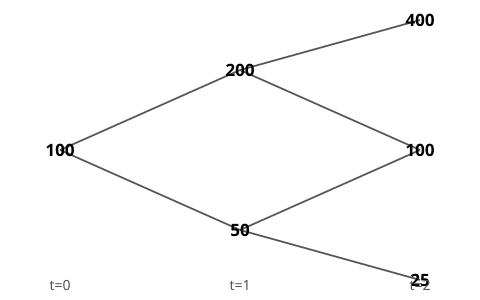
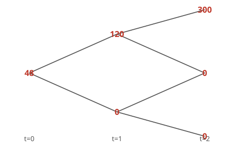
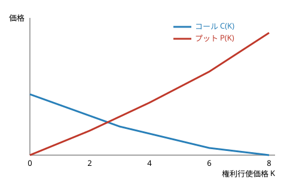

## 金融工学 勉強会

### 第7章　デリバティブの評価理論

---

# 本日の内容

1. 二項モデルによるコール・オプションの評価
2. プット・オプションの評価
3. フォワード契約の評価とフォワード価格
4. 一般化：u, d, r_f による公式
5. ブラック＝ショールズ公式
6. グリークスとインプライド・ボラティリティ
7. アメリカン・オプション

底本：『新・証券投資論 I 理論篇』（日本証券アナリスト協会 編，小林孝雄・芹田敏夫 著，日本経済新聞出版社，2009）第7章。

---

本章はまずオプション評価理論を，具体的な数値の二項ツリーを使って説明する。次にオプションの複製という考え方を学び，リスク中立化法と複製法という2通りの解法が一致することを見る。多くの教科書はフォワード契約を先に扱うが，本書はあえて順序を逆にする——オプションを先に理解してからフォワードを見た方が，「なぜフォワードは確率モデルによらず評価できるのか」という事実がより深く理解できるからである。最後に，二項モデルの刻みを細かくした極限としてブラック＝ショールズ公式に至る。

---

# 株価のツリー

Part 1：二項モデルによるコール・オプションの評価

今日の株価100円が，1年ごとに倍額（200円）か半額（50円）になるとする。2年後の株価は400円・100円・25円の3通り。

価格の時間的な動きを，上昇・下落2個の分岐の連鎖で表すモデルを「二項モデル」と呼ぶ

1年を1期とするのは非現実的に粗いが，刻みを細かくすれば現実の株価過程にいくらでも近づけられる——それを断ったうえで，まずこの単純な例で理論の骨格を学ぶ。

---

# コール・オプションのペイオフ

満期$t=2$・権利行使価格$K=100$のヨーロピアン・コールを考える。満期の株価が400円ならイン・ザ・マネーで価値$\max(400-100,0)=300$円，100円・25円ならアウト・オブ・ザ・マネーで価値0円。

25%というリスクフリー・レートは現実離れした高さだが，計算を手計算しやすくするためにこの数値を使う。

---

# リスク中立確率を求める

無裁定より，各分岐点で「株価＝割引いたリスク中立期待値」（第5章の定理5.1）が成り立つ。分岐点$(0,0)$では

$$
100=\frac{1}{1.25}\bigl[q_{(0,0)}\times200+(1-q_{(0,0)})\times50\bigr]
$$

上側の分岐点$(1,1)$・$(1,0)$でも同様の式が立つ。3本の式をそれぞれ解くと

q(0,0) = q(1,1) = q(1,0) = 0.5——どの分岐点でも共通

---

# 後退帰納法で価格を求める

リスク中立割引公式を，満期から**時間の進行と逆向き**に適用する。分岐点$(1,1)$から：

$$
C_{(1,1)}=\frac{1}{1.25}(0.5{\cdot}300+0.5{\cdot}0)=120,\qquad C_{(1,0)}=\frac{1}{1.25}(0.5{\cdot}0+0.5{\cdot}0)=0
$$

$$
C_{(0,0)}=\frac{1}{1.25}(0.5{\cdot}120+0.5{\cdot}0)=48
$$

今日の理論価格は48円

---

# オプション価格の意味①②

計算したオプション価格をどう捉えるべきか，教科書は4点を指摘する。

**①** 市場価格があるオプションについては，これは理論モデルが出す市場価格の「予想値」。市場価格のないオプションについては，これがそのまま評価値になる。

**②** これはオプションの**「製造原価」**である（次のPartで明らかになる）。市場が効率的なら，製造原価＝市場価格——さもなければ裁定が発生してしまう。

---

# オプション価格の意味③④

**③** 計算に使った$q$は投資家の主観的な上昇確率ではなく**リスク中立確率**。オプション価値は，株価の将来の動きに対する投資家の予想に**依存しない**——これがオプション評価理論の客観性の源。

**④** より実践的なブラック＝ショールズ・モデルでは，上昇・下落確率は**株式の期待収益率**に置き換わる。

ブラック＝ショールズ・モデルの最大の利点は，株式の期待収益率という主観的なパラメータなしにオプション価格が計算できること——リスク中立確率は株価のボラティリティだけで決まる

---

# 複製ポートフォリオ：分岐点(1,1)から

確率を一切使わずオプションを評価する方法もある——**オプションの複製**。分岐点$(1,1)$（株価200円）で，株式$\Delta$単位とリスクフリー資産$B$円からなるポートフォリオが，満期のオプション価値（300円/0円）と一致するよう$(\Delta,B)$を選ぶ：

$$
400\Delta+1.25B=300,\qquad 100\Delta+1.25B=0
$$

解くと Δ=1, B=−80——株式1単位を買い，80円を借り入れる

必要な自己資金は $200\times1-80=120$ 円——これが分岐点$(1,1)$でのオプションの製造原価。

---

# ヘッジの物語

金融機関が顧客にこのコールを売ったとしよう。分岐点$(1,1)$で株式1単位を買い80円を借りておけば，株価が400円に上昇したとき手元に$400-80\times1.25=300$円が残り，オプションの支払債務にちょうど充てられる。

このポジションを組めば，顧客に売ったオプションの支払債務を完全にヘッジできる——ヘッジコスト120円＝製造原価

もし市場価格が製造原価からズレていれば，複製ポートフォリオと逆のポジションを組むことで確実に儲けられる——フリーランチが生じてしまう。

---

# 動的複製の全体像

同様に分岐点$(0,0)$を解くと $\Delta=0.8,B=-32$，製造原価48円——リスク中立化法の結果とぴったり一致する。

初期時点で株式0.8単位を購入（自己資金48円＋借入32円）。株価が上がれば株式保有を1単位に増やし不足分を追加借入，下がれば株式を売却し借入を返済——分岐点ごとに比率を組み替える（動的複製）。株価が上がるほどΔを高め，下がるほどΔを低める「順張り戦略」になる。

---

# なぜ静的複製は失敗するのか

初期時点の単一の$(\Delta,B)$を2年間**リバランスせず**買い持ちして複製できないか？

$$
400\Delta+1.5625B=300,\ \ 100\Delta+1.5625B=0,\ \ 25\Delta+1.5625B=0
$$

未知数2個に方程式3本——解なし

オプションのペイオフ$\max(S-K,0)$が折れ線であるために，静的な複製では満期の3状態すべてを同時に再現できない——動的な調整が本質的に必要になる。

---

# 同じ木でプットを評価する

Part 2：プット・オプションの評価

同じ株価ツリー（$K=100$）でヨーロピアン・**プット**を考える。満期ペイオフ$\max(100-S,0)$は $400\to0,\ 100\to0,\ 25\to75$（株価が25円に下落したときだけイン・ザ・マネー）。

---

# リスク中立化法でプットを評価する

リスク中立確率$q=0.5$・割引率$0.8$は共通。同じ後退帰納法で

$$
P_{(1,1)}=\frac{1}{1.25}(0.5{\cdot}0+0.5{\cdot}0)=0,\qquad P_{(1,0)}=\frac{1}{1.25}(0.5{\cdot}0+0.5{\cdot}75)=30
$$

$$
P_{(0,0)}=\frac{1}{1.25}(0.5{\cdot}0+0.5{\cdot}30)=12
$$

プットの今日の理論価格は12円

---

# 動的複製でプットを評価する

分岐点$(1,0)$（株価50円）：$100\Delta+1.25B=0,\ 25\Delta+1.25B=75$ より$\Delta=-1,B=80$。分岐点$(0,0)$：$\Delta=-0.2,B=32$，製造原価12円——リスク中立化法と一致。

コールは「株式ロング＋借り入れ」で複製できたが，プットは「株式ショート＋貸し付け」で複製する

プットも株価が上がれば株式を買い戻し，下がればショートを増やす「順張り戦略」になる。$\Delta<0$は，株価が下がるほど価値が増すプットの性質そのもの。

---

# オプションは損失回避のために生まれた

Part 3：フォワード契約の評価とフォワード価格

株式を2年後に買いたい投資家が普通に契約を結ぶなら，フォワードのロング・ポジションで足りる。ただし株価が受渡価格100円を下回ると損失が出る。

この損失の発生を防ぐために考え出された取引がコール・オプションである（プットも同様に，売り手の損失を防ぐために生まれた）

フォワード契約は，オプションと違い買い手・売り手ともに満期に**必ず**取引を実行しなければならない——権利ではなく義務。

---

# フォワードのペイオフとリスク中立評価

満期$t=2$・受渡価格$K=100$のロング・フォワードのペイオフは$S_T-K$：$400\to300,\ 100\to0,\ 25\to\mathbf{-75}$（コールと違い，株価が下がっても損失を防げない）。

同じ$q=0.5$でリスク中立化法を適用すると

$$
F_{(1,1)}=\frac{1}{1.25}(0.5{\cdot}300+0.5{\cdot}0)=120,\qquad F_{(1,0)}=\frac{1}{1.25}(0.5{\cdot}0-0.5{\cdot}75)=-30
$$

$$
F_{(0,0)}=\frac{1}{1.25}(0.5{\cdot}120-0.5{\cdot}30)=36
$$

---

# フォワードは静的複製できる

驚くべきことに，フォワードは**どの分岐点でもΔ=1**の複製ポートフォリオで足りる。初期時点で株式1単位を購入し，購入代金100円のうち64円を借り入れる（$B=-64$）。リバランスせず満期まで持てば

$$
400-100=300,\quad 100-100=0,\quad 25-100=-75
$$

満期のペイオフ(300,0,−75)を，一度も組み替えずに複製できる——リスク中立化法の結果36円とも一致する

---

# 確率モデルを変えても同じ結果になる

株価の変化率を$\pm100\%/-50\%$から$\pm50\%$へと**まるごと変えた**別のツリー（$100\to150\text{ or }50$）で確かめてみよう。リスク中立確率は$q'=3/4$に変わる。

$$
F_{(1,1)}=\frac{1}{1.25}\Bigl(\frac34{\cdot}125-\frac14{\cdot}25\Bigr)=70,\qquad F_{(1,0)}=\frac{1}{1.25}\Bigl(-\frac34{\cdot}25-\frac14{\cdot}75\Bigr)=-30
$$

$$
F_{(0,0)}=\frac{1}{1.25}\Bigl(\frac34{\cdot}70-\frac14{\cdot}30\Bigr)=36
$$

確率モデルをまるごと変えても，フォワード・ロングの価値はやはり36円——株価の確率分布のかたちに依存しない

---

# なぜフォワードだけ静的複製できるのか

複製ポートフォリオの満期価値$S_T\Delta+(1+r_f)^TB$は，$S_T$についての**直線**。フォワードのペイオフ$S_T-K$も直線なので，$\Delta=1,B=-K/(1+r_f)^T$の1組の解ですべての$S_T$に一致させられる。

オプションのペイオフ$\max(S_T-K,0)$は$K$で折れ曲がる**非線形**な折れ線——直線をどう選んでも重ならない。

フォワードとオプションの違いはただ一点，ペイオフが直線か非線形かにある

だからこそオプションの評価には「リスク中立化法」や「動的複製」というより深い原理が必要になる——ブラック＝ショールズ・モデルが1997年ノーベル経済学賞の対象になったのもこのためである。

---

# フォワード評価の一般公式

株価自身についても「株価＝割引現在価値の期待値」が成り立つ：$S_0=\frac{1}{(1+r_f)^T}\mathbb{E}^Q[S_T]$。フォワードの評価式 $F_0=\frac{1}{(1+r_f)^T}\mathbb{E}^Q[S_T-K]$ の右辺第1項がこれと一致するので

**フォワードの評価式**

$$
F_0=S_0-\frac{K}{(1+r_f)^T}
$$

検算：$100-100/1.25^2=36$——一致。オプションでは満期株価の確率分布を定めないと計算できないが，フォワードはこの単純化ができる。

---

# 市場フォワード価格

新規に契約するとき，双方にとって契約価値がゼロになる受渡価格を**市場フォワード価格**$f_0$という。$F_0=0$とおいて解くと

**市場フォワード価格（キャリー公式）**

$$
f_0=S_0(1+r_f)^T
$$

フォワードで株式を売るには，今$S_0$円を借りて株式を買い，満期に相手に渡せばよい。株式と交換に借入金の元利合計$S_0(1+r_f)^T$をもらえば収支トントン——市場フォワード価格は今日の株価に満期までの金利を上乗せした値。

---

# 1期間モデルの一般公式

Part 4：一般化：u, d, r_f による公式

ここまでの具体例を踏まえ，二項モデルの1期分を一般化しよう。今日の株価$S$，1期後に$uS$または$dS$，オプション価値は$C_u$または$C_d$とする。

**リスク中立化法**

$$
q=\frac{(1+r_f)-d}{u-d},\qquad C=\frac{1}{1+r_f}[qC_u+(1-q)C_d]
$$

$q=0.5$の由来は，具体例で$u=2,d=0.5,r_f=0.25$を代入すれば確かめられる。

---

# 複製法の一般公式

**複製ポートフォリオ**

$$
\Delta=\frac{C_u-C_d}{(u-d)S},\qquad B=\frac{uC_d-dC_u}{(1+r_f)(u-d)}
$$

$C=\Delta S+B$

代入して整理すると，リスク中立化法の式とぴったり一致する——複数期間でも，ツリーの1期分ごとにこの作業を繰り返せばよい。

Δはオプション・トレーダーの言葉でも「デルタ」と呼ばれる——原資産価格が1円変化するとオプション価格がΔ円変化するという感応度

---

# 二項モデルから連続時間へ

Part 5：ブラック＝ショールズ公式

1973年，フィッシャー・ブラック，マイロン・ショールズ，ロバート・マートンが連続時間の確率微分方程式でオプション評価理論を確立し，**1997年ノーベル経済学賞**を受賞した（ブラックは受賞2年前に他界）。

彼らの理論から高度な数学を除いて本質を取り出したのが，ここまで見てきた二項モデル——ジョン・コックス，マーク・ルビンスタイン，ステファン・ロスが1979年に発表した。

満期までの時間$T$を細かく刻み，各刻みでリスク中立化を適用して$n\to\infty$の極限をとると，二項モデルの価格はブラック＝ショールズ公式に収束する。

---

# ブラック＝ショールズ公式

**ブラック＝ショールズ公式**

配当のないヨーロピアン・オプションの価格は
$$
C=S_0N(d_1)-\frac{K}{(1+r_f)^T}N(d_2),\qquad
d_1=\frac{\ln(S_0/K^*)}{\sigma\sqrt T}+\frac12\sigma\sqrt T,\ \ d_2=d_1-\sigma\sqrt T
$$

（$K^*=K/(1+r_f)^T$：行使価格の現在価値）

$\sigma$（ボラティリティ・年率）だけが直接観測できないパラメータ——過去データから算出したものを**ヒストリカル・ボラティリティ**という。

---

# 公式の直感的解釈

$N(d_2)$は，満期にコールがイン・ザ・マネーになる**リスク中立確率**。$K^*N(d_2)$はこれに行使価格を掛けたもの。$S_0N(d_1)(1+r_f)^T$は，イン・ザ・マネーのときだけ株価を受け取る確率変数のリスク中立期待値にあたる。

投資家がフォワードの買いを行えば満期に必ずK円払って株式を受け取る——これはN(d1),N(d2)を1に置き換えた式そのもので，フォワードの評価式に一致する

コールを複製するには$N(d_1)$単位の株式を買い，$K^*N(d_2)$円を借り入れればよい。

---

# 数値例：BS価格の計算

日経平均を想定し，$S_0=9{,}000,\ K=8{,}500,\ \sigma=20\%,\ r_f=3\%,\ T=0.5$ とする。

$K^*=8{,}500/1.03^{0.5}\approx8{,}375.9$ より $\ln(S_0/K^*)\approx0.0719$，$\sigma\sqrt T\approx0.1414$

$$
d_1\approx0.579,\qquad d_2\approx0.438,\qquad N(d_1)\approx0.719,\ N(d_2)\approx0.669
$$

C ≈ 9,000×0.719 − 8,375.9×0.669 ≈ 864円，P ≈ 239円

同じ$K,T$で$\sigma=30\%$に上げると$C\approx1{,}088$円，$P\approx463$円——ボラティリティが上がるほど価値は増す。

---

# プット・コール・パリティ

同一満期・同一行使価格のプットは，**コール1単位の買い＋株式1単位の空売り＋$K^*$円のリスクフリー投資**で複製できる。

満期に$S_T<K$なら，リスクフリー資産の残高$K$円で株式を買い戻し，手元に$K-S_T$円が残る。$S_T>K$なら残高$K$円でコールを行使し株式を受け取ってショートを解消，手元には何も残らない——**これはプット1単位そのもの**。

**プット・コール・パリティ**

$$
P=C-S_0+K^*\qquad\Longleftrightarrow\qquad C-P=S_0-K^*
$$

数値確認：$864-239=625\approx9{,}000-8{,}375.9=624.1$。この式は確率モデルによらず成り立つ裁定式——BSモデルの世界でも当然成立する。

---

# 株価とオプション価値の関係

株価が0に近ければコールの価値も0に近づき，株価が十分高ければコールの買いはフォワードの買いと同じになる——コール価値は本源的価値$\max(S_0-K^*,0)$に**漸近**する。プットは対称に，株価が低いときフォワード売りの価値$K^*-S_0$に漸近する。

---

# グリークス

Part 6：グリークスとインプライド・ボラティリティ

BS価格の5パラメータへの感応度＝グリークス。

| 名称 | 定義 | 意味 |
|---|---|---|
| デルタ Δ | $N(d_1)$ | 株価感応度（複製の株式保有比率）。プットは$N(d_1)-1$ |
| ガンマ Γ | $\partial\Delta/\partial S_0$ | 常に正。動的複製の誤差（ヘッジ・エラー）に直結 |
| ベガ V | $\partial C/\partial\sigma$ | 常に正——コールは株価上昇，プットは株価下落への「保険」だから，ボラティリティが高いほど価値も高い |
| セータ Θ | $-\partial C/\partial T$ | 通常は負（時間価値の減衰） |
| ロー ρ | $\partial C/\partial r_f$ | コール正・プット負 |

---

# デルタ・ガンマ・ヘッジ

株価変動の**方向**に対してヘッジをかけるのが**デルタヘッジ**。しかし株価が短期間に大きく動くと，デルタだけのヘッジでは効かなくなる——このときはガンマも中立にする**デルタガンマヘッジ**が使われる。

プットのデルタ・ガンマ・ベガはプット・コール・パリティを使ってコールから直接導ける（BSモデルに依拠しなくてよい）。

---

# インプライド・ボラティリティ

5パラメータのうち$\sigma$だけは観測できない。市場のオプション価格$C^{\mathrm{mkt}}$をBS公式に与え，それを実現する$\sigma$を逆算したものが**インプライド・ボラティリティ（IV）**。

BSが完全に成り立つなら全オプションのIVは等しいはずだが，現実には行使価格・満期によってIVが異なる——「ボラティリティ・スキュー」と呼ばれ，対数正規分布を仮定するBSでは説明しきれない現象

代表的な指標がシカゴ・オプション取引所の**VIX指数**。

---

# アメリカン・プットの評価

Part 7：アメリカン・オプション

同じ株価ツリーで，権利行使価格$K=125$のアメリカン・プットを評価する。各分岐点で

$$
P_t=\max(\hat P_t,\ K-S_t)
$$

（$\hat P_t$：保有継続の価値，$K-S_t$：即時行使のペイオフ）を計算する。

- 分岐点$(1,1)$（$S=200$）：継続価値$10$ vs 行使ペイオフ$-75$ → 継続，$P=10$
- 分岐点$(1,0)$（$S=50$）：継続価値$50$ vs 行使ペイオフ$\mathbf{75}$ → **ここで行使**，$P=75$
- 分岐点$(0,0)$（$S=100$）：継続価値$34$ vs 行使ペイオフ$25$ → 継続，$P=34$

今日は行使しないが，分岐点(1,0)での早期行使を織り込んで今日の理論価格は34円になる

---

# 満期前権利行使のタイミング

配当のない株式の**コール**では，満期前に権利行使するべきでないことが知られている。**プット**では，配当の有無にかかわらず，大きくイン・ザ・マネーになれば権利行使する方が投資家にとって有利になりうる。

---

# まとめ

- **二項モデル**：具体的なツリーでリスク中立化法と複製法（$C=\Delta S+B$）が一致することを確認し，後で$u,d,r_f$による一般公式にまとめる
- オプション価値は投資家の主観確率に依存しない（客観性）。BSモデルでは株式の期待収益率さえ不要——ボラティリティだけで決まる
- **フォワード**はペイオフが直線なので$\Delta=1$の静的複製で足り，確率モデルによらず同じ結果になる。**オプション**はペイオフが折れ線（非線形）なので動的複製が必須——これが両者の本質的な違い
- 連続時間の極限として**ブラック＝ショールズ公式**を得る。プット・コール・パリティは複製ポートフォリオから導ける普遍的な裁定式
- **グリークス**でBS価格の感応度を測り，市場価格から**インプライド・ボラティリティ**を逆算する
- **アメリカン・オプション**は早期行使の権利に価値がある（プットで顕著）
- 次章：これらの価格理論が前提としてきた**市場の効率性**そのものを問い直す

---

## 金融工学 勉強会

### 次回：第8章　市場の効率性

投資家の選好からデリバティブ評価まで見てきた価格理論の
前提そのものである「市場の効率性」を問い直す
