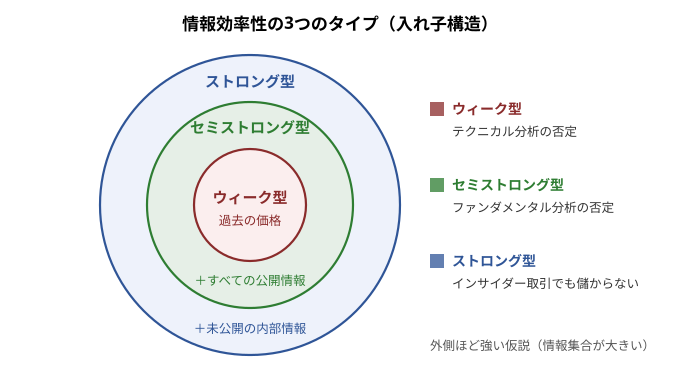

## 証券投資論 勉強会

### 第8章　市場の効率性

---

# はじめに

現実のマーケットが理論と整合的であることを市場が**効率的**であると呼び，「市場は効率的である」という仮説を**効率的市場仮説**と呼ぶ。市場が効率的というのは，現実の市場がほぼ理論通りに動くという意味なので，効率的市場仮説はファイナンスにとって大変重要なテーマである一方で，この仮説をめぐっては理論的な混乱も広く存在する。

市場の効率性に関する実証研究は具体的テーマが広範囲に存在し，実証方法の種類もきわめて多岐にわたるので，本章では**この仮説が何を意味し，何を意味しないかを明らかにすることに重点を置く**。

---

# 8.1.1 効率的市場仮説とは

ウィリアム・シャープは，効率的な市場を次のように定義している。

**効率的市場の定義**：効率的な市場とは，**すべての証券の市場価格が常にその投資価値に等しい市場**である。

市場が効率的ならば，株式，債券，その他あらゆる金融資産には，いついかなるときでも，その投資価値を正しく反映した価格がつく。反対に，市場が効率的でなければ，証券価格はその本源的価値から離れがちになる。その場合には，投資家にとって価格の偏り（**ミスプライシング**）を利用して大きな投資収益を上げる可能性が開ける。

---

# 8.1.2 価格効率性と資源配分の効率性

市場の効率性というのは証券価格の正しさを問う概念であるが，それは次の意味で**経済の生産性**と密接につながっている。市場は，投資家が将来に対する予想や判断を表明する場である。どの事業プロジェクトが成功するか，どんな技術が将来開花するか，どの新製品が消費者の心をつかみ，どの新製品は失敗に終わるか。多数の投資家のこうした意見を集約して，証券価格に正確に織り込むのが効率的な市場である。

市場がこの意味で効率的ならば，証券価格は企業価値の最大化をめざして意思決定を行う企業経営者に重要な情報を伝え，**経済資源の有効利用を促進する**。反対に，証券価格が誤謬の産物であれば，市場は経営者の意思決定をミスリードする。その場合には，資源の有効利用を阻害し，経済の生産性を大きく損ねることになる。

---

資源の最大限の有効利用のことを，経済学では**資源配分の効率性**（Allocational Efficiency）と呼ぶ。これと区別するために，上で定義した効率性を**価格効率性**（Price Efficiency）と呼ぶことにしよう。

市場の効率性は，本来は，資源配分の効率性と価格効率性の両方を意味する言葉であるが，**ファイナンスで市場の効率性というときは，市場の価格効率性のことを指す**。

---

# 8.2.1 市場の情報効率性

市場が（価格）効率的であれば，情報は迅速かつ完全に証券価格に織り込まれるはずである。では，迅速かつ完全に織り込まれる情報はどんな情報で，織り込まれない情報はどんな情報であるか。この問いかけによって，市場の効率性の程度を段階的に分けて検証できるようになる。

この方向での検証は，特定の情報に注目して，証券価格がその情報を織り込むスピードやその正確さを問うことになるので，**市場の情報効率性**と呼ぶ。

**市場の情報効率性の定義**：市場がある情報に関して効率的であるとは，**その情報に基づいた投資戦略をどのように策定しても，過大な投資収益を平均的に稼ぐことができない**ことをいう。

---

# 8.2.2 情報効率性の3つのタイプ

上の定義に従う場合，どんな情報を問題にするかが問われることになるが，**ハリー・ロバーツ [1967]** と**ユージン・ファーマ [1970]** は，次のように情報を3つの種類に分けて市場の効率性を検証することを提案した。

---

- **(1) ウィーク型の効率性**　今日の証券価格が，過去の証券価格に関する情報を完全に織り込むかどうかを問う。ウィーク型の効率性が成り立てば，過去の証券価格のパターンを分析してそこから投資戦略を策定しても，過大な投資リターンを平均的に獲得することはできないことになり，いわゆる**テクニカル分析**の否定につながる。株価の**ランダム・ウォーク仮説**はウィーク型の効率性と関連する。
- **(2) セミストロング型の効率性**　今日の証券価格が，過去の証券価格を含むあらゆる公開情報を迅速かつ完全に織り込むかどうかを問う。企業の有価証券報告書や決算短信，増配や株式分割，M&A のニュース，アナリストの業績予想などを分析しても過大なリターンは得られず，いわゆる**ファンダメンタル分析**の否定につながる。
---

- **(3) ストロング型の効率性**　一部の投資家にしか知られていない情報でも，証券価格に迅速かつ完全に織り込まれるかどうかを問う。企業の内部情報でさえ瞬時に市場価格に織り込まれるので，**インサイダー取引**によって過大なリターンを獲得することも不可能ということになる。

---

# 8.3.1 要求リターン

市場の効率性を実際に検証するには，**何が正常なリターンで何が過大なリターンであるか**を知る必要がある。そこで正常なリターンのことを，市場が要求するリターンという意味で，**要求リターン**と呼ぶことにしよう。

リスクのない投資対象に市場が要求するリターンはリスクフリー・レートであるが，リスク資産に対しては**リスクフリー・レートにリスクプレミアムを上乗せしたリターン**を市場は要求する。

---

# 8.3.2 効率的市場の命題

市場が効率的ならば，市場の需給調整能力によって，投資家が高い要求リターンを求める証券の価格は低く，投資家が低い要求リターンで満足する証券の価格は高くなる。

**効率的市場の命題**：市場が効率的ならば
$$
\text{期待リターン}=\text{要求リターン}
$$
が成立するところまで，個々の証券価格は調整される。

---

左辺の期待リターンとは，リターンの平均的な実現値や，現在の株価をベースに計算されるリターンの予想値を指す。市場が効率的でなければ，期待リターンが要求リターンから乖離している証券が市場に存在する。**期待リターンが要求リターンを上回る証券は価格が割安であり，下回る証券は価格が割高**である。

---

# 8.3.3 要求リターンを決めるもの

要求リターンの大きさを決めるのが**リスクの価格理論**であるが，これには CAPM，APT，ICAPM など複数の理論モデルがあり，どのモデルを使って要求リターンを計算するかで，市場の情報効率性に関する結論が左右される。

**ジョイント仮説問題**：検証は，**(1) 市場が情報効率的であるという命題**と，**(2) 採用した資産価格モデルが妥当であるという命題**の双方を同時に検証することになる。

逆にいえば，仮説に否定的な検証結果が出ても，その結果は市場の情報効率性を否定しているとも，採用した資産価格モデルが現実の証券価格に対する説明力を持たないことを示唆しているとも，**どちらにも解釈できてしまう**。市場の情報効率性に関する実証結果を見るときは，このことを念頭に置く必要がある。

---

# 8.3.4 ストロング型効率性とインサイダー取引

市場がストロング型効率性を満たすならば，企業の経営者がインサイダー情報を悪用して儲けようとしても，株式を市場で売買する直前に瞬時にその情報が価格に織り込まれてしまって，儲ける余地がないということになる。**市場の効率性がこのレベルで成立すると考えるファイナンス学者はほとんどいない。**

セミストロング型，およびウィーク型の効率性も，文字通りに成立すると考えるのは妥当ではない。**市場の効率性は程度の問題**であり，現実の市場において情報がどの程度迅速かつ正確に証券価格に織り込まれるかを知ることが，ファイナンスにとって重要な課題である。

---

# 8.3.5 証券の市場価格の意味

需要（買い）と供給（売り）が市場で交錯して，証券の価格が決定される。この価格は，その証券が将来いかなる価値を持つようになるかについての，**市場の多数意見を集約したもの**である。

多数の証券アナリストやファンドマネジャーが日々変動する証券価格を不断にウォッチしていて，割安と思えば買い，割高と思えば売りの注文を市場に出す。投資収益を追い求める投資家のこうした利益追求行動が盛んであればあるほど，市場のミスプライスはすぐ発見され，発見者による発注と市場の需給調整能力によって，価格は正しい水準に修正される。

市場の効率性は，上記のメカニズムが現実の市場でどの程度強力に働いているかに左右され，**取引コストや市場の制度設計，取引規制，投資家の目的関数，市場参加者の厚みや成熟度**などに依存して決まる。

---

# 8.4.1 マルチンゲール性

いま，要求リターンがゼロと仮定しよう。時点 $t$ での証券価格を $p_t$ とし，時点 $t$ 以前に証券価格がどういう経路をたどったかに関する情報を $I_t$ と表すことにすると，効率的市場の命題は
$$
p_t=E(p_{t+1}\mid I_t)
$$
とも書ける。右辺は，情報 $I_t$ に基づく $p_{t+1}$ の**条件付き期待値**を意味する。

**マルチンゲール過程**：この式を満たす経済時系列（確率過程）は，**マルチンゲール性**を持つという。

---

この式は，明日の価格に対する今日の予想値（期待値）が今日の価格に等しいことを示している。同じゲームを繰り返しプレイするプレイヤーの稼ぎの合計額を $p_t$ とすると，1回当たりの稼ぎの期待値がゼロであることを意味する。つまり**公平な（フェアな）ゲームの条件**にほかならない。

---

# 8.4.2 価格変化の予測不可能性

各時点で入手される情報に基づいて将来の価格変化を予測しても価格変化の期待値が常にゼロであるならば，価格は予測不可能ということができる。そして，価格が予測不可能ということは，価格が**ランダムに動く**，あるいは**価格変化の系列相関はゼロ**といいかえることもできる。

証券に本源的な価値があるならば，中長期的には価格はその本源的価値の水準に近づいていくのではないか——そうであれば，価格はランダムではなく，むしろスムーズに本源的価値に近づいていくはずだ，という直感が働くかもしれない。本源的価値に向かって価格が少しずつゆっくりと調整されていくならば，テクニカル分析が有効になる素地が生まれる。

---

**しかしながら，この見方は正しくない。** 市場では，証券の本源的価値に関する新しい情報が絶えず発生する。情報効率的な市場では，新しい情報は瞬時に，かつ完全に，価格に織り込まれていく。**新しい情報とは，言葉の定義上，前もって予測不可能な情報（サプライズ）のことである。** グッド・ニュースが来れば価格は上昇し，バッド・ニュースが来れば価格は下落する。グッド・ニュースとバッド・ニュースはランダムに発生するので，情報効率的な市場では証券価格はランダムに変動する。

スポーツ選手の好不調の波や，日々の天候・気温から，製品価格や物価水準，GDP に至るまで，大多数の変数を時系列で追えば，それらの動きは完全にランダムではなく，時系列変化にプラスやマイナスの相関があるのが普通である。これに対して，**証券や金融資産の価格だけは特別**である。この命題を数学的な命題として最初に発表したのは，有名な経済学者**ポール・サミュエルソン**である。

---

# 8.4.3 効率的市場命題の注意点

しかしながら，効率的市場の命題の解釈には注意を要する。上の式は要求リターンがゼロという仮定を置いて導かれた。実際には市場の要求リターンはゼロではなく，リスクフリー・レート＋リスクプレミアムであることに注意して，場合分けをして考えてみよう。

- **(1) 要求リターンが一定の場合**　この場合は，やはり証券価格はランダムに動くことになる。
- **(2) リスクプレミアムが一定の場合**　リターンからリスクフリー・レートを差し引いた超過リターンがマルチンゲール性を有する。金利が確率的に動くと考えれば，**超過リターンの系列相関はゼロであるが，リターンの系列相関はゼロとはかぎらない**。
---

- **(3) リスクプレミアムが確率変動する場合**　リターンと要求リターンの差がマルチンゲール性を有することになるが，**証券のリターンや超過リターンに系列相関があっても不思議ではない**。
- **(4) 配当が支払われる場合**　途中で現金の支払いがある場合には，期待リターンにこのインカムゲインも含めて考える必要がある。

---

# 8.4.4 情報効率性の数学的表現

以上を次の式にまとめることができる。時点 $t$ での金利を $r_t$，リスクプレミアムを $\pi_t$，時点 $t+1$ で受け取る配当を $d_{t+1}$ と表すと，情報効率的な市場では，証券価格 $p_t$ は次の式を満たすように決定される：
$$
(1+r_t+\pi_t)\,p_t=E\bigl(p_{t+1}+d_{t+1}\mid I_t\bigr)
$$

これを
$$
p_t=E\bigl[(p_{t+1}+d_{t+1})-(r_t+\pi_t)p_t\mid I_t\bigr]
$$
と書き直すと，右辺の期待値の中の変数が**マルチンゲール性を有する変数**であることがわかる。

---

# 8.4.5 効率性の数学的表現の意味

上式の意味をもっと具体的に説明しよう。証券価格を配当込みで指数化して，**その指数を買い，マネー・マーケット・ファンド（短期金利のロール運用）をショートするロング・ショート戦略**の累積リターンを計算する。

リスクプレミアム $\pi_t$ がゼロのとき，（ウィーク型の）情報効率的な市場では，このロング・ショート・ファンドの指数値が**マルチンゲール過程**になる。つまり，この指数値の増分に系列相関がないことを意味する。また，$\pi_t$ がゼロでなくても**一定値**であれば，やはりこの指数値の増分に系列相関は生まれない。

しかしながら，リスクプレミアム $\pi_t$ が**確率的に変動する**ならば，短期金利だけでなくリスクプレミアム部分も控除した累積リターンがマルチンゲールになるだけで，**証券のリターンや超過リターンに系列相関がないという命題は成立しない**。

---

第3章の6節で述べたように，米国では株式の6カ月以内のリターンにプラスの系列相関（**株価モーメンタム**）が存在することが知られている。これとは逆に，日本では1カ月程度のリターンにマイナスの系列相関（**株価リバーサル**）が存在する。一方，3年から5年という長期のリターンを見ると，米国でも日本でも株価にマイナスの系列相関が存在する。

これらを市場が情報効率的でない証拠と解釈する向きも多いが，理論的にいえば，**短絡的にこう解釈して市場の非効率性を喧伝するのは早計である**。

---

長期については，**配当利回りが株式の将来のリターンに対してかなり強い予測力を持つ**ことが知られている。この現象は，市場の要求リターン（将来のキャッシュフローに対する割引率）が時間をかけて緩やかに変動すると考えれば説明可能である。マクロ経済的な要因によって投資家の要求リターンが上昇すれば，足下の株価は下落し，その結果期待リターンが上昇する。一方，株価が下落すれば，配当利回りは上昇し，過去の実現リターンは低下する。**株価が長期的にはミーン・リバージョンの傾向を持つことは，市場の効率性と整合的に説明することもできるのである。**

---

# 8.4.6 市場の効率性では解釈できない時系列特性

株価の時系列が統計的な癖を持つとするすべての結果が，市場の効率性と整合的かどうかは疑わしい。特に，株価の季節性（**1月効果**）や**曜日効果**などについては，その統計的有意性が十分高ければ，**効率的市場仮説への反証と解釈するのが自然**と思われる。

また，数カ月以内の株式リターンが米国ではプラスの系列相関，日本ではマイナスの系列相関を持つのはなぜか。これについても，まだ理論的に解明されていない。

---

ただし，株価の系列相関は十分強い統計的有意性を持つにもかかわらず，実際にこれを利用した運用戦略を策定しても，**ポートフォリオの売買回転率がきわめて高くなって，取引費用をカバーするだけの高いリターンを生むのは容易ではない**。この意味で，ウィーク型の情報効率性仮説は，日米の株式市場ではおおむね成立していると考えてよいであろう。

> 「1月効果」は株式のリターンが1月が他の月よりも高いという現象。「曜日効果」は特定の曜日の株式リターンが高い（あるいは低い）という現象で，米国では週末日のリターンが高く，月曜日のリターンが低いといわれる。日本では，月曜日よりも火曜日のリターンが低いという報告がある。

---

# 8.5.1 セミストロング型の効率的市場仮説の実証研究

ウィーク型に比べてセミストロング型の情報効率性仮説は，すべての公開情報が瞬時にかつ完全に証券価格に織り込まれるという，より強い内容の主張を含むがゆえに，株価に関して賛否両論の研究が数多く発表されてきた。増益，増配，アナリスト予想の改訂（リビジョン），増資，株式分割，自社株買い戻し，M&A などのニュースが，どの程度のスピードで，またファイナンス理論と整合的な水準に株価に織り込まれるかについては，数多くの実証研究がある。

膨大な実証研究の的になってきた米国の株式市場について総論的にいえば，この種の情報は**ニュース公表のインパクトを受けた瞬間，ほぼ完全に株価に織り込まれる**。ニュースになる以前に徐々に株価に織り込まれることがあっても（これは，ストロング型の情報効率性が市場で成立していないことの証拠となる），**あとになって時間をかけて株価が調整していくということは，あまり見られない**といっていいであろう。その意味で，セミストロング型の情報効率性仮説もおおむね成立するといえる。

---

# 8.5.2 実証研究についての2つの注意点

**第1に**，この分野の研究では，正常なリターン（要求リターン）を構成するリスクプレミアムの大きさを定義するうえで，**CAPM を前提にするものが圧倒的に多い**。CAPM をベンチマーク理論としてそれとの比較で現実を判断するわけであるから，現実が理論通りでなくても，市場の情報処理能力の効率性を否定する結果なのか，CAPM が観測結果にバイアスをもたらしているだけなのかは識別できない。この問題を回避するには，APT やファーマ＝フレンチの3ファクター・モデルなど，**複数の理論モデルをベンチマークにして，アノマリー**（理論からの乖離）の有無を調べるべきである。

---

**第2に**，米国の株式市場でも実証研究の対象は**大型株に集中する**。小型株は流動性が低く，多くの投資家やアナリストの注目から取り残されている銘柄も多い。したがって，大型株に比べて小型株について市場の情報効率性が劣るとしても不思議ではない。

また，日本では，**株式分割による異常な株価上昇とその後の暴落**が，少なくとも最近までは日常茶飯事であった。こうした点を振り返ると，市場の情報効率性は程度の問題で，仮説が正しいか誤りかが問題なのではなく，むしろ**投資家や市場の成熟度を測るものさし**と考えるほうが有益である。

> 2001年の商法改正により株式分割が行いやすくなり，2005年の取引所による自粛要請までに1対10を超えるような大幅な分割比率の株式分割がしばしば行われた。例えば，**ライブドアは2001年7月から2004年8月までの3年余りの間に1株が30,000株に増殖した**。

---

# 8.6.1 株価変動の大きさとニュース発生頻度の関係

情報と株価の関連について，株価の変動性（ボラティリティ）に注目した研究も多数発表されている。その中から代表的なものを3つあげよう。

株価を変動させるのが市場の外側で公開される情報であるとすれば，株価変動の大きさは**ニュースが発生する頻度にほぼ比例**しなければならない。しかし，**金曜の終値から月曜始値の株価変化の分散は**（週末の間にも新しい情報が報道されているにもかかわらず）**，1取引日当たりの株価変化の分散よりもはるかに小さい**ことが知られている。また，株価変動の中で，経済・産業・企業のニュースの発生によって説明される部分は半分以下という研究もある。

これらの研究から，**公開情報が市場に入れば市場の内部で情報が自己増殖して**，株価に複雑で多様なインパクトを与えていることが推測される。

---

1987年10月19日，いわゆる**ブラックマンデー**にニューヨーク証券取引所で起きた株価の暴落は，**全米企業時価総額の23%を1日で失う**ものであったが，この月曜日や週末の間に市場ファンダメンタルズの不調を伝えるニュースは何もなかった。

この突然のマーケット・クラッシュは，ほんのわずかな情報が引き金になって，売りが売りを呼び，投資家の疑心暗鬼に相乗作用が働いて株価を大きく動かしたものと考えられているが，**市場内部での情報の自己増殖がときにはこれほどの規模で起こりうる**ことを物語っている。

---

# 8.6.2 配当変動との比較における過度の株価変動

**ロバート・シラー [1981]** は，株価の変動が配当の変動よりもはるかに大きいことをもって，株式市場の非効率性の証拠と主張した。株価が将来支払われる配当の割引現在価値の期待値に等しいという理論が正しいとすれば，株価のボラティリティが配当のボラティリティよりもはるかに大きいという事実を説明できないというわけである。

> このシラーの主張に対しては，配当のミーン・リバージョンや割引率（要求リターン）の時間的変動があれば，株価が配当よりも大きく変動することは理論と何ら矛盾しないと反論できる。また，配当割引モデルを前提にして実際に配当とそれに応じた株価の時系列をコンピュータに発生させて，シラーが観測したのと同じ現象が起きることを指摘し，シラーの主張の理論的欠陥を突いた議論もある。

---

# 8.6.3 投資家の集団心理や熱狂が株価に与える影響

株式をはじめ，不動産や商品の価格が投資家の集団心理や熱狂に長い間支配されうることは，多くの歴史的事実が示すところである。

- 18世紀の**南海泡沫事件**
- 米国での1960年代のオープン型投信ブーム（**ゴーゴー・ファンド**）の過熱
- 日本における1980年代後半の土地ならびに株式市場の**バブル**
- 1999〜2000年の **IT バブル**
- 2003年以降の**米国の不動産バブル**

---

皮肉な見方をすれば，人類の歴史はバブルに至るエネルギーの蓄積過程であり，そのエネルギーの混沌の中でこそ経済的革新や文化的創造が生まれるといえなくもない。**しかしながら，バブルは必ず弾けるときが来ることも歴史が教えるところ**であり，市場のアービトラージの圧力が強いほど，ミスプライシングの矯正力が強く働く。

この観点から補足すると，市場の価格効率性を論じるときには，株価水準に関する**マクロ的価格効率性**の問題と，個別株式の相対価格に関する**ミクロ的価格効率性**の問題を切り分けることも重要なポイントである。

---

# 8.7.1 ノー・フリーランチから導かれる関係式

株価以外についても，市場の効率性に関する研究が多数行われている。例えば

- 先物価格が先物の**キャリー公式**の通りについているか（第5章）
- オプションの**プット・コール・パリティ**が成立しているか（第5・7章）
- 通貨について**カバー付き金利平価**が成立しているか（第6章）

などを例としてあげることができる。これらはいずれも**ノー・フリーランチの理論と観測可能な変数だけから導かれる関係式**なので，裁定ポートフォリオによって実際に取引コストを上回るリターンが稼げるかどうかで，真偽が判定できる。

この領域の研究結果は，デリバティブ市場の立ち上がり時期に関する研究を除けば，**理論と現実が一致することを支持する結果を報告するものが圧倒的に多い**。これらの研究も市場の価格効率性を検証しようとするものであるが，市場が新しい情報に反応するスピードを問題にする情報効率性とは**区別して考えたほうがいい**。

---

# 8.7.2 近似的な裁定関係に関する研究

必ずしもノー・フリーランチとはならない，**近似的な裁定関係**を検証する研究も存在する。中でも有名なものは

- **金利の期待仮説**（イールドカーブの金利予測力に関する仮説）の検証
- 第6章で述べた**通貨に関するカバーなし金利平価**（内外金利差の為替レート予測力に関する仮説）の検証

特に後者については，**フォワード・プレミアム・パズル**と呼ばれるアノマリーが有名であり，まだ説得的な理論的説明が発見されていない。

また，フィッシャー・ブラックとマイロン・ショールズ [1972] が共同で行ったブラック・ショールズ・モデルのアービトラージ実験も，彼ら自身が，論文に「**市場効率性の研究**」という題目をつけている。

---

# 8.7.3 限定的アービトラージ

現実の市場では裁定取引が十分に行われないために，しばしば価格がノー・フリーランチの原理から乖離することが生じる。裁定取引が十分に行われない原因には，取引費用の存在のほかに，論理的な行動原理を持たない**ノイズ・トレーダー**と呼ばれる一群の投資家によって，市場の価格が理論価格から継続的に離れてしまう**ノイズ・トレーダー・リスク**の存在がある。

裁定を行う投資家がリスク回避的であれば，ノイズ・トレーダー・リスクを恐れて裁定取引が十分には行われなくなってしまう。これは行動ファイナンスにおいて**限定的アービトラージ**と呼ばれている。

---

具体的なアノマリーの例としては次のようなものが知られている。

- **債券**：発行体が同じで，償還日やクーポンレートもほぼ同一の社債でも，既発債と新発債の最終利回りに格差が存在する。逆に，債券の最終利回りに格付けの違いに見合った格差がつかない。
- **親子上場問題**：親会社が子会社の株式のほとんどを所有しているにもかかわらず，親会社の時価総額よりも子会社の時価総額のほうが大きいという現象。
- **クローズ型投信パズル**：会社型投信の発行株式の時価総額が，保有する投信ポートフォリオの時価総額を下回る現象。

---

価格非効率性の多くは，**市場の流動性不足**に大いに関連している。しかし残念ながら，市場の流動性という問題は，一部の日中取引にかかわる現象の説明を除いて，**ファイナンス理論にとってまだ未開拓の領域**である。

> 「親子上場問題」は日本で有名になった問題であり，東京証券取引所はこの問題による株価の歪みを解消するために「**TOPIX 浮動株指数**」を2005年に導入した。

---

# 8.8.1 CAPMアノマリーのタイプ

最後に，第3章で述べたいわゆる **CAPM アノマリー**について簡単にまとめておきたい。すでに指摘したように，CAPM は効率的市場仮説の検証において要求リターンのベンチマークとして用いられることが多い。そのため，実証的に CAPM が成立しているかどうかは大変重要な論点になる。

CAPM に関する実証研究は，初期には肯定的な検証結果を示すものが多かったが，**1970年代後半以降，否定的な結果を示す文献が多く登場する**ようになってきた。CAPM アノマリーと呼ばれるこれらの文献の多くでは，複数の株式ポートフォリオの間のリターン格差がベータの相違だけでは説明しきれず，**株価収益率（PER）・株価純資産倍率（PBR）・時価総額・株価モーメンタム**などが，ベータとは独立な要因として，ポートフォリオの平均リターンに影響を与えることが指摘されている。

---

# 8.8.2 CAPMアノマリーの解釈

今日では，ベータという単一のリスク指標がリスクプレミアムの大きさを決定するという最も古典的な CAPM は，**実証的に支持されていない**といってよいであろう。実際に，様々なスクリーニング基準で株式ポートフォリオを作る場合，ポートフォリオ間のリターン格差に対する説明力はベータだけではなく，複数の説明変数を用いる**マルチファクター・モデル**を使ったほうが良好な結果が得られることが多い。その代表例がファーマ＝フレンチの3ファクター・モデルである。また，APT に基づくロール＝ロス＝チェンのマクロファクター・モデルも，現実のリターンの説明力では CAPM よりも優れている。

しかし，**ではどのモデルがベストかという問いに対しては，まだ誰もが認める結論は得られていない**。また，CAPM も，多期間モデルに拡張すればリスクプレミアムを複数のリスクファクターで説明するモデルに形を変えることになり，**CAPM が理論的に敗北するわけでもない**。こうした事情で，今日でも CAPM は多くの場面で頻繁に利用されており，実務的にその重要性は失われていないのである。

---

# 8.9.1 まとめ——20ドル札のジョーク

効率的市場仮説には，それを揶揄する有名なジョークがある。

> ファイナンスの**教授と学生**が大学の廊下を歩いていて20ドル札が落ちているのを見つけた。学生がそれを拾おうと腰をかがめると，教授はそれを制してこういった。
>
> 「止したほうがいい。**それがニセ札でなければ，誰かがとっくに拾っているよ**」

このジョークにおける教授の揶揄的な位置が示唆するように，**効率的市場仮説の教義に過度にとらわれるのは危険である**。株式市場が完全に効率的であるとすべての投資家が信じれば，誰も企業の業績を予想しようとしなくなる。そうなれば，株価の価格発見機能は損なわれ，資源の効率的配分を阻害する。

---

ファイナンスの実証研究は，株式市場に価格効率性や情報効率性に反するアノマリーが存在することを示している。おそらく，投資家が割安株や割高株を発掘し，市場平均以上のパフォーマンスを上げることは不可能ではないであろう。

**しかしながら，他方で，人々が想像する以上に市場が効率的であることも，過去のファイナンス研究が示してきた。** 誰でも簡単に儲かるような戦略はすでに株価に織り込まれている。あるいは一見儲かるようでも，取引コストや隠れたリスクで儲けが残らないことが多い。

市場は十分に効率的で，**アクティブ・マネジメントの果実は，他者を凌駕する情報収集力，分析力，創造力，そして決断力を持つ投資家のみが手にすることが可能なもの**と考えるのが妥当である。

---

## 証券投資論 勉強会

### ご清聴ありがとうございました