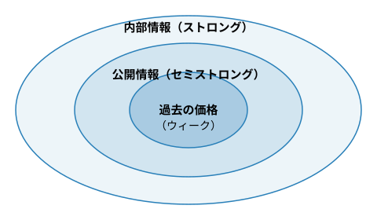
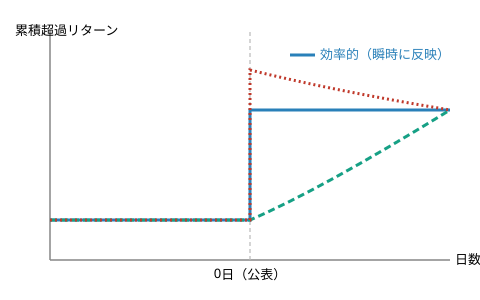

## 証券投資論 勉強会

### 第8章　市場の効率性

---

# はじめに

CAPM・APT・リスクニュートラル・プライシングといった理論モデルで，現実の資産市場をどこまで理解できるか——本章はこれを問う。ファイナンスは社会科学の中でも屈指のデータに恵まれた分野であり，理論と現実の整合性を問う実証研究が膨大に蓄積されている。本章は市場の**価格効率性**という側面に絞り，検証可能な命題を整理し，主要な実証研究の要点をたどる。

---

# 8.1.1　効率的市場の定義

**効率的市場（Sharpe他の定義）**

すべての証券の市場価格が，つねにその**投資価値**に等しい市場を**効率的市場**という。

市場が効率的なら価格はつねに正しく，ミスプライシングを利用して大きな投資収益を上げることはできない。市場が効率的でなければ，価格は本源的価値から離れがちになり，それを見つけられる投資家に収益機会が開ける。

---

# 8.1.2　資源配分の効率性とのつながり

市場は，投資家が将来への予想や判断を**表明する場**である。どの事業が成功し，どの新製品が消費者の心をつかむか——多数の投資家の意見を集約し，証券価格に正確に織り込むのが効率的な市場である。

価格が正しければ，企業経営者に投資判断のための重要な情報を伝え，経済資源の有効利用（資源配分の効率性）を促進する。価格が誤りの産物なら，経営者の意思決定をミスリードし，経済の生産性を損ねる

ファイナンスで単に「市場の効率性」というときは，この**価格効率性**を指す（資源配分の効率性とは区別される概念）。

---

# 8.1.3　市場の情報効率性

市場が効率的なら情報は迅速・完全に価格へ織り込まれるはず——どんな情報が織り込まれ，どんな情報が織り込まれないかを段階的に検証できる。

**市場の情報効率性**

ある情報に関して市場が効率的であるとは，その情報に基づく投資戦略をどう策定しても，過大な投資収益を平均的に稼げないことをいう。

ハリー・ロバーツ（1967）とユージン・ファーマ（1970）は，情報を3種類に分けて効率性を検証することを提案した。

---

# 8.1.4　情報効率性の3つの型

**情報効率性の3つの型**

- **ウィーク型**：過去の価格を反映。**テクニカル分析**は無効
- **セミストロング型**：過去の価格＋すべての公開情報を反映。**ファンダメンタル分析**でも無効
- **ストロング型**：公開情報＋未公開の内部情報まで反映。**インサイダー取引**でも無効

---

# 8.1.5　効率性は程度の問題

> **注意：効率性は程度の問題**
>
> ストロング型を文字どおり信じる研究者はほとんどいない——インサイダー取引が超過収益を生むことは広く知られている。ウィーク型・セミストロング型も文字どおり成立すると考えるのは妥当でない。市場の効率性は「成り立つか否か」ではなく，**投資家や市場の成熟度を測るものさし**として理解するのが実務的である。

---

# 8.1.6　効率的市場の命題

「正常なリターン」を市場が**要求するリターン**（要求リターン＝$r_f$＋リスクプレミアム）と呼ぶ。

**効率的市場の命題**

市場が効率的ならば，$\text{期待リターン}=\text{要求リターン}$ が成立するところまで，個々の証券価格は調整される。

期待リターンが要求リターンを上回る証券は**割安**，下回る証券は**割高**。こうした乖離を体系的に見つけられる投資家は，要求リターン以上を平均的に得られる。

---

# 8.1.7　ジョイント仮説問題

要求リターンの大きさを決めるのはCAPM・APT・ICAPMなど複数の理論モデルであり，**どのモデルを使うかで効率性の結論が変わる**。

実証研究は常に「①市場は情報効率的である」と「②採用した資産価格モデルは妥当である」という2つの命題を同時に検証している——これがジョイント仮説問題

否定的な検証結果が出ても，それが市場の非効率を示すのか，モデルの説明力不足を示すのか，原理的に区別できない。本章の以降の実証結果はすべて，この留保つきで読む必要がある。

---

# 8.1.8　証券の市場価格の意味

需要と供給が市場で交錯して価格が決まる。多数のアナリストやファンドマネジャーが日々価格を監視し，割安と思えば買い，割高と思えば売る——この利益追求行動が盛んなほど，ミスプライスは早く発見・修正される。

市場の効率性の強さは，取引コスト・市場の制度設計・取引規制・投資家の目的関数・市場参加者の厚みや成熟度に依存する

---

# 8.2.1　効率的市場命題とマルチンゲール性

要求リターンをゼロと仮定しよう。証券価格$p_t$，時点$t$までの情報を$I_t$とすると，効率的市場では

**マルチンゲール過程**

$$
p_t=\mathbb{E}[p_{t+1}\mid I_t]
$$

を満たす確率過程を**マルチンゲール**という——今日の価格が明日の価格の期待値に等しい，公平な（フェアな）ゲームの条件。

---

# 8.2.2　なぜ価格はランダムに動くのか

他の経済変数（気温，物価，GDPなど）の多くは時系列に相関を持つのが普通だが，情報効率的な市場での証券価格だけは特別——**ランダムに動くはず**である。

新しい情報とは定義上，前もって予測できない**サプライズ**。情報効率的な市場では新しい情報が瞬時に価格へ織り込まれ，グッド・ニュースなら上昇，バッド・ニュースなら下落する。

価格が予測不可能にランダムに動くことこそ，市場が情報を効率的に処理している証拠——この命題を最初に数学的に示したのはポール・サミュエルソンである

---

# 8.2.3　フェア・ゲームとしての超過リターン

**超過リターンはフェア・ゲーム**

効率的市場では，超過リターン$\varepsilon_t$は条件付き期待値ゼロを満たし，異なる時点間で無相関：$\mathrm{Cov}(\varepsilon_s,\varepsilon_t)=0\ (s\neq t)$。

過去の超過リターンをいくら分析しても，将来の超過リターンの予測には使えない。

---

# 8.2.4　命題の解釈で注意すべき4つのケース

効率的市場命題は要求リターンをゼロと単純化していた。実際の要求リターンを踏まえ，場合分けして考える必要がある。

1. **要求リターンが一定**：証券価格はランダムに動く
2. **リスクプレミアムが一定**：超過リターンがマルチンゲール性を持つ。証券リターン自体の系列相関はゼロとは限らない
3. **リスクプレミアムが確率変動**：リターンや超過リターンに系列相関があっても不思議ではない
4. **配当が支払われる場合**：期待リターンにインカムゲインも含めて考える必要がある

見かけ上の系列相関から即座に「市場は非効率」と結論するのは早計——常にこの4通りを意識する

---

# 8.2.5　アノマリーの再登場

理論上は超過リターンの系列相関ゼロのはずだが，現実には規則性が観測される。

- **米国**：6ヶ月以内のリターンにプラスの系列相関（**モメンタム**）
- **日本**：1ヶ月程度のリターンにマイナスの系列相関（**リバーサル**）
- **米国・日本とも**：3〜5年の長期リターンにマイナスの系列相関（**長期リバーサル**）

配当利回りが高い（株価が割安な）ときは市場全体の要求リターンが上昇している局面と解釈すれば，その後の高いリターンは非効率の証拠ではなく正常な補償でありうる

---

# 8.2.6　カレンダー・アノマリー

**1月効果**（1月のリターンが他の月より高い）や**曜日効果**（米国は月曜日が低い，日本は火曜日が月曜日より低い）が報告されている。統計的に十分有意なら，**効率的市場仮説への反証と解釈するのが自然**である。

ただし，これらの系列相関を利用した戦略は売買回転率が非常に高くなり，取引費用をカバーするだけの高いリターンを生むのは容易ではない——この意味で，ウィーク型効率性は日米市場でおおむね成立していると考えてよい

---

# 8.3.1　イベント・スタディ

セミストロング型は，増益・増配・アナリスト予想改訂・増資・株式分割・自社株買い・M&Aなどのニュース公表前後の超過リターンを調べる**イベント・スタディ**で検証される。

米国株では，公表の瞬間にほぼ完全に価格に織り込まれる。公表**前**にじわじわ織り込まれる現象があれば，それは**ストロング型**の非効率の証拠。公表**後**に時間をかけて調整する現象は，あまり見られない。

---

# 8.3.2　実証研究の2つの注意点

**第1に**：この分野の研究は正常なリターンの基準としてCAPMを使うものが圧倒的に多い——ジョイント仮説問題そのもの。APTやファーマ＝フレンチ・モデルなど複数のベンチマークで確かめるべきである。

**第2に**：実証対象は大型株に集中しがちで，小型株は情報効率性が劣っても不思議はない。日本では株式分割による異常な株価上昇とその後の暴落が日常茶飯事だった時期がある——**ライブドアは2001年7月〜2004年8月の3年余りで1株を30,000株に分割**した。

市場の情報効率性は程度の問題であり，投資家や市場の成熟度を測るものさしと考えるのが有益

---

# 8.3.3　具体例：ブラックマンデー（1987年）

株価変動の大きさはニュース発生頻度にほぼ比例するはずだが，週末（金曜終値〜月曜始値）の株価変化の分散は，1取引日あたりの変化の分散よりはるかに小さいことが知られている——**市場内部で情報が自己増殖**していることを示唆する。

1987年10月19日のブラックマンデーでは，全米企業の時価総額の23%が1日で失われた——この週末にファンダメンタルズの不調を伝えるニュースは何もなかった

わずかな情報が引き金となり，売りが売りを呼び，投資家の疑心暗鬼が相乗した結果と考えられている。

---

# 8.3.4　シラーの過剰変動性パズル

> **注意：シラーの過剰変動性パズル**
>
> 株価は将来配当の割引現在価値の期待値であるはずなので，その変動は配当の変動によってしか説明できないはず。Shiller (1981) は，実際の株価のボラティリティが配当のボラティリティを大幅に上回ることを示し，市場の非効率性の証拠と主張した。ただし配当のミーン・リバージョンや割引率の時間変動を考慮すれば矛盾しないという反論もあり，論争が続いている。

---

# 8.3.5　バブルと集団心理

株式・不動産・商品の価格が投資家の集団心理や熱狂に支配されうることは，18世紀の**南海泡沫事件**，1960年代米国の**ゴーゴー・ファンド**ブーム，1980年代後半の**日本のバブル**，1999〜2000年の**ITバブル**，2003年以降の**米国不動産バブル**など多くの歴史的事実が示す。

皮肉な見方をすれば，人類の歴史はバブルへ至るエネルギーの蓄積過程であり，その混沌の中でこそ経済的革新が生まれるともいえる——しかしバブルは必ず弾ける

市場の価格効率性を論じる際は，株価水準に関する**マクロ的**価格効率性と，個別株の相対価格に関する**ミクロ的**価格効率性を切り分けることが重要である。

---

# 8.3.6　限定的アービトラージ

現実の市場では，取引費用に加え，非合理的な**ノイズ・トレーダー**によって価格が理論値から乖離し続けてしまう**ノイズ・トレーダー・リスク**のために，裁定取引が十分に働かないことがある——**限定的アービトラージ**。

- 社債の新発・既発利回りの格差，格付けの違いに見合わない利回り格差
- **親子上場のパズル**：子会社株式の時価総額が親会社の時価総額を上回る現象（東証はこの歪みの解消のため**2005年にTOPIX浮動株指数を導入**）
- **クローズ型投信パズル**：投信の時価総額が保有ポートフォリオの時価総額を下回る現象

価格非効率性の多くは市場の流動性不足に関連するが，流動性の問題はファイナンス理論にとってまだ未開拓の領域である。

---

# 8.4.1　厳密なノー・フリーランチ関係

資産価格モデルに依存せず，観測可能な変数だけから導かれる関係式も効率性の検証対象になる。

**広義の効率性＝ノー・フリーランチ**

**先物のキャリー公式**，**プット・コール・パリティ**，**カバー付き金利平価（CIP）**——これらは第5・7章のノー・フリーランチの理論から導かれ，裁定ポートフォリオで直接真偽を判定できる

デリバティブ市場の立ち上がり期を除けば，理論と現実の一致を支持する結果が圧倒的に多い

---

# 8.4.2　近似的な裁定関係

必ずしも無裁定とは限らないが，近似的な裁定関係を検証する研究もある。

- **金利の期待仮説**（イールドカーブの金利予測力）
- **カバーなし金利平価（UIP）**（第6章）：**フォワード・プレミアム・パズル**として有名で，説得的な理論的説明はまだない

フィッシャー・ブラックとマイロン・ショールズ（1972）が行ったBS公式のアービトラージ実験は，彼ら自身の論文に「市場効率性の研究」という題目がつけられている

---

# 8.4.3　CAPMアノマリーのタイプ

第3章で見たCAPMアノマリーを振り返ろう。CAPM実証は初期には肯定的だったが，1970年代後半以降，否定的な結果が多く報告されるようになった。

複数ポートフォリオ間のリターン格差がベータの違いだけでは説明しきれず，株価収益率（PER）・株価純資産倍率（PBR）・時価総額・株価モメンタムが，ベータとは独立にリターンへ影響することが指摘されている

---

# 8.4.4　CAPMアノマリーの解釈

単一ベータの古典的CAPMは，今日では実証的に支持されているとは言いがたい。ファーマ＝フレンチの3ファクター・モデルやロス＝ロール＝チェンのマクロファクター・モデルの方が，説明力で優れることが多い。

しかし，どのモデルがベストかはまだ誰もが認める結論に至っていない。CAPMも多期間モデルに拡張すればマルチファクター的な形に変わり，理論的に「敗北」したわけでもない——実務ではCAPMは今も広く使われ続けている

---

# 補足：期待形成の偏りとモメンタム・リバーサル

教科書の数学付録は，モメンタム・リバーサルの別の（行動論的な）説明を示す。投資家が真の価値$q$をベイズ更新で学習するモデルで，直近のシグナルに**過大な**重みをつけて期待形成すると：

オーバーシュート（直近重視しすぎ）→ 前後期リターンの相関係数 −0.463 ＝ 株価リバーサルを再現

逆に直近のシグナルに**過小な**重みをつけると：

アンダーシュート（直近軽視しすぎ）→ 相関係数 +0.593 ＝ 株価モメンタムを再現

本文が示す「要求リターンの緩やかな変動」という合理的な説明とは別の，補完的な説明である。

---

# 8.4.5　締めくくりに：$20札のジョーク

> ファイナンスの**教授と学生**が大学の廊下を歩いていて，20ドル札が落ちているのを見つけた。学生がそれを拾おうと腰をかがめると，教授はそれを制してこう言った——「よしたほうがいい。それが**ニセ札でなければ**，誰かがとっくに拾っているよ」

効率的市場仮説の教義に過度にとらわれることへの，機知に富んだ戒めである。

誰もが市場を完全に信じれば，誰も企業業績を予想しなくなり価格発見機能が損なわれる。しかし市場は人々が思う以上に効率的でもある——アクティブ運用で市場に勝てるのは，真に優れた情報収集力・分析力・決断力を持つ投資家だけだと考えるのが妥当である

---

# まとめ（1）

- **効率的市場**：価格＝投資価値。情報効率性はウィーク／セミストロング／ストロングの3段階（程度の問題）
- 要求リターンのモデルに応じて結論が変わる**ジョイント仮説問題**——本章の実証結果すべてに関わる留保
- 効率的市場では価格は**マルチンゲール**。ただし要求リターンの変動や配当により，見かけ上の系列相関は複数の解釈がありうる（4つのケース）
- ブラックマンデー・シラーのパズル・バブル・限定的アービトラージなど，効率性への挑戦は多い

---

# まとめ（2）

- **広義の効率性＝ノー・フリーランチ**はモデルに依存せず直接検証でき，概ね支持される
- **CAPMアノマリー**（PER・PBR・サイズ・モメンタム）はマルチファクター・モデルへの発展を促したが，決着はついていない
- 市場は思うより効率的——だが理論を過信せず，例外の存在にも謙虚でありたい

---

## 証券投資論 勉強会

### ご清聴ありがとうございました

投資家の選好からポートフォリオ理論・CAPM・APT・
リスク中立プライシング・国際投資・デリバティブ・市場効率性まで
